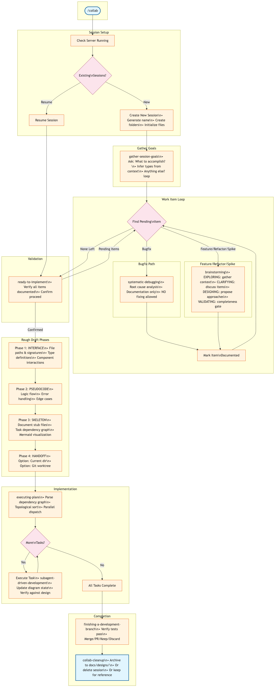

# Mermaid Collab

A collaborative design toolkit for Claude Code: diagram server + skills for design-to-implementation workflows.

**Two components:**
1. **Server** - Real-time Mermaid diagram collaboration with MCP integration
2. **Plugin** - 22 skills for brainstorming, planning, and structured development workflows

## Collab Workflow

The collab workflow turns ideas into working code through structured phases with verification gates at each transition.



```
/collab → gather-goals → work-item-loop → ready-to-implement → rough-draft → executing-plans → cleanup
```

### Phases

| Phase | Purpose | Output |
|-------|---------|--------|
| **gather-session-goals** | Collect work items with type inference | Work items in design doc |
| **brainstorming** | Socratic design refinement (EXPLORING → CLARIFYING → DESIGNING → VALIDATING) | Complete design with diagrams |
| **rough-draft** | Progressive refinement (Interface → Pseudocode → Skeleton → Handoff) | Task dependency graph |
| **executing-plans** | Parallel task execution with verification gates | Working implementation |
| **collab-cleanup** | Archive or delete session artifacts | Clean workspace |

### Key Principles

- **Spec-first**: Design is complete before any code is written
- **Drift detection**: Each phase verifies alignment with original design
- **Anti-drift rules**: Implementation follows design EXACTLY - no interpretation
- **Verification gates**: Evidence-based checks before each transition

## Features

### Server

- **Multi-Session Architecture**: One server serves multiple projects and sessions
- **Web Dashboard**: Browse diagrams with cached thumbnails at `http://localhost:3737`
- **Split-Pane Editor**: Live preview with syntax validation, undo/redo
- **Real-Time Collaboration**: WebSocket-based live updates
- **MCP Integration**: Claude Code can create, read, update, and preview diagrams
- **Wireframe Plugin**: Built-in support for UI wireframes and mockups
- **Document Collaboration**: Create and edit markdown documents alongside diagrams

### Skills (22 Total)

#### Core Workflow
| Skill | Purpose |
|-------|---------|
| **collab** | Orchestrator - creates sessions, manages work item loop |
| **gather-session-goals** | Collects and classifies work items at session start |
| **brainstorming** | Socratic design refinement through 5 phases |
| **rough-draft** | Bridges design to implementation via 4 phases |
| **executing-plans** | Batch execution with dependency-aware parallel dispatch |
| **ready-to-implement** | Central checkpoint - validates all items documented |

#### Debugging & Verification
| Skill | Purpose |
|-------|---------|
| **systematic-debugging** | 4-phase root cause analysis (documentation only - no fixing) |
| **verify-phase** | Checks rough-draft output aligns with design |
| **test-driven-development** | RED-GREEN-REFACTOR cycle enforcement |
| **verification-before-completion** | Evidence before success claims |

#### Implementation
| Skill | Purpose |
|-------|---------|
| **subagent-driven-development** | Fast iteration with parallel task execution |
| **dispatching-parallel-agents** | Coordinates independent tasks |
| **using-git-worktrees** | Creates isolated development branches |
| **finishing-a-development-branch** | Merge/PR decision workflow |
| **writing-plans** | Detailed implementation plans (standalone) |

#### Code Review
| Skill | Purpose |
|-------|---------|
| **requesting-code-review** | Prepares code for peer review |
| **receiving-code-review** | Handles feedback with validation |

#### Visualization & Cleanup
| Skill | Purpose |
|-------|---------|
| **mermaid-collab** | Create/edit diagrams, wireframes, documents |
| **using-gui-wireframes** | UI mockup creation |
| **collab-cleanup** | Archive/delete session artifacts |

## Quick Start

### 1. Install Server

```bash
git clone https://github.com/ben-mad-jlp/claude-mermaid-collab.git
cd claude-mermaid-collab
bun install
```

### 2. Start Server

```bash
# Start server in background
bun run bin/mermaid-collab.ts start

# Check status
bun run bin/mermaid-collab.ts status

# Stop server
bun run bin/mermaid-collab.ts stop
```

The server runs at `http://localhost:3737` and serves all sessions.

### 3. Install Plugin (Claude Code)

```bash
# In Claude Code, install the plugin
/plugin install ben-mad-jlp/claude-mermaid-collab
```

### 4. Start a Collab Session

```bash
# In Claude Code
/collab
```

This will:
1. Create a new session with a memorable name (e.g., `bright-calm-river`)
2. Ask what you want to accomplish
3. Guide you through the design-to-implementation workflow

## Session Storage

```
~/.mermaid-collab/
├── sessions.json       # Registry of all sessions
├── server.pid          # Server process ID
└── .collab/
    └── scratch/        # Default scratch session

/your/project/
└── .collab/
    └── session-name/
        ├── diagrams/           # .mmd files
        ├── documents/          # .md files (design.md required)
        └── collab-state.json   # Phase tracking
```

### Collab State

```json
{
  "phase": "brainstorming|rough-draft/interface|rough-draft/pseudocode|rough-draft/skeleton|implementation",
  "lastActivity": "2026-01-20T10:30:00Z",
  "currentItem": null,
  "completedTasks": [],
  "pendingTasks": []
}
```

## MCP Tools

All tools require `project` (absolute path) and `session` (session name) parameters.

### Session Management

| Tool | Description |
|------|-------------|
| `generate_session_name()` | Generate a memorable session name |
| `list_sessions()` | List all registered sessions |

### Diagram Tools

| Tool | Description |
|------|-------------|
| `list_diagrams(project, session)` | List all diagrams |
| `get_diagram(project, session, id)` | Get diagram content |
| `create_diagram(project, session, name, content)` | Create new diagram |
| `update_diagram(project, session, id, content)` | Update diagram |
| `validate_diagram(content)` | Check Mermaid syntax |
| `preview_diagram(project, session, id)` | Get browser URL |

### Document Tools

| Tool | Description |
|------|-------------|
| `list_documents(project, session)` | List all documents |
| `get_document(project, session, id)` | Get document content |
| `create_document(project, session, name, content)` | Create new document |
| `update_document(project, session, id, content)` | Update document |
| `preview_document(project, session, id)` | Get browser URL |

## REST API

All endpoints require `?project=...&session=...` query parameters.

### Sessions
```bash
GET /api/sessions              # List all sessions
POST /api/sessions             # Register session
DELETE /api/sessions           # Unregister session
```

### Diagrams
```bash
GET /api/diagrams              # List diagrams
GET /api/diagram/:id           # Get diagram
POST /api/diagram              # Create diagram
POST /api/diagram/:id          # Update diagram
DELETE /api/diagram/:id        # Delete diagram
```

### Documents
```bash
GET /api/documents             # List documents
GET /api/document/:id          # Get document
POST /api/document             # Create document
POST /api/document/:id         # Update document
DELETE /api/document/:id       # Delete document
```

## Architecture

### Services

| Service | Purpose |
|---------|---------|
| **SessionRegistry** | Tracks sessions across projects |
| **DiagramManager** | Per-session diagram CRUD |
| **DocumentManager** | Per-session document CRUD |
| **Validator** | Mermaid syntax validation |
| **Renderer** | Server-side SVG generation |
| **WebSocketHandler** | Real-time updates |

### Single Server Model

- One server instance serves all projects and sessions
- Runs on port 3737 (configurable via `PORT` env var)
- Session registry at `~/.mermaid-collab/sessions.json`
- WebSocket broadcasts include project/session context for filtering

## Wireframe Plugin

Create UI wireframes with text-based syntax:

```
wireframe mobile TD
  screen "Login Screen"
    col padding=16
      Title "Welcome Back"
      Input "Email"
      Input "Password"
      Button "Sign In" primary
```

See [plugins/wireframe/README.md](plugins/wireframe/README.md) for full documentation.

## Development

```bash
# Run server directly (for development)
bun run src/server.ts

# Run MCP server directly
bun run src/mcp/server.ts
```

## License

MIT
