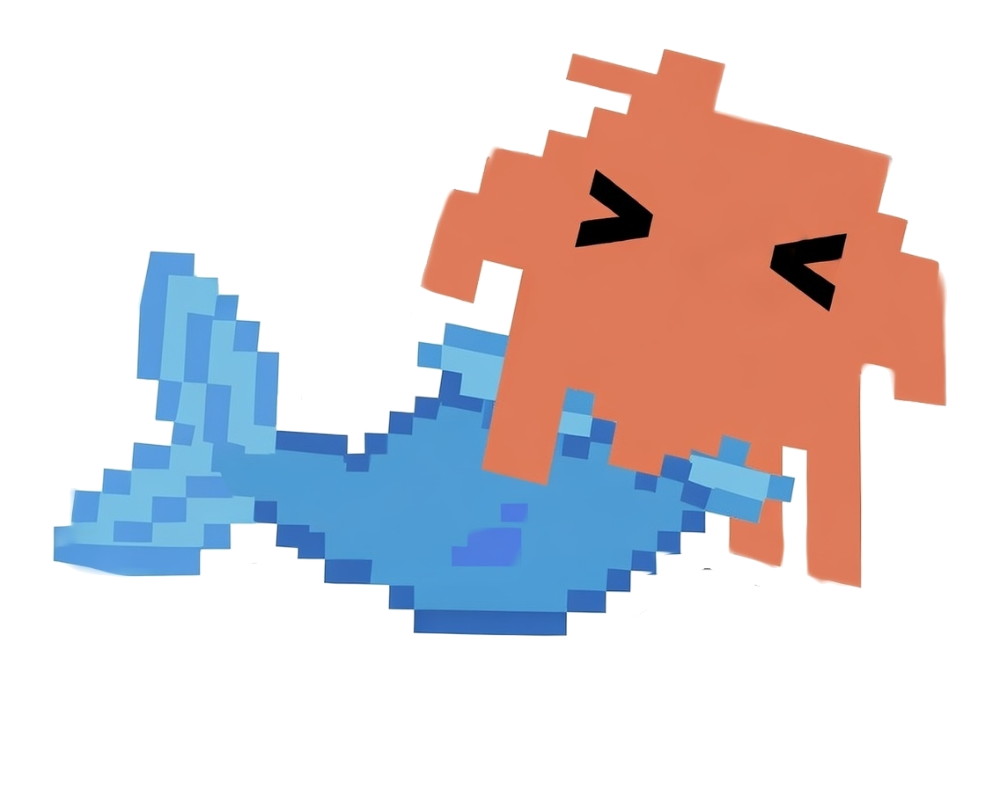
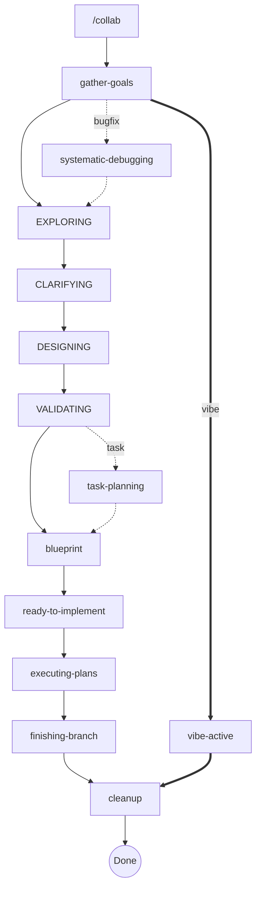
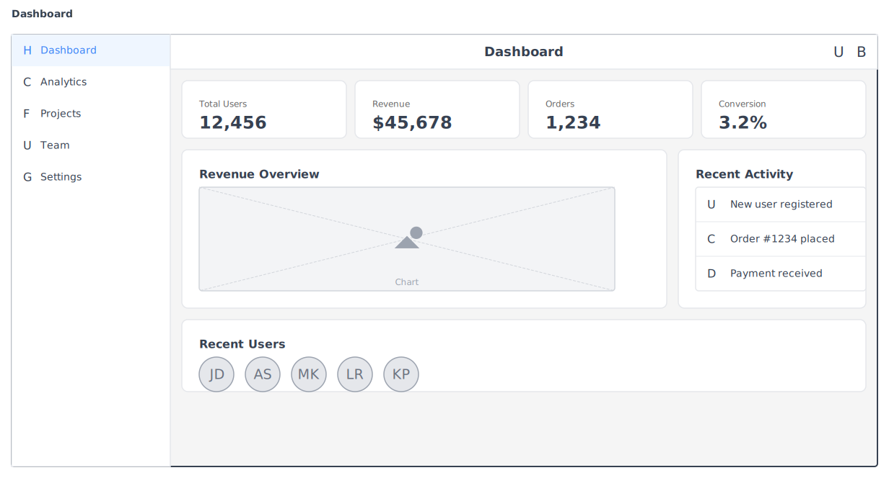
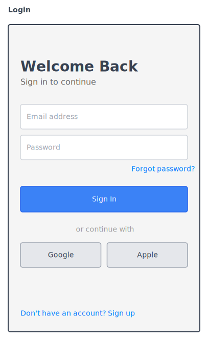

# Mermaid Collab

A design-to-implementation toolkit for Claude Code that transforms ideas into working software through structured collaboration.



## What is Mermaid Collab?

Mermaid Collab is a Claude Code plugin that provides:

1. **Collaboration Server** - Real-time Mermaid diagrams, wireframes, and documents with a React GUI
2. **Structured Workflow** - A state machine that guides you from idea to implementation
3. **40+ Skills** - Orchestrated design patterns for brainstorming, planning, and development

## Quick Start

```bash
# Install the plugin in Claude Code
/plugin install ben-mad-jlp/claude-mermaid-collab

# Start a collab session
/collab
```

That's it! The server auto-starts when needed, and you're guided through a structured workflow.

---

## The Collab Workflow

The collab workflow is a state machine that ensures **design completeness before implementation**. Every idea goes through verification gates before any code is written.

### State Machine Overview



The full workflow includes brainstorming phases, special routing for bugfixes and tasks, and a **vibe mode** shortcut for freeform work.

### Two Session Types

| Type | Flow | Best For |
|------|------|----------|
| **Structured** | Full state machine with verification gates | Features, refactors, complex work |
| **Vibe** | Skip brainstorming → straight to cleanup | Quick sketches, exploration, prototyping |

In **vibe mode**, you bypass all brainstorming phases and work directly with diagrams, documents, and wireframes. When done, go straight to cleanup.

### Phase Details

#### 1. Gather Goals
Collect work items and classify them:
- **Code** - Features requiring implementation
- **Task** - Operational work (setup, config, organization)
- **Bugfix** - Issues requiring investigation

#### 2. Brainstorming (4 sub-phases)

| Phase | Purpose |
|-------|---------|
| **EXPLORING** | Gather context, form initial understanding |
| **CLARIFYING** | Discuss each item to fully understand requirements |
| **DESIGNING** | Present design approach in validated sections |
| **VALIDATING** | Run completeness gate before proceeding |

Special routing:
- **Bugfixes** → `systematic-debugging` (skip brainstorming)
- **Tasks** → `task-planning` after design (skip rough-draft)

#### 3. Rough-Draft (code items only)
Progressive refinement through:
- **Interface** - Define contracts and types
- **Pseudocode** - Logic flow for each function
- **Skeleton** - Generate stub files and task graph

#### 4. Execution
- Parallel task execution with dependency awareness
- Verification gates between batches
- Drift detection against original design

#### 5. Cleanup
- Archive session to `docs/designs/`
- Or delete session files
- Clean workspace for next project

---

## Features

### React GUI

Access at `http://localhost:3737` after starting a session.

**Dashboard Features:**
- Session browser with project grouping
- Split-pane editors with live preview
- Diagram validation with syntax highlighting
- Document editor with markdown preview
- Wireframe designer with component palette
- Terminal integration with tmux support
- Real-time WebSocket updates

### Wireframes

Create UI mockups with a JSON-based component system:





- 20+ component types (buttons, inputs, cards, lists, etc.)
- Responsive viewports (mobile, tablet, desktop)
- Hand-drawn "rough" style for sketching
- Export to SVG/PNG

### Diagrams

Full Mermaid support with:
- Flowcharts, sequence diagrams, class diagrams
- State machines, entity relationships
- Gantt charts, mind maps
- Custom themes and styling

### AI UI System

The `render_ui` tool pushes interactive components to the browser:

**32 Component Types:**
- **Display**: Table, CodeBlock, DiffView, JsonViewer, Markdown, Image
- **Layout**: Card, Section, Columns, Accordion, Alert
- **Interactive**: Wizard, Checklist, ApprovalButtons, ProgressBar, Tabs
- **Inputs**: TextInput, TextArea, Checkbox, RadioGroup, Toggle, Slider

---

## Architecture

### Single Server Model

```
┌─────────────────────────────────────────┐
│           Collaboration Server          │
│              (port 3737)                │
├─────────────────────────────────────────┤
│  React GUI    │  REST API  │  WebSocket │
├───────────────┴────────────┴────────────┤
│              MCP Transport              │
├─────────────────────────────────────────┤
│  DiagramManager │ DocumentManager │ ... │
└─────────────────────────────────────────┘
         ↓              ↓
    Project A       Project B
    └─ .collab/     └─ .collab/
       └─ sessions     └─ sessions
```

One server instance serves all projects. Sessions are stored in each project's `.collab/` directory.

### Session Storage

```
~/.mermaid-collab/           # Global config
├── sessions.json            # Session registry
├── server.pid               # Process ID
└── server.log               # Server logs

/your/project/
├── .collab/
│   └── session-name/
│       ├── diagrams/        # .mmd files
│       ├── documents/       # .md files
│       ├── wireframes/      # .json files
│       └── collab-state.json
└── .kodex/                  # Knowledge base
    └── topics/
```

---

## MCP Tools

All tools are available to Claude Code via the MCP protocol.

### Session Management
| Tool | Description |
|------|-------------|
| `check_server_health` | Server status and uptime |
| `generate_session_name` | Create memorable name |
| `list_sessions` | All sessions across projects |
| `get_session_state` | Current phase and work items |

### Content Creation
| Tool | Description |
|------|-------------|
| `create_diagram` | New Mermaid diagram |
| `create_document` | New markdown document |
| `create_wireframe` | New UI wireframe |
| `update_*` / `patch_*` | Modify existing content |
| `validate_diagram` | Check Mermaid syntax |

### Workflow
| Tool | Description |
|------|-------------|
| `complete_skill` | Report completion, get next skill |
| `update_task_status` | Update task in graph |
| `get_task_graph` | Current task dependencies |

### Knowledge Base (Kodex)
| Tool | Description |
|------|-------------|
| `kodex_query_topic` | Read topic content |
| `kodex_create_topic` | Create new topic (as draft) |
| `kodex_flag_topic` | Mark as outdated/incorrect |

---

## Skills (40+)

Skills are orchestration instructions loaded on-demand. Key categories:

### Core Workflow
- `collab` - Entry point and session management
- `gather-session-goals` - Collect and classify work items
- `collab-cleanup` - Archive or delete artifacts

### Brainstorming
- `brainstorming-exploring` - Context gathering
- `brainstorming-clarifying` - Requirement discussion
- `brainstorming-designing` - Design presentation
- `brainstorming-validating` - Completeness gate

### Implementation
- `rough-draft-blueprint` - Interface → Pseudocode → Skeleton
- `executing-plans` - Parallel task execution
- `test-driven-development` - RED-GREEN-REFACTOR

### Utilities
- `systematic-debugging` - 4-phase root cause analysis
- `writing-skills` - Create new skills
- `using-kodex` - Query project knowledge

---

## CLI Commands

```bash
# Server management
bun run bin/mermaid-collab.ts start   # Start in background
bun run bin/mermaid-collab.ts stop    # Stop server
bun run bin/mermaid-collab.ts status  # Check status

# Development
bun run dev          # Full dev environment (API + UI)
bun run dev:api      # API server only
bun run dev:ui       # UI dev server only
npm run test:ci      # Run all tests
```

---

## Key Principles

1. **Spec-First** - Design is complete before code is written
2. **Verification Gates** - Evidence-based checks at each transition
3. **Drift Detection** - Implementation matches design exactly
4. **Context Management** - Clear between phases to stay focused

---

## License

MIT
