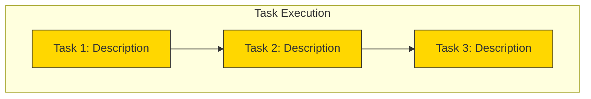

# Interface: Item 11 - Always Show Task Execution Diagram

## File Structure
- `skills/executing-plans/SKILL.md` - Update to always create diagram (MODIFY)
- `skills/executing-plans-execution/SKILL.md` - Update task status in diagram (MODIFY)

## Diagram Structure



## Status Update Pattern

When task starts:
```
Tool: mcp__mermaid__patch_diagram
Args: {
  "id": "task-execution",
  "old_string": "task1[Task 1: Description]:::waiting",
  "new_string": "task1[Task 1: Description]:::executing"
}
```

When task completes:
```
Tool: mcp__mermaid__patch_diagram  
Args: {
  "id": "task-execution",
  "old_string": "task1[Task 1: Description]:::executing",
  "new_string": "task1[Task 1: Description]:::completed"
}
```

## Skill Changes

executing-plans skill must:
1. Always create task-execution diagram at start (never skip)
2. Ensure diagram is visible in viewer (use preview_diagram)
3. Update task status as each task progresses

executing-plans-execution must:
1. Update diagram when claiming task (waiting → executing)
2. Update diagram when completing task (executing → completed)
3. Update diagram on failure (executing → failed)
