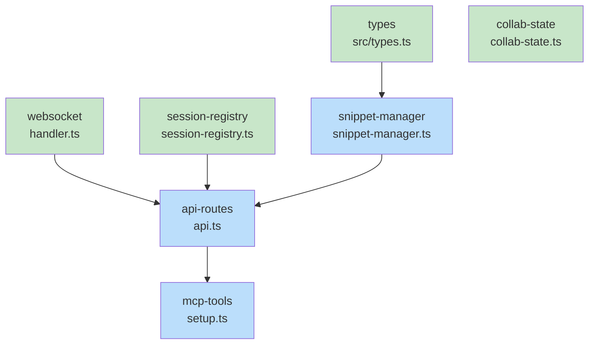

# Blueprint: Item 2 - Snippet Backend

## 1. Structure Summary

### Files
- [ ] `src/types.ts` — Add Snippet, SnippetMeta, SnippetListItem interfaces
- [ ] `src/services/snippet-manager.ts` — New file: SnippetManager class
- [ ] `src/services/session-registry.ts` — Add `snippets/` directory creation
- [ ] `src/routes/api.ts` — Add 5 CRUD routes + update createManagers()
- [ ] `src/mcp/setup.ts` — Register 7 MCP tools
- [ ] `src/websocket/handler.ts` — Add snippet_created/updated/deleted to WSMessage union
- [ ] `src/mcp/tools/collab-state.ts` — Include snippets in archive

### Type Definitions

```typescript
// src/types.ts additions

export interface Snippet {
  id: string;
  name: string;
  content: string;       // raw JSON string: { language, code, filePath?, highlightLines?, originalCode? }
  lastModified: number;
}

export interface SnippetMeta {
  name: string;
  path: string;
  lastModified: number;
}

export interface SnippetListItem {
  id: string;
  name: string;
  lastModified: number;
}

// WebSocket additions (src/websocket/handler.ts)
// snippet_created | snippet_updated | snippet_deleted
```

### Component Interactions
- MCP tools call API routes via HTTP
- API routes instantiate SnippetManager and call CRUD methods
- API routes broadcast WebSocket events after mutations
- Session registry creates snippets/ dir on session init
- collab-state copies snippets/ dir on archive

---

## 2. Function Blueprints

### `SnippetManager.createSnippet(name, content): Promise<string>`

**Pseudocode:**
1. Sanitize name: `name.replace(/[^a-zA-Z0-9-_]/g, '-')`
2. Build filename: `${sanitized}.snippet.json`
3. Check index for collision, throw if exists
4. Validate content.length <= config.MAX_FILE_SIZE
5. Write file
6. Stat file for lastModified
7. Add to index, return id

**Error Handling:**
- Duplicate ID: throw `Snippet ${id} already exists`
- Too large: throw `Snippet too large`

**Edge Cases:**
- Name with special chars → sanitized to dashes
- Empty content → allowed (valid empty JSON)

**Stub:**
```typescript
async createSnippet(name: string, content: string): Promise<string> {
  // TODO: Sanitize name
  // TODO: Check for collision
  // TODO: Validate size
  // TODO: Write file and update index
  throw new Error('Not implemented');
}
```

---

### `SnippetManager.getSnippet(id): Promise<Snippet | null>`

**Pseudocode:**
1. Look up meta in index, return null if not found
2. Read file content
3. Return Snippet object with id, name, content, lastModified

**Stub:**
```typescript
async getSnippet(id: string): Promise<Snippet | null> {
  // TODO: Lookup in index
  // TODO: Read file
  // TODO: Return Snippet
  throw new Error('Not implemented');
}
```

---

### `SnippetManager.saveSnippet(id, content): Promise<void>`

**Pseudocode:**
1. Look up meta in index, throw if not found
2. Validate content.length <= MAX_FILE_SIZE
3. Write file
4. Update index lastModified

**Stub:**
```typescript
async saveSnippet(id: string, content: string): Promise<void> {
  // TODO: Lookup, validate, write, update index
  throw new Error('Not implemented');
}
```

---

### API Route: `POST /api/snippet` (create)

**Pseudocode:**
1. Parse project/session from query params
2. Parse { name, content } from request body
3. Instantiate SnippetManager via createManagers()
4. Call snippetManager.createSnippet(name, content)
5. Broadcast `snippet_created` WebSocket event
6. Return `{ success: true, id }`

**Stub:**
```typescript
if (path === '/api/snippet' && req.method === 'POST') {
  // TODO: Parse params and body
  // TODO: createManagers
  // TODO: snippetManager.createSnippet
  // TODO: wsHandler.broadcast snippet_created
  // TODO: return { success: true, id }
}
```

---

### MCP Tool: `create_snippet`

**Pseudocode:**
1. Extract { project, session, name, language, code, filePath?, highlightLines?, originalCode? }
2. Serialize to JSON content string
3. POST to /api/snippet with { name, content }
4. Return { success: true, id, previewUrl }

**Stub:**
```typescript
case 'create_snippet': {
  // TODO: Extract and validate args
  // TODO: Serialize rich fields to JSON content
  // TODO: Call API POST /api/snippet
  // TODO: Return result
}
```

---

### MCP Tool: `update_snippet`

**Pseudocode:**
1. Extract { project, session, id, ...fields }
2. GET current snippet content from API
3. Parse existing JSON, merge provided fields (language?, code?, filePath?, etc.)
4. Serialize back to JSON
5. POST to /api/snippet/:id with merged content
6. Return { success: true }

**Stub:**
```typescript
case 'update_snippet': {
  // TODO: GET current snippet
  // TODO: Merge partial updates
  // TODO: POST merged content
}
```

---

### `archiveSession()` addition (collab-state.ts)

**Pseudocode:**
1. Define snippetsDir = join(sessionDir, 'snippets')
2. Add `snippets: string[]` to archivedFiles object
3. If snippetsDir exists: readdir, cp each .snippet.json file to archiveDir

---

## 3. Task Dependency Graph

### YAML Graph

```yaml
tasks:
  - id: types
    files: [src/types.ts]
    tests: []
    description: "Add Snippet, SnippetMeta, SnippetListItem interfaces"
    parallel: true
    depends-on: []

  - id: websocket
    files: [src/websocket/handler.ts]
    tests: []
    description: "Add snippet_created, snippet_updated, snippet_deleted to WSMessage union"
    parallel: true
    depends-on: []

  - id: session-registry
    files: [src/services/session-registry.ts]
    tests: []
    description: "Add snippets/ directory creation in registerSession"
    parallel: true
    depends-on: []

  - id: collab-state
    files: [src/mcp/tools/collab-state.ts]
    tests: []
    description: "Include snippets directory in archiveSession"
    parallel: true
    depends-on: []

  - id: snippet-manager
    files: [src/services/snippet-manager.ts]
    tests: [src/services/__tests__/snippet-manager.test.ts]
    description: "New SnippetManager class with CRUD for .snippet.json files"
    parallel: false
    depends-on: [types]

  - id: api-routes
    files: [src/routes/api.ts]
    tests: [src/routes/__tests__/api-snippets.test.ts]
    description: "Add 5 CRUD routes and snippetManager to createManagers"
    parallel: false
    depends-on: [snippet-manager, session-registry, websocket]

  - id: mcp-tools
    files: [src/mcp/setup.ts]
    tests: []
    description: "Register create/get/list/update/delete/history/revert_snippet MCP tools"
    parallel: false
    depends-on: [api-routes]
```

### Execution Waves

**Wave 1 (parallel - no dependencies):**
- `types`
- `websocket`
- `session-registry`
- `collab-state`

**Wave 2:**
- `snippet-manager` (depends on types)

**Wave 3:**
- `api-routes` (depends on snippet-manager, session-registry, websocket)

**Wave 4:**
- `mcp-tools` (depends on api-routes)

### Mermaid Visualization



### Summary
- Total tasks: 7
- Total waves: 4
- Max parallelism: 4 (Wave 1)
