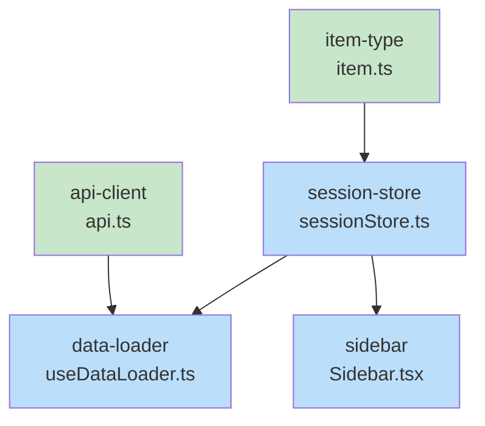

# Blueprint: Item 3 - Snippet UI Plumbing

## 1. Structure Summary

### Files
- [ ] `ui/src/types/item.ts` — Add `'snippet'` to Item type union
- [ ] `ui/src/stores/sessionStore.ts` — Add snippet state + actions
- [ ] `ui/src/lib/api.ts` — Add getSnippets, getSnippet, updateSnippet, deleteSnippet
- [ ] `ui/src/hooks/useDataLoader.ts` — Add getSnippets to parallel fetch
- [ ] `ui/src/components/layout/Sidebar.tsx` — Add snippet entries with code icon

### Type Definitions

```typescript
// ui/src/types/item.ts
type: 'diagram' | 'document' | 'design' | 'spreadsheet' | 'snippet';

// sessionStore snippet state shape
snippets: Snippet[];
selectedSnippetId: string | null;
```

### Component Interactions
- `useDataLoader` fetches snippets via `api.getSnippets()` on session load
- WebSocket handler calls `addSnippet/updateSnippet/removeSnippet` on events
- `Sidebar` reads snippets from store, maps to Item entries with `type: 'snippet'`
- `UnifiedEditor` receives Item with `type: 'snippet'` and routes to SnippetEditor (Item 4)

---

## 2. Function Blueprints

### `api.getSnippets(project, session): Promise<Snippet[]>`

**Pseudocode:**
1. GET /api/snippets?project=...&session=...
2. Parse response.snippets
3. Return array

**Stub:**
```typescript
async getSnippets(project: string, session: string): Promise<Snippet[]> {
  // TODO: GET /api/snippets with params
  // TODO: return response.snippets
  throw new Error('Not implemented');
}
```

---

### `api.updateSnippet(project, session, id, content): Promise<void>`

**Pseudocode:**
1. POST /api/snippet/:id?project=...&session=... with body { content }
2. Check response ok

**Stub:**
```typescript
async updateSnippet(project: string, session: string, id: string, content: string): Promise<void> {
  // TODO: POST /api/snippet/:id
  throw new Error('Not implemented');
}
```

---

### `sessionStore` snippet actions

**setSnippets(snippets):** Replace full array
**addSnippet(snippet):** Append to array
**updateSnippet(id, partial):** Merge partial into existing item
**removeSnippet(id):** Filter out by id
**selectSnippet(id | null):** Set selectedSnippetId
**getSelectedSnippet():** Return snippet matching selectedSnippetId

Pattern: copy exactly from existing `setDesigns/addDesign/updateDesign/removeDesign/selectDesign/getSelectedDesign`.

---

### `useDataLoader` fetch addition

**Pseudocode:**
1. Add `api.getSnippets(project, session)` to the existing `Promise.all([...])` call
2. Destructure the result as `snippets`
3. Call `setSnippets(snippets)` after Promise.all resolves

WebSocket handler additions (wherever diagram_created/updated/deleted are handled):
```typescript
case 'snippet_created': addSnippet({ id, name, content, lastModified }); break;
case 'snippet_updated': updateSnippet(id, { content, lastModified }); break;
case 'snippet_deleted': removeSnippet(id); break;
```

---

### `Sidebar` snippet rendering

**Pseudocode:**
1. Pull `snippets`, `selectedSnippetId`, `removeSnippet` from store
2. Map snippets to Item objects: `{ id, name, type: 'snippet', content, lastModified }`
3. Render snippet entries in the artifact list using the same row component as other types
4. Icon: `Code` from `lucide-react`

---

## 3. Task Dependency Graph

### YAML Graph

```yaml
tasks:
  - id: item-type
    files: [ui/src/types/item.ts]
    tests: []
    description: "Add 'snippet' to Item type union"
    parallel: true
    depends-on: []

  - id: api-client
    files: [ui/src/lib/api.ts]
    tests: []
    description: "Add getSnippets, getSnippet, updateSnippet, deleteSnippet methods"
    parallel: true
    depends-on: []

  - id: session-store
    files: [ui/src/stores/sessionStore.ts]
    tests: []
    description: "Add snippet state and CRUD actions following design pattern"
    parallel: false
    depends-on: [item-type]

  - id: data-loader
    files: [ui/src/hooks/useDataLoader.ts]
    tests: []
    description: "Add getSnippets to parallel fetch and WebSocket handlers"
    parallel: false
    depends-on: [api-client, session-store]

  - id: sidebar
    files: [ui/src/components/layout/Sidebar.tsx]
    tests: []
    description: "Add snippet entries with Code icon to artifact list"
    parallel: false
    depends-on: [session-store]
```

### Execution Waves

**Wave 1 (parallel):**
- `item-type`
- `api-client`

**Wave 2:**
- `session-store` (depends on item-type)

**Wave 3:**
- `data-loader` (depends on api-client + session-store)
- `sidebar` (depends on session-store)

### Mermaid Visualization



### Summary
- Total tasks: 5
- Total waves: 3
- Max parallelism: 2 (Wave 1)
