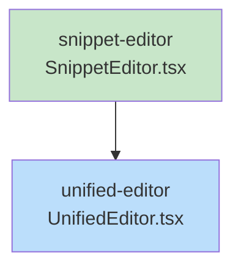

# Blueprint: Item 4 - SnippetEditor Component

## 1. Structure Summary

### Files
- [ ] `ui/src/components/editors/SnippetEditor.tsx` — New component
- [ ] `ui/src/components/editors/UnifiedEditor.tsx` — Add snippet routing

### Type Definitions

```typescript
// SnippetEditor.tsx internal types

interface SnippetData {
  language: string;
  code: string;
  filePath?: string;
  highlightLines?: number[];
  originalCode?: string;
}

interface SnippetEditorProps {
  snippetId: string;
}

// Language map
const EXT_TO_LANGUAGE: Record<string, string> = {
  '.ts': 'typescript',
  '.tsx': 'typescript',
  '.js': 'javascript',
  '.jsx': 'javascript',
  '.py': 'python',
  '.go': 'go',
  '.rs': 'rust',
  '.json': 'json',
  '.css': 'css',
  '.html': 'html',
  '.md': 'markdown',
  '.sh': 'shell',
  '.sql': 'sql',
};
```

### Component Interactions
- Reads snippet from `sessionStore` by `snippetId`
- Parses JSON `content` into `SnippetData` fields
- On user code edit: serializes back, calls `api.updateSnippet` + store `updateSnippet`
- Uses `CodeMirrorWrapper` (existing) for code view
- Uses `DiffView` (existing, from `ai-ui/display/DiffView`) for diff view
- Registered in `UnifiedEditor` with `item.type === 'snippet'` check

---

## 2. Function Blueprints

### `SnippetEditor` component

**Pseudocode:**
1. Get snippet from store via snippetId
2. Parse content JSON → { language, code, filePath, highlightLines, originalCode }
3. Local state: `viewMode: 'code' | 'diff'`, initialized to 'code'
4. Auto-detect language from filePath extension if language not explicit
5. Render toolbar:
   - Language dropdown (left) — value=language, onChange updates field + re-serializes
   - FilePath badge (left, if present) — gray text display
   - Spacer
   - Diff toggle button (right) — disabled if no originalCode, active state when diff mode
   - Copy button (right) — copies `code` to clipboard
6. Render editor area based on viewMode:
   - 'code': `<CodeMirrorWrapper>` with language, line numbers, highlight decorations
   - 'diff': `<DiffView>` with oldCode=originalCode, newCode=code

**Error Handling:**
- If snippet not found in store: render empty placeholder
- If content JSON parse fails: treat code as raw string, language as 'plaintext'

**Edge Cases:**
- `highlightLines` empty/undefined: no decorations applied
- `originalCode` undefined: diff toggle disabled, diff mode inaccessible
- Language not in EXT_TO_LANGUAGE map: fallback to 'plaintext'

**Stub:**
```typescript
export const SnippetEditor: React.FC<SnippetEditorProps> = ({ snippetId }) => {
  // TODO: Get snippet from store
  // TODO: Parse JSON content → SnippetData
  // TODO: Local viewMode state
  // TODO: Detect language from filePath
  // TODO: handleCodeChange - serialize and save
  // TODO: handleLanguageChange - update language field
  // TODO: handleCopy - clipboard
  // TODO: Render toolbar + editor area
  throw new Error('Not implemented');
};
```

---

### `handleCodeChange(newCode: string): void`

**Pseudocode:**
1. Update local `code` field in SnippetData
2. Serialize full SnippetData back to JSON string
3. Call `store.updateSnippet(snippetId, { content: jsonString })`
4. Call `api.updateSnippet(project, session, snippetId, jsonString)` (debounced, ~500ms)

**Stub:**
```typescript
const handleCodeChange = useCallback((newCode: string) => {
  // TODO: Update SnippetData.code
  // TODO: Serialize to JSON
  // TODO: Update store
  // TODO: Debounced API call
}, [snippetId, snippetData]);
```

---

### `getHighlightDecorations(highlightLines: number[])`

**Pseudocode:**
1. Build CodeMirror `Decoration` for each line number in highlightLines
2. Use `lineDecoration` with className `snippet-highlight-line`
3. Return `DecorationSet` via `StateField` or `ViewPlugin`

**CSS:**
```css
.snippet-highlight-line {
  background-color: rgb(254 249 195 / 0.5); /* yellow-50/50 */
}
.dark .snippet-highlight-line {
  background-color: rgb(113 63 18 / 0.3); /* yellow-900/30 */
}
```

**Stub:**
```typescript
function buildHighlightExtension(lines: number[]) {
  // TODO: Create CodeMirror decoration for each line
  // TODO: Return ViewPlugin or StateField
}
```

---

### `UnifiedEditor` addition

**Pseudocode:**
1. After the `item.type === 'spreadsheet'` block (~line 257)
2. Add: `if (item.type === 'snippet') return <div ...><SnippetEditor key={item.id} snippetId={item.id} /></div>`
3. Add import: `import { SnippetEditor } from '@/components/editors/SnippetEditor'`

---

## 3. Task Dependency Graph

### YAML Graph

```yaml
tasks:
  - id: snippet-editor
    files: [ui/src/components/editors/SnippetEditor.tsx]
    tests: [ui/src/components/editors/__tests__/SnippetEditor.test.tsx]
    description: "New SnippetEditor component with CodeMirror, toolbar, diff toggle, line highlighting"
    parallel: true
    depends-on: []

  - id: unified-editor
    files: [ui/src/components/editors/UnifiedEditor.tsx]
    tests: []
    description: "Add snippet type routing to UnifiedEditor"
    parallel: false
    depends-on: [snippet-editor]
```

### Execution Waves

**Wave 1:**
- `snippet-editor`

**Wave 2:**
- `unified-editor` (depends on snippet-editor)

### Mermaid Visualization



### Summary
- Total tasks: 2
- Total waves: 2
- Max parallelism: 1
