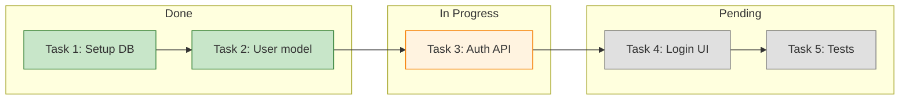
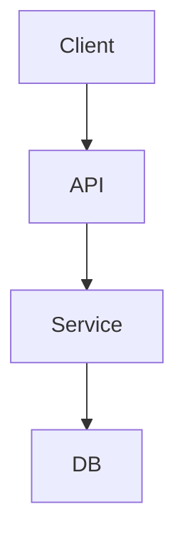
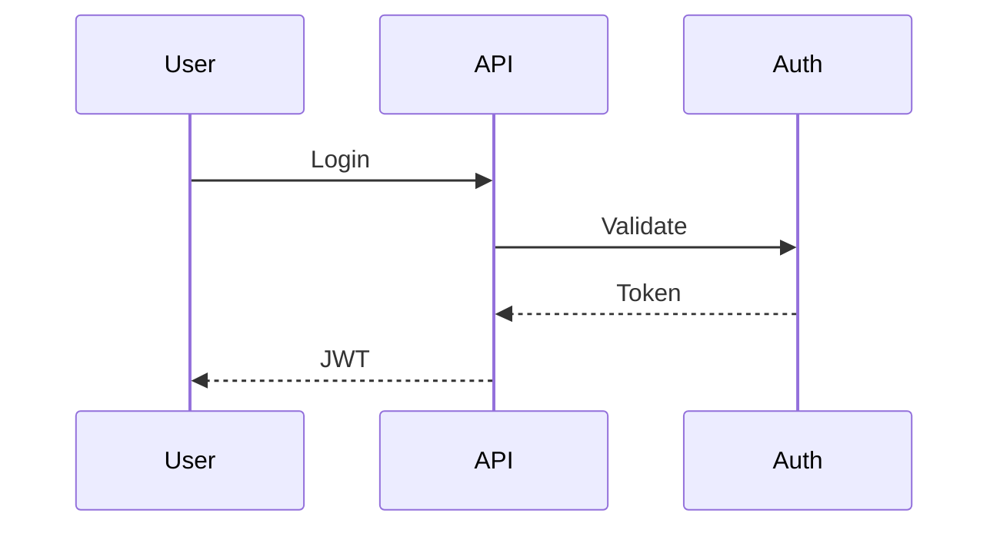
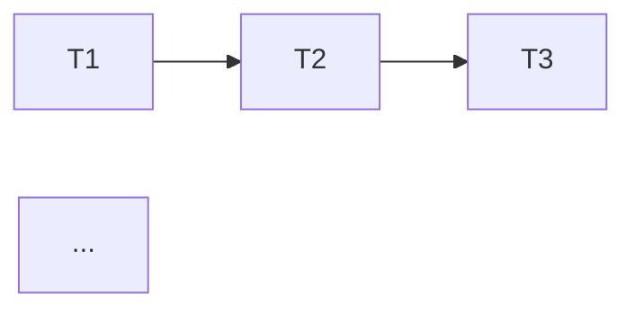

# Collab Workflow Implementation Design

## Problem / Goal

Implement the comprehensive collab workflow with hooks as defined in the collab-workflow diagram. This includes:
- Adding the 3 recommended hooks (server-check, verify-phase, post-task-complete)
- Implementing the partial/optional features (context-recovery, sync-diagram-to-doc, immediate state saves)
- Ensuring all skills work together as shown in the workflow

## Current State (from EXPLORING)

### Existing Skills
| Skill | Purpose | Status |
|-------|---------|--------|
| collab | Session management, server startup | Exists |
| brainstorming | Design exploration, live design doc | Exists |
| rough-draft | Interface → Pseudocode → Skeleton → Implementation | Exists |
| systematic-debugging | Root cause investigation, 4-phase process | Exists |
| subagent-driven-development | Task execution with spec + quality review | Exists |
| executing-plans | Batch execution with checkpoints | Exists |
| test-driven-development | RED → GREEN → REFACTOR | Exists |
| verification-before-completion | Verify before claiming done | Exists |
| using-git-worktrees | Isolated workspace creation | Exists |
| finishing-a-development-branch | PR/merge/cleanup options | Exists |

### What's Referenced But Not Implemented
1. **server-check hook** - ✅ DESIGNED
2. **brainstorming phase enforcement** - ✅ DESIGNED
3. **verify-phase hook** - ✅ DESIGNED
4. **post-task-complete hook** - ✅ DESIGNED
5. **context-recovery** - ✅ DESIGNED
6. **sync-diagram-to-doc** - ✅ DESIGNED
7. **immediate state saves** - ✅ DESIGNED

---

## ✅ DECISION: server-check hook

**Approach:** Claude Code PreToolUse hook (not part of skill)

### Specification
| Property | Value |
|----------|-------|
| Type | PreToolUse |
| Trigger | `mcp__mermaid__*` tool calls |
| Location | `hooks/server-check.sh` |
| Purpose | Ensure mermaid-collab server is running before any MCP tool call |

### Behavior
1. Check if port 3737 responds (`curl --silent --fail`)
2. If responding → exit 0 (proceed with tool)
3. If not responding:
   - Start server: `bun run src/server.ts &`
   - Poll every 500ms for up to 10 seconds
   - If started → exit 0
   - If timeout → exit 1 with error message

### Implementation Files
- `hooks/server-check.sh` - The hook script
- `.claude/settings.local.json` - Hook configuration

---

## ✅ DECISION: brainstorming phase enforcement

**Approach:** Hybrid - Phase hooks + Tool restrictions + Exit gate skill

### Problem Solved
Prevents premature implementation during brainstorming. Example: discussing one design item, then immediately implementing it before other items are discussed.

### Key Design Decisions

| Question | Decision | Rationale |
|----------|----------|-----------|
| How to track phase? | **State file** | Persists across sessions, `.collab/session/state.json` |
| What are design files? | **Everything in `.collab/`** | Brainstorming always happens in collab session |
| Exit gate mechanism? | **Skill with validation** | Explicit `/ready-to-implement` skill |

### Components

#### 1. State File (`.collab/{session}/collab-state.json`)
```json
{
  "phase": "brainstorming",  // or "implementation"
  "subphase": "DESIGNING",   // EXPLORING, CLARIFYING, DESIGNING, VALIDATING
  "items": [...],
  "lastUpdated": "2026-01-19T..."
}
```

#### 2. Light Phase Hooks (logging + state saves)
- Log phase transitions (EXPLORING → CLARIFYING → DESIGNING → VALIDATING)
- Auto-save state at each transition
- Non-blocking - just observability

#### 3. Tool Restrictions During Brainstorming
- **Block:** Write, Edit tools on files outside `.collab/`
- **Allow:** Read, Grep, Glob (exploration is fine)
- **Allow:** MCP tools (design doc/diagrams live in collab)
- **Enforcement:** PreToolUse hook checks `state.phase === "brainstorming"`

#### 4. Exit Gate: `/ready-to-implement` Skill
- User explicitly invokes to transition out of brainstorming
- Validation checks:
  - All items in design doc have decisions marked (✅)
  - User confirms: "Design complete, ready to implement?"
- On confirmation:
  - Updates `state.phase` to `"implementation"`
  - Unblocks Write/Edit for implementation files

### Flow
```
/collab → state.phase = "brainstorming"
         ↓
  [Write/Edit blocked outside .collab/]
         ↓
  Design work in collab session
         ↓
/ready-to-implement → validate → confirm
         ↓
  state.phase = "implementation"
         ↓
  [Write/Edit allowed everywhere]
```

---

## ✅ DECISION: verify-phase hook

**Approach:** PostToolUse hook with LLM-based drift detection

### Problem Solved
Detects when rough-draft implementation is drifting from the original design intent. Catches drift early at phase boundaries rather than at the end.

### Key Design Decisions

| Question | Decision | Rationale |
|----------|----------|-----------|
| When to trigger? | **After each phase completes** | INTERFACE → PSEUDOCODE → SKELETON transitions |
| How to detect drift? | **LLM compares to design doc** | Read current work + design doc, judge alignment |
| What happens on drift? | **Present pros/cons, suggest, let user decide** | May need to return to brainstorming |

### Specification
| Property | Value |
|----------|-------|
| Type | PostToolUse (or explicit skill call) |
| Trigger | After INTERFACE, PSEUDOCODE, SKELETON phases complete |
| Location | `hooks/verify-phase.sh` or `/verify-phase` skill |
| Purpose | Detect drift from design doc, present options |

### Behavior

#### 1. Detection
- Read current phase output (interface/pseudocode/skeleton)
- Read original design doc from collab session
- LLM evaluates: "Does this align with the design?"

#### 2. If Aligned
- Log confirmation: "Phase complete, aligned with design"
- Proceed to next phase

#### 3. If Drift Detected
Present to user:

```
⚠️ Drift detected in INTERFACE phase

**What changed:**
- Design doc specified REST API, but implementation uses GraphQL
- Added authentication layer not in original scope

**Pros of accepting drift:**
- GraphQL provides better client flexibility
- Auth is needed anyway, might as well add now

**Cons of accepting drift:**
- Scope creep - original timeline didn't account for this
- Design doc is now out of sync
- Other dependent work may need updates

**Suggestion:** Accept the GraphQL change (improves design), 
but defer auth to a separate work item.

**Options:**
1. Accept drift → Return to brainstorming to update design doc
2. Reject drift → Redo this phase aligned with original design
3. Partially accept → [specify what to keep/discard]
```

#### 4. If Accepted
- Transition back to brainstorming phase
- Update design doc to reflect new direction
- Re-run `/ready-to-implement` before continuing

### Flow
```
INTERFACE complete
       ↓
  verify-phase hook
       ↓
   Drift? ──No──→ Continue to PSEUDOCODE
       │
      Yes
       ↓
  Show pros/cons + suggestion
       ↓
   User choice
       │
  ┌────┴────┐
Accept    Reject
  │         │
  ↓         ↓
Return    Redo
to        phase
brainstorm
```

### Connection to Brainstorming Enforcement
- If drift is accepted, `state.phase` changes back to `"brainstorming"`
- Tool restrictions re-engage (Write/Edit blocked outside `.collab/`)
- Must go through `/ready-to-implement` again before continuing

---

## ✅ DECISION: post-task-complete hook

**Approach:** State-file-triggered hook that updates task graph diagram

### Problem Solved
Keeps task graph diagram in sync with implementation progress. Provides visibility into what's done and what's remaining.

### Key Design Decisions

| Question | Decision | Rationale |
|----------|----------|-----------|
| When to trigger? | **State file change detection** | Watches for task status → "complete" |
| What actions? | **Update diagram + log completion** | Required for visibility |
| Where is task graph? | **Separate diagram in collab session** | Visual progress tracking |

### Specification
| Property | Value |
|----------|-------|
| Type | PostToolUse or file watcher |
| Trigger | Task status changes to "complete" in state file |
| Location | `hooks/post-task-complete.sh` |
| Purpose | Update task graph diagram, log completion |

### Task Graph Diagram

Lives in collab session as a separate Mermaid diagram (e.g., `task-graph.mmd`):



### Behavior

#### 1. Trigger Detection
- Subagent completes task → updates `collab-state.json`
- Hook detects task status changed to "complete"

#### 2. Update Task Graph Diagram
- Read current `task-graph.mmd` from collab session
- Move completed task from "In Progress" to "Done"
- Update styling (change class to `done`)
- Save updated diagram via MCP tool

#### 3. Log Completion
- Append to completion log in state file:
```json
{
  "completionLog": [
    {"task": "T1", "completedAt": "2026-01-19T10:30:00Z", "notes": "..."},
    {"task": "T2", "completedAt": "2026-01-19T11:45:00Z", "notes": "..."}
  ]
}
```

#### 4. Notify (optional)
- Output: "✅ Task 3 complete. 2/5 tasks done, 3 remaining."

### Flow
```
Subagent completes task
         ↓
  Updates state file (task.status = "complete")
         ↓
  post-task-complete hook triggers
         ↓
  ┌───────────────────────────┐
  │ 1. Update task-graph.mmd  │
  │ 2. Log to completionLog   │
  │ 3. Notify user (optional) │
  └───────────────────────────┘
         ↓
  executing-plans picks next task
```

### State File Addition
```json
{
  "phase": "implementation",
  "tasks": [
    {"id": "T1", "name": "Setup DB", "status": "complete"},
    {"id": "T2", "name": "User model", "status": "complete"},
    {"id": "T3", "name": "Auth API", "status": "in_progress"},
    {"id": "T4", "name": "Login UI", "status": "pending", "dependsOn": ["T3"]},
    {"id": "T5", "name": "Tests", "status": "pending", "dependsOn": ["T4"]}
  ],
  "completionLog": [...]
}
```

---

## ✅ DECISION: context-recovery

**Approach:** Integrated into `/collab` skill resume flow

### Problem Solved
Restores context when resuming a collab session after:
- Context compaction (conversation got too long)
- New conversation picking up previous work
- Coming back after a break

### Key Design Decisions

| Question | Decision | Rationale |
|----------|----------|-----------|
| When to trigger? | **On session resume via `/collab`** | Natural part of resume flow |
| What to recover? | **All available information** | Full context for continuity |
| How to present? | **Summary message, then continue** | Quick orientation |
| Hook or skill? | **Part of `/collab` skill** | Integrated, not separate |

### Information Recovered

| Data | Source | Purpose |
|------|--------|---------|
| Current phase | `collab-state.json` | Know if brainstorming or implementing |
| Current subphase | `collab-state.json` | Know exact position (EXPLORING, INTERFACE, etc.) |
| Design decisions | Design doc | What's been decided |
| Open questions | Design doc "Items to Discuss" | What still needs work |
| Tasks completed | State file + task graph | Implementation progress |
| Tasks remaining | State file + task graph | What's left to do |
| Recent activity | Completion log | What just happened |

### Summary Message Format

```
## Session Resumed: {session-name}

**Phase:** Implementation (rough-draft → SKELETON)

**Design Decisions Made:**
- ✅ server-check hook: PreToolUse on mermaid tools
- ✅ brainstorming enforcement: Hybrid approach
- ✅ verify-phase hook: LLM comparison after each phase
- ... (3 more)

**Open Questions:**
- sync-diagram-to-doc: When should diagrams sync?
- immediate state saves: What triggers saves?

**Task Progress:** 3/7 complete
- ✅ T1: Setup state file structure
- ✅ T2: Implement server-check hook
- ✅ T3: Add hook to settings
- 🔄 T4: Implement brainstorming enforcement (in progress)
- ⬜ T5-T7: Remaining tasks

**Last Activity:** T3 completed 2 hours ago

---
Continue from SKELETON phase?
```

### Flow
```
/collab
   ↓
Show sessions → User picks "Resume session X"
   ↓
Load collab-state.json
   ↓
Read design doc + task graph
   ↓
Generate summary message
   ↓
Output summary to user
   ↓
"Continue from {phase}?"
   ↓
Proceed with work
```

### Integration with `/collab` Skill

The `/collab` skill flow becomes:

1. Check for existing sessions
2. If resuming:
   - Load state file
   - Read all collab artifacts (design doc, diagrams, task graph)
   - Generate and display summary
   - Confirm continuation point
   - Set phase/subphase context
3. If new:
   - Create session directory
   - Initialize state file
   - Begin brainstorming

---

## ✅ DECISION: sync-diagram-to-doc

**Approach:** Auto-sync on diagram change, inline Mermaid in design doc

### Problem Solved
Keeps design doc and diagrams connected. Ensures Claude has diagram content in context during rough-draft for accurate implementation.

### Key Design Decisions

| Question | Decision | Rationale |
|----------|----------|-----------|
| When to sync? | **On diagram create/update** | Always current, no manual step |
| Which diagrams? | **All diagrams in session** | Complete picture |
| How to embed? | **Inline Mermaid code** | Claude can read directly, no extra tool calls |
| Where in doc? | **Dedicated section + inline refs** | Organized but contextual |

### Why Inline Mermaid?

During rough-draft, Claude needs diagram content to:
- Understand architecture decisions
- Check alignment with design
- Reference structure during implementation

If diagrams are just links, Claude would need extra `get_diagram` calls. Inline Mermaid gives immediate access.

### Document Structure

```markdown
## Key Decisions

### Authentication
We chose JWT tokens (see [auth-flow diagram](#diagrams))...

### Architecture  
The system uses a layered approach (see [architecture diagram](#diagrams))...

---

## Diagrams

### architecture


### auth-flow


### task-graph

```

### Behavior

#### 1. On Diagram Create
- Hook detects `mcp__mermaid__create_diagram` call
- Reads new diagram content
- Appends to "Diagrams" section in design doc
- Adds inline reference if contextually relevant

#### 2. On Diagram Update
- Hook detects `mcp__mermaid__update_diagram` call
- Finds existing diagram section in doc
- Replaces Mermaid code block with new content
- Preserves surrounding text/context

#### 3. Sync Mechanism
- PostToolUse hook on `mcp__mermaid__create_diagram` and `mcp__mermaid__update_diagram`
- Reads diagram content from MCP response
- Updates design doc via `mcp__mermaid__update_document`

### Flow
```
Create/Update diagram via MCP
         ↓
  PostToolUse hook triggers
         ↓
  Read diagram content
         ↓
  Read current design doc
         ↓
  Find/create diagram section
         ↓
  Update Mermaid code block
         ↓
  Save design doc via MCP
```

### Edge Cases

| Case | Handling |
|------|----------|
| Diagram deleted | Remove from doc's Diagrams section |
| Doc doesn't exist | Create minimal doc with Diagrams section |
| Diagram renamed | Update section header, preserve content |
| Multiple diagrams at once | Batch updates to avoid conflicts |

---

## ✅ DECISION: immediate state saves

**Approach:** Hook-triggered saves at phase transitions, blocking, stored via MCP

### Problem Solved
Ensures state is captured at critical moments so context-recovery works and progress isn't lost on crashes or compaction.

### Key Design Decisions

| Question | Decision | Rationale |
|----------|----------|-----------|
| What triggers saves? | **PostToolUse hooks + phase transitions** | Piggyback on existing hooks |
| What to save? | **Current structure + lastAction** | Structured state, not conversation |
| Where does logic live? | **Hybrid - hooks trigger, MCP stores** | Clean separation |
| Blocking or async? | **Blocking** | Small/fast, guarantees capture |

### Save Triggers

State saves happen automatically at these moments:

| Trigger | Hook | What's Saved |
|---------|------|--------------|
| Phase transition | brainstorming → implementation | phase, subphase |
| Subphase transition | EXPLORING → CLARIFYING, etc. | subphase, lastAction |
| Task completion | post-task-complete hook | tasks, completionLog |
| Design decision made | After updating design doc | items (parsed from doc) |
| Drift accepted/rejected | verify-phase hook | phase (may revert to brainstorming) |
| Session start/resume | `/collab` skill | Initialize or validate state |

### Enhanced State File

```json
{
  "phase": "implementation",
  "subphase": "SKELETON",
  "lastAction": {
    "type": "task_complete",
    "task": "T3",
    "timestamp": "2026-01-19T14:30:00Z",
    "notes": "Auth API implemented with JWT"
  },
  "tasks": [...],
  "completionLog": [...],
  "lastUpdated": "2026-01-19T14:30:00Z",
  "checkpoints": [
    {"phase": "brainstorming", "subphase": "VALIDATING", "at": "..."},
    {"phase": "implementation", "subphase": "INTERFACE", "at": "..."},
    {"phase": "implementation", "subphase": "PSEUDOCODE", "at": "..."}
  ]
}
```

### Save Behavior

#### 1. Integration with Existing Hooks
Each hook that modifies state calls save at the end:

```
post-task-complete hook:
  1. Update task status
  2. Update task graph diagram
  3. Log to completionLog
  4. → SAVE STATE (blocking)
  5. Return

verify-phase hook:
  1. Detect drift
  2. If accepted: update phase
  3. → SAVE STATE (blocking)
  4. Return
```

#### 2. Save Implementation
- Hook calls MCP tool or writes directly to `.collab/{session}/collab-state.json`
- Blocking - wait for write to complete
- Include timestamp in `lastUpdated`

#### 3. Checkpoints
- Track major phase/subphase transitions in `checkpoints` array
- Enables "rollback to checkpoint" if needed
- Limited to last N checkpoints (e.g., 10) to avoid bloat

### Flow
```
Action completes (task done, phase change, etc.)
         ↓
  Hook updates in-memory state
         ↓
  Hook calls save
         ↓
  Write to collab-state.json (blocking)
         ↓
  Continue to next action
```

### Why Blocking?

| Consideration | Reasoning |
|---------------|-----------|
| File size | Small JSON, writes are fast (<10ms) |
| Reliability | Guarantees state captured before next action |
| Simplicity | No async coordination, no race conditions |
| Recovery | If crash happens, last save is complete |

### Error Handling

| Error | Handling |
|-------|----------|
| Write fails | Retry once, then warn user but continue |
| File locked | Wait up to 1s, then warn and continue |
| Disk full | Warn user, continue without save |

---

## Items Still To Discuss

1. ~~**server-check hook**~~ ✅ DECIDED
2. ~~**brainstorming phase enforcement**~~ ✅ DECIDED
3. ~~**verify-phase hook**~~ ✅ DECIDED
4. ~~**post-task-complete hook**~~ ✅ DECIDED
5. ~~**context-recovery**~~ ✅ DECIDED
6. ~~**sync-diagram-to-doc**~~ ✅ DECIDED
7. ~~**immediate state saves**~~ ✅ DECIDED

**ALL ITEMS DECIDED** ✅

## Key Decisions

| # | Decision | Rationale |
|---|----------|-----------|
| 1 | server-check as PreToolUse hook | Auto-runs on any mermaid tool, no skill logic needed |
| 2 | Brainstorming enforcement via hybrid | Phase hooks for observability, tool restrictions to prevent drift, exit gate skill for explicit transition |
| 2a | State file for phase tracking | Persists across sessions, lives in `.collab/session/` |
| 2b | Design files = `.collab/**/*` | Brainstorming always in collab, simple boundary |
| 2c | `/ready-to-implement` skill | Explicit user intent, validation before transition |
| 3 | verify-phase after each rough-draft phase | Catches drift early at INTERFACE/PSEUDOCODE/SKELETON boundaries |
| 3a | LLM comparison to design doc | Automated detection, no manual checklist needed |
| 3b | Present pros/cons + suggestion on drift | User decides, may return to brainstorming to update design |
| 4 | post-task-complete via state file detection | Decoupled - subagent updates state, hook reacts |
| 4a | Update diagram + log completion | Required actions for visibility and audit |
| 4b | Task graph as separate collab diagram | Visual progress tracking, updated automatically |
| 5 | context-recovery in `/collab` skill | Integrated resume flow, not separate |
| 5a | Recover all available information | Full context for continuity |
| 5b | Summary message + continue | Quick orientation, then proceed |
| 6 | sync-diagram-to-doc on change | Always current, no manual sync |
| 6a | All diagrams synced | Complete picture in doc |
| 6b | Inline Mermaid code | Claude reads directly, better context for rough-draft |
| 6c | Dedicated section + inline refs | Organized but contextual |
| 7 | State saves via existing hooks | Piggyback on post-task-complete, verify-phase, etc. |
| 7a | Blocking saves | Fast, reliable, simple |
| 7b | Checkpoints for rollback | Track major transitions |

## Success Criteria

- All hooks implemented and configured in `.claude/settings.local.json`
- State file created/updated at appropriate moments
- Context recovery shows accurate summary on session resume
- Diagrams sync to design doc automatically
- Drift detection works at phase boundaries
- Task graph updates on task completion
- No state loss on conversation compaction or restart

## Out of Scope

- Conversation transcript storage (handled by episodic memory)
- Multi-user collaboration (single-user sessions only)
- Remote/cloud state sync (local files only)
- Undo/redo beyond checkpoint rollback
