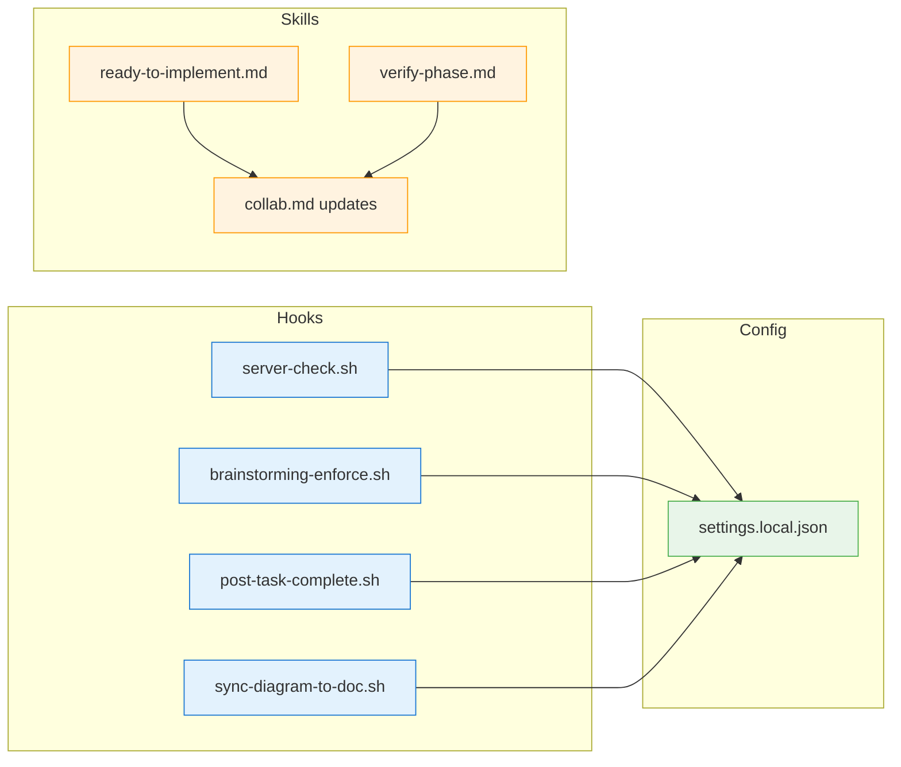

# Collab Workflow Skeleton

## Phase: SKELETON

This document outlines all files to be created with their structure.

---

## File Structure Overview

```
hooks/
├── server-check.sh           # NEW
├── brainstorming-enforce.sh  # NEW  
├── post-task-complete.sh     # NEW
└── sync-diagram-to-doc.sh    # NEW

skills/
├── collab.md                 # MODIFY (add context-recovery)
├── ready-to-implement.md     # NEW
└── verify-phase.md           # NEW

.claude/
└── settings.local.json       # MODIFY (add hook config)
```

---

## 1. hooks/server-check.sh

```bash
#!/bin/bash
# hooks/server-check.sh
# PreToolUse hook for mcp__mermaid__* tools
# Ensures mermaid-collab server is running

set -e

PORT=${MERMAID_PORT:-3737}
MAX_WAIT=10
POLL_INTERVAL=0.5

SCRIPT_DIR="$(cd "$(dirname "${BASH_SOURCE[0]}")" && pwd)"
PROJECT_ROOT="$(dirname "$SCRIPT_DIR")"

check_server() {
    curl --silent --fail --max-time 1 "http://localhost:$PORT" > /dev/null 2>&1
}

# Already running?
if check_server; then
    exit 0
fi

# Start server
echo "Starting mermaid-collab server..." >&2
cd "$PROJECT_ROOT" && bun run src/server.ts > /dev/null 2>&1 &

# Wait for ready
elapsed=0
while [ "$elapsed" -lt "$MAX_WAIT" ]; do
    if check_server; then
        echo "Server ready on port $PORT" >&2
        exit 0
    fi
    sleep $POLL_INTERVAL
    elapsed=$((elapsed + 1))
done

echo "ERROR: Server failed to start within ${MAX_WAIT}s" >&2
exit 1
```

---

## 2. hooks/brainstorming-enforce.sh

```bash
#!/bin/bash
# hooks/brainstorming-enforce.sh
# PreToolUse hook for Write/Edit tools
# Blocks edits outside .collab/ during brainstorming phase

set -e

# Parse file_path from TOOL_INPUT
FILE_PATH=$(echo "$TOOL_INPUT" | jq -r '.file_path // .filePath // empty')

if [ -z "$FILE_PATH" ]; then
    # Can't determine file, allow
    exit 0
fi

# Find session path
find_session_path() {
    if [ -n "$COLLAB_SESSION_PATH" ]; then
        echo "$COLLAB_SESSION_PATH"
        return
    fi
    
    # Scan for .collab/
    local current="$PWD"
    while [ "$current" != "/" ]; do
        if [ -d "$current/.collab" ]; then
            # Find most recent session
            local latest=$(ls -t "$current/.collab" 2>/dev/null | head -1)
            if [ -n "$latest" ]; then
                echo "$current/.collab/$latest"
                return
            fi
        fi
        current=$(dirname "$current")
    done
}

SESSION_PATH=$(find_session_path)

if [ -z "$SESSION_PATH" ]; then
    # No session, allow all
    exit 0
fi

STATE_FILE="$SESSION_PATH/collab-state.json"

if [ ! -f "$STATE_FILE" ]; then
    exit 0
fi

# Read phase
PHASE=$(jq -r '.phase' "$STATE_FILE")

if [ "$PHASE" = "implementation" ]; then
    exit 0
fi

# Brainstorming - check if file is in .collab/
COLLAB_DIR=$(dirname "$SESSION_PATH")

case "$FILE_PATH" in
    "$COLLAB_DIR"*)
        exit 0
        ;;
    *)
        echo '{"result":"block","reason":"Cannot edit files outside .collab/ during brainstorming phase","suggestion":"Use /ready-to-implement to transition to implementation phase"}'
        exit 1
        ;;
esac
```

---

## 3. hooks/post-task-complete.sh

```bash
#!/bin/bash
# hooks/post-task-complete.sh
# Updates task graph and logs completion

set -e

TASK_ID="$COMPLETED_TASK_ID"

# Find session
find_session_path() {
    # ... same as above ...
}

SESSION_PATH=$(find_session_path)
[ -z "$SESSION_PATH" ] && exit 0

STATE_FILE="$SESSION_PATH/collab-state.json"
[ ! -f "$STATE_FILE" ] && exit 0

# Read state
STATE=$(cat "$STATE_FILE")

# Find task name
TASK_NAME=$(echo "$STATE" | jq -r --arg id "$TASK_ID" '.tasks[] | select(.id == $id) | .name')

# Add to completion log
TIMESTAMP=$(date -u +"%Y-%m-%dT%H:%M:%SZ")
STATE=$(echo "$STATE" | jq --arg id "$TASK_ID" --arg ts "$TIMESTAMP" \
    '.completionLog += [{"task": $id, "completedAt": $ts}]')

# Update lastAction
STATE=$(echo "$STATE" | jq --arg ts "$TIMESTAMP" --arg name "$TASK_NAME" \
    '.lastAction = {"type": "task_complete", "details": ("Completed: " + $name), "timestamp": $ts}')

STATE=$(echo "$STATE" | jq --arg ts "$TIMESTAMP" '.lastUpdated = $ts')

# Write state
echo "$STATE" > "$STATE_FILE"

# Update task graph (simplified - full impl uses MCP)
# TODO: Generate mermaid diagram and write to diagrams/task-graph.mmd

# Output notification
COMPLETE=$(echo "$STATE" | jq '[.tasks[] | select(.status == "complete")] | length')
TOTAL=$(echo "$STATE" | jq '.tasks | length')
echo "✅ Task $TASK_ID ($TASK_NAME) complete. $COMPLETE/$TOTAL tasks done."

exit 0
```

---

## 4. hooks/sync-diagram-to-doc.sh

```bash
#!/bin/bash
# hooks/sync-diagram-to-doc.sh
# PostToolUse hook for diagram create/update
# Syncs diagram content to design doc

set -e

# Parse diagram ID from tool output
DIAGRAM_ID=$(echo "$TOOL_OUTPUT" | jq -r '.id // empty')
[ -z "$DIAGRAM_ID" ] && exit 0

# Find session
find_session_path() {
    # ... same as above ...
}

SESSION_PATH=$(find_session_path)
[ -z "$SESSION_PATH" ] && exit 0

# Read diagram content
DIAGRAM_FILE="$SESSION_PATH/diagrams/$DIAGRAM_ID.mmd"
[ ! -f "$DIAGRAM_FILE" ] && exit 0
DIAGRAM_CONTENT=$(cat "$DIAGRAM_FILE")

# Read or create design doc
DOC_FILE="$SESSION_PATH/documents/design.md"
if [ -f "$DOC_FILE" ]; then
    DOC_CONTENT=$(cat "$DOC_FILE")
else
    DOC_CONTENT="# Design\n\n## Diagrams\n"
fi

# TODO: Implement section replacement logic
# For now, just append if not exists
if ! echo "$DOC_CONTENT" | grep -q "### $DIAGRAM_ID"; then
    DOC_CONTENT="$DOC_CONTENT\n\n### $DIAGRAM_ID\n\`\`\`mermaid\n$DIAGRAM_CONTENT\n\`\`\`\n"
    echo -e "$DOC_CONTENT" > "$DOC_FILE"
fi

exit 0
```

---

## 5. skills/ready-to-implement.md

```markdown
---
name: ready-to-implement
description: Validate design completion and transition to implementation phase
---

# Ready to Implement

Validates that all design decisions are complete and transitions from brainstorming to implementation phase.

## Behavior

1. Find active collab session
2. Read design document
3. Check for undecided items (items without ✅ or ~~strikethrough~~)
4. If incomplete: list missing decisions
5. If complete: ask user confirmation
6. On confirm: update state.phase to "implementation"

## Implementation

When invoked:

1. Read `$COLLAB_SESSION_PATH/collab-state.json`
2. If already in implementation phase, inform user and return
3. Read design doc via `mcp__mermaid__get_document`
4. Parse "Items to Discuss" section
5. Find items without decision markers
6. If undecided items exist:
   - List them
   - Return without transitioning
7. If all decided:
   - Ask: "Design complete. Ready to implement?"
   - On "Yes": update state.phase = "implementation"
   - Output: "✅ Transitioned to implementation phase"
```

---

## 6. skills/verify-phase.md

```markdown
---
name: verify-phase  
description: Verify rough-draft phase alignment with design doc
---

# Verify Phase

Checks if rough-draft output aligns with original design. Called after each rough-draft phase (INTERFACE, PSEUDOCODE, SKELETON).

## Behavior

1. Read current phase output
2. Read design document
3. Use LLM to evaluate alignment
4. If aligned: proceed
5. If drift detected:
   - Present what changed, pros/cons, suggestion
   - Ask user: Accept (return to brainstorm), Reject (redo), or Partial
6. Handle user choice

## Implementation

Called by rough-draft skill after each phase with:
- `currentPhase`: INTERFACE | PSEUDOCODE | SKELETON
- `phaseOutput`: content produced

Process:
1. Get design doc from session
2. Construct comparison prompt for LLM
3. Parse LLM response for alignment status
4. If drift: present options to user via AskUserQuestion
5. On Accept: set state.phase = "brainstorming", return signal
6. On Reject: return signal to redo phase
```

---

## 7. skills/collab.md (modifications)

```markdown
# Additions to existing collab skill

## Context Recovery (on resume)

When user chooses to resume an existing session:

1. Set environment: `COLLAB_SESSION_PATH`
2. Load state file
3. Read design doc and count decisions
4. Count task progress
5. Format and output summary:

```
## Session Resumed: {name}

**Phase:** {phase} ({subphase})
**Decisions:** {n} made, {m} open  
**Tasks:** {complete}/{total}
**Last:** {lastAction}

Continue from {subphase}?
```

6. Confirm with user
7. Proceed or allow redirect
```

---

## 8. .claude/settings.local.json (additions)

```json
{
  "hooks": {
    "PreToolUse": [
      {
        "matcher": "mcp__mermaid__*",
        "hooks": [
          {
            "type": "command",
            "command": "./hooks/server-check.sh",
            "timeout": 15,
            "statusMessage": "Checking mermaid-collab server..."
          }
        ]
      },
      {
        "matcher": "Write|Edit",
        "hooks": [
          {
            "type": "command",
            "command": "./hooks/brainstorming-enforce.sh",
            "timeout": 5,
            "statusMessage": "Checking phase permissions..."
          }
        ]
      }
    ],
    "PostToolUse": [
      {
        "matcher": "mcp__mermaid__create_diagram|mcp__mermaid__update_diagram",
        "hooks": [
          {
            "type": "command",
            "command": "./hooks/sync-diagram-to-doc.sh",
            "timeout": 10
          }
        ]
      }
    ]
  }
}
```

---

## Task Graph for Implementation



---

**Phase Status:** SKELETON ✅ complete. Ready for implementation handoff.

## Implementation Order

1. **T1: server-check.sh** - No dependencies
2. **T2: brainstorming-enforce.sh** - No dependencies  
3. **T3: post-task-complete.sh** - No dependencies
4. **T4: sync-diagram-to-doc.sh** - No dependencies
5. **T5: ready-to-implement.md** - No dependencies
6. **T6: verify-phase.md** - No dependencies
7. **T7: collab.md updates** - After T5, T6 (references them)
8. **T8: settings.local.json** - After T1-T4 (references hooks)

Tasks T1-T6 can be done in parallel.
