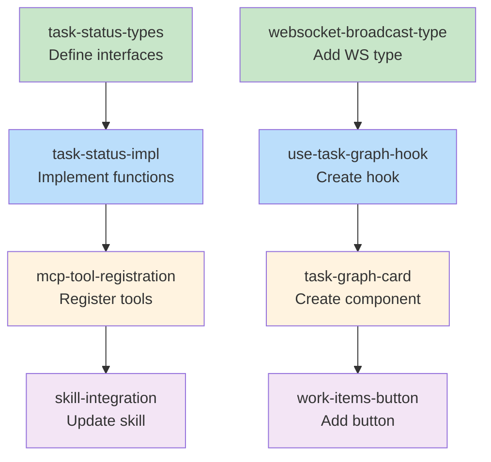

# Blueprint: Item 1 - Real-time task graph via MCP

## Kodex Context
- **type-conventions**: Interfaces for domain models, `[Name]Props` for components, `[Name]Return` for hooks
- **mcp-tools**: Tools in `src/mcp/setup.ts`, snake_case naming, common params: `project`, `session`

---

## 1. Structure Summary

### Files

**Backend (src/):**
- [ ] `src/mcp/workflow/task-status.ts` - **NEW** - MCP tool implementations
- [ ] `src/mcp/setup.ts` - Register new tools
- [ ] `src/mcp/workflow/task-diagram.ts` - Export existing function (minor change)

**Frontend (ui/):**
- [ ] `ui/src/lib/websocket.ts` - Add broadcast type
- [ ] `ui/src/hooks/useTaskGraph.ts` - **NEW** - Task graph state hook
- [ ] `ui/src/components/dashboard/TaskGraphCard.tsx` - **NEW** - Card component
- [ ] `ui/src/components/dashboard/WorkItemsList.tsx` - Add button (check actual file name)

**Skills:**
- [ ] `skills/executing-plans-execution.md` - Update to use new tool

**Tests:**
- [ ] `src/mcp/workflow/__tests__/task-status.test.ts` - **NEW** - Backend tests
- [ ] `ui/src/hooks/__tests__/useTaskGraph.test.ts` - **NEW** - Hook tests

### Type Definitions

```typescript
// src/mcp/workflow/task-status.ts

import type { TaskBatch } from './types.js';

/** Parameters for update_task_status tool */
export interface UpdateTaskStatusParams {
  project: string;
  session: string;
  taskId: string;
  status: 'pending' | 'in_progress' | 'completed' | 'failed';
}

/** Parameters for get_task_graph tool */
export interface GetTaskGraphParams {
  project: string;
  session: string;
}

/** Response from both task graph tools */
export interface TaskGraphResponse {
  success?: boolean;
  diagram: string;
  batches: TaskBatch[];
  completedTasks: string[];
  pendingTasks: string[];
}

/** WebSocket broadcast payload */
export interface TaskGraphUpdatedPayload {
  diagram: string;
  batches: TaskBatch[];
  completedTasks: string[];
  pendingTasks: string[];
  updatedTaskId: string;
  updatedStatus: string;
}
```

```typescript
// ui/src/hooks/useTaskGraph.ts

export interface UseTaskGraphReturn {
  diagram: string | null;
  batches: TaskBatch[];
  completedTasks: string[];
  pendingTasks: string[];
  isLoading: boolean;
  error: Error | null;
  refresh: () => Promise<void>;
}
```

```typescript
// ui/src/components/dashboard/TaskGraphCard.tsx

export interface TaskGraphCardProps {
  project: string;
  session: string;
  onClose?: () => void;
}
```

### Component Interactions

1. **AI Agent → MCP Tool**: Agent calls `update_task_status` when task starts/completes
2. **MCP Tool → State**: Tool updates `collab-state.json` batches
3. **MCP Tool → Diagram**: Tool calls `generateTaskDiagram()` to create Mermaid
4. **MCP Tool → WebSocket**: Tool broadcasts `task_graph_updated` message
5. **WebSocket → Hook**: `useTaskGraph` receives update via CustomEvent
6. **Hook → Component**: `TaskGraphCard` re-renders with new diagram

---

## 2. Function Blueprints

### `updateTaskStatus(params: UpdateTaskStatusParams): Promise<TaskGraphResponse>`

**Location:** `src/mcp/workflow/task-status.ts`

**Pseudocode:**
1. Validate params (project, session, taskId, status)
2. Read current session state via `getSessionState()`
3. Find task in batches and update its status
4. Recalculate `completedTasks` and `pendingTasks` arrays
5. Update batch status if all tasks in batch are complete
6. Save state via `updateSessionState()`
7. Generate diagram via `generateTaskDiagram()`
8. Broadcast `task_graph_updated` via WebSocket handler
9. Return response with diagram and updated state

**Error Handling:**
- Task not found: Return error `{ error: "Task not found: {taskId}" }`
- Invalid status: Return error `{ error: "Invalid status: {status}" }`
- Session not found: Return error `{ error: "Session not found" }`

**Edge Cases:**
- Task already in target status: No-op, still return current state
- All tasks complete: Mark batch as complete, advance currentBatch

**Dependencies:**
- `getSessionState()` from `collab-state.ts`
- `updateSessionState()` from `collab-state.ts`
- `generateTaskDiagram()` from `task-diagram.ts`
- WebSocket handler for broadcast

**Test Strategy:**
- Test status transitions: pending → in_progress → completed
- Test task not found error
- Test batch completion detection
- Test WebSocket broadcast is called

**Stub:**
```typescript
export async function updateTaskStatus(
  params: UpdateTaskStatusParams,
  wsHandler?: { broadcast: (msg: unknown) => void }
): Promise<TaskGraphResponse> {
  // TODO: Step 1 - Validate params
  // TODO: Step 2 - Read current session state
  // TODO: Step 3 - Find task and update status
  // TODO: Step 4 - Recalculate completedTasks/pendingTasks
  // TODO: Step 5 - Update batch status if needed
  // TODO: Step 6 - Save state
  // TODO: Step 7 - Generate diagram
  // TODO: Step 8 - Broadcast via WebSocket
  // TODO: Step 9 - Return response
  throw new Error('Not implemented');
}
```

---

### `getTaskGraph(params: GetTaskGraphParams): Promise<TaskGraphResponse>`

**Location:** `src/mcp/workflow/task-status.ts`

**Pseudocode:**
1. Validate params (project, session)
2. Read current session state via `getSessionState()`
3. Generate diagram via `generateTaskDiagram()`
4. Return response with diagram and current state

**Error Handling:**
- Session not found: Return error `{ error: "Session not found" }`

**Edge Cases:**
- No batches defined: Return empty diagram placeholder

**Dependencies:**
- `getSessionState()` from `collab-state.ts`
- `generateTaskDiagram()` from `task-diagram.ts`

**Test Strategy:**
- Test returns current state
- Test handles missing session
- Test returns valid Mermaid syntax

**Stub:**
```typescript
export async function getTaskGraph(
  params: GetTaskGraphParams
): Promise<TaskGraphResponse> {
  // TODO: Step 1 - Validate params
  // TODO: Step 2 - Read current session state
  // TODO: Step 3 - Generate diagram
  // TODO: Step 4 - Return response
  throw new Error('Not implemented');
}
```

---

### `useTaskGraph(project: string, session: string): UseTaskGraphReturn`

**Location:** `ui/src/hooks/useTaskGraph.ts`

**Pseudocode:**
1. Initialize state: diagram, batches, completedTasks, pendingTasks, isLoading, error
2. On mount, fetch initial state via API `GET /api/projects/{project}/sessions/{session}/task-graph`
3. Set up CustomEvent listener for `task_graph_updated`
4. When event received, update local state with payload
5. Provide `refresh()` function to manually re-fetch
6. Clean up event listener on unmount

**Error Handling:**
- API fetch fails: Set error state, keep previous data
- Invalid event data: Log warning, ignore

**Edge Cases:**
- Component unmounts during fetch: Cancel/ignore response
- Multiple rapid updates: Latest wins (no debouncing needed, data is full state)

**Dependencies:**
- `window.addEventListener` for CustomEvent
- Fetch API for initial load

**Test Strategy:**
- Test initial fetch on mount
- Test updates from CustomEvent
- Test cleanup on unmount
- Test error handling

**Stub:**
```typescript
export function useTaskGraph(
  project: string,
  session: string
): UseTaskGraphReturn {
  // TODO: Step 1 - Initialize state
  // TODO: Step 2 - Fetch initial state on mount
  // TODO: Step 3 - Set up CustomEvent listener
  // TODO: Step 4 - Handle event updates
  // TODO: Step 5 - Provide refresh function
  // TODO: Step 6 - Clean up on unmount
  throw new Error('Not implemented');
}
```

---

### `TaskGraphCard({ project, session, onClose }: TaskGraphCardProps)`

**Location:** `ui/src/components/dashboard/TaskGraphCard.tsx`

**Pseudocode:**
1. Call `useTaskGraph(project, session)` to get state
2. If loading, show spinner
3. If error, show error message
4. If no diagram, show "No tasks" message
5. Render Card with DiagramEmbed
6. Include close button if onClose provided

**Error Handling:**
- Hook returns error: Display user-friendly error message

**Edge Cases:**
- Empty diagram: Show placeholder text

**Dependencies:**
- `useTaskGraph` hook
- `DiagramEmbed` component
- `Card` component (from existing UI library)

**Test Strategy:**
- Test renders diagram when data present
- Test shows loading state
- Test shows error state
- Test close button calls onClose

**Stub:**
```tsx
export function TaskGraphCard({
  project,
  session,
  onClose
}: TaskGraphCardProps): JSX.Element {
  // TODO: Step 1 - Get task graph state from hook
  // TODO: Step 2 - Handle loading state
  // TODO: Step 3 - Handle error state
  // TODO: Step 4 - Handle empty state
  // TODO: Step 5 - Render Card with DiagramEmbed
  throw new Error('Not implemented');
}
```

---

### WebSocket Broadcast Type Addition

**Location:** `ui/src/lib/websocket.ts`

**Change:** Add `'task_graph_updated'` to `BROADCAST_MESSAGE_TYPES` array and add event dispatch.

**Stub:**
```typescript
// Add to BROADCAST_MESSAGE_TYPES
const BROADCAST_MESSAGE_TYPES = ['status_changed', 'session_state_updated', 'task_graph_updated'] as const;

// Add interface
export interface TaskGraphUpdatedDetail {
  project: string;
  session: string;
  payload: {
    diagram: string;
    batches: unknown[];
    completedTasks: string[];
    pendingTasks: string[];
    updatedTaskId: string;
    updatedStatus: string;
  };
}

// Add dispatch in onmessage handler
else if (message.type === 'task_graph_updated') {
  dispatchWebSocketEvent('task_graph_updated', {
    project: message.project,
    session: message.session,
    payload: message.payload,
  });
}
```

---

## 3. Task Dependency Graph

### YAML Graph

```yaml
tasks:
  - id: task-status-types
    files: [src/mcp/workflow/task-status.ts]
    tests: [src/mcp/workflow/__tests__/task-status.test.ts]
    description: Define TypeScript interfaces for task status tools
    parallel: true
    depends-on: []

  - id: task-status-impl
    files: [src/mcp/workflow/task-status.ts]
    tests: [src/mcp/workflow/__tests__/task-status.test.ts]
    description: Implement updateTaskStatus and getTaskGraph functions
    parallel: false
    depends-on: [task-status-types]

  - id: mcp-tool-registration
    files: [src/mcp/setup.ts]
    tests: []
    description: Register update_task_status and get_task_graph tools in MCP setup
    parallel: false
    depends-on: [task-status-impl]

  - id: websocket-broadcast-type
    files: [ui/src/lib/websocket.ts]
    tests: [ui/src/lib/__tests__/websocket.test.ts]
    description: Add task_graph_updated to broadcast message types
    parallel: true
    depends-on: []

  - id: use-task-graph-hook
    files: [ui/src/hooks/useTaskGraph.ts]
    tests: [ui/src/hooks/__tests__/useTaskGraph.test.ts]
    description: Create useTaskGraph hook for task graph state management
    parallel: false
    depends-on: [websocket-broadcast-type]

  - id: task-graph-card
    files: [ui/src/components/dashboard/TaskGraphCard.tsx]
    tests: [ui/src/components/dashboard/__tests__/TaskGraphCard.test.tsx]
    description: Create TaskGraphCard component with DiagramEmbed
    parallel: false
    depends-on: [use-task-graph-hook]

  - id: work-items-button
    files: [ui/src/components/dashboard/WorkItemsList.tsx]
    tests: []
    description: Add View Task Graph button to work items list
    parallel: false
    depends-on: [task-graph-card]

  - id: skill-integration
    files: [skills/executing-plans-execution.md]
    tests: []
    description: Update executing-plans skill to use update_task_status tool
    parallel: false
    depends-on: [mcp-tool-registration]
```

### Execution Waves

**Wave 1 (no dependencies):**
- `task-status-types` - Define interfaces
- `websocket-broadcast-type` - Add WebSocket type

**Wave 2 (depends on Wave 1):**
- `task-status-impl` - Implement MCP functions
- `use-task-graph-hook` - Create React hook

**Wave 3 (depends on Wave 2):**
- `mcp-tool-registration` - Register MCP tools
- `task-graph-card` - Create card component

**Wave 4 (depends on Wave 3):**
- `work-items-button` - Add UI button
- `skill-integration` - Update skill

### Mermaid Visualization



### Summary
- **Total tasks:** 8
- **Total waves:** 4
- **Max parallelism:** 2 (Wave 1)
- **Backend tasks:** 3 (types, impl, registration)
- **Frontend tasks:** 4 (websocket, hook, card, button)
- **Skill tasks:** 1

---

## Gate Checklist Summary

### GATE 1: Structure ✓
- [x] All files from design are listed
- [x] All public interfaces have signatures
- [x] Parameter types are explicit
- [x] Return types are explicit
- [x] Component interactions are documented

### GATE 2: Function Completeness ✓
- [x] Every function from Structure has a blueprint
- [x] Pseudocode steps are clear and actionable
- [x] Error handling is explicit for each function
- [x] Edge cases are identified
- [x] TODO comments in stubs match pseudocode steps
- [x] External dependencies are noted

### GATE 3: Graph Validation ✓
- [x] All files from structure are covered in tasks
- [x] No circular dependencies
- [x] Dependencies match import analysis
- [x] Test file paths are generated for each source file
- [x] Execution waves are calculated