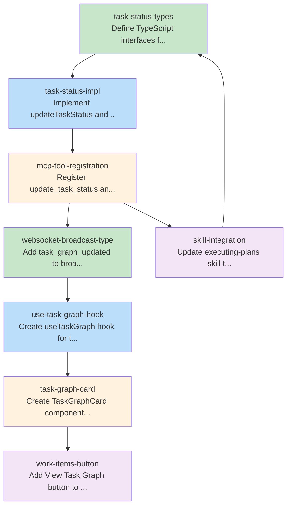

# Consolidated Task Graph

This document was auto-generated from blueprint documents.

## Summary

- **Total tasks:** 8
- **Total waves:** 4
- **Max parallelism:** 2

## Execution Waves

**Wave 1:** task-status-types, websocket-broadcast-type
**Wave 2:** task-status-impl, use-task-graph-hook
**Wave 3:** mcp-tool-registration, task-graph-card
**Wave 4:** work-items-button, skill-integration

## Task Graph (YAML)

```yaml
tasks:
  - id: task-status-types
    files: [src/mcp/workflow/task-status.ts]
    tests: [src/mcp/workflow/__tests__/task-status.test.ts]
    description: Define TypeScript interfaces for task status tools
    parallel: true
    depends-on: []
  - id: task-status-impl
    files: [src/mcp/workflow/task-status.ts]
    tests: [src/mcp/workflow/__tests__/task-status.test.ts]
    description: Implement updateTaskStatus and getTaskGraph functions
    parallel: false
    depends-on: [task-status-types]
  - id: mcp-tool-registration
    files: [src/mcp/setup.ts]
    tests: []
    description: Register update_task_status and get_task_graph tools in MCP setup
    parallel: false
    depends-on: [task-status-impl]
  - id: websocket-broadcast-type
    files: [ui/src/lib/websocket.ts]
    tests: [ui/src/lib/__tests__/websocket.test.ts]
    description: Add task_graph_updated to broadcast message types
    parallel: true
    depends-on: []
  - id: use-task-graph-hook
    files: [ui/src/hooks/useTaskGraph.ts]
    tests: [ui/src/hooks/__tests__/useTaskGraph.test.ts]
    description: Create useTaskGraph hook for task graph state management
    parallel: false
    depends-on: [websocket-broadcast-type]
  - id: task-graph-card
    files: [ui/src/components/dashboard/TaskGraphCard.tsx]
    tests: [ui/src/components/dashboard/__tests__/TaskGraphCard.test.tsx]
    description: Create TaskGraphCard component with DiagramEmbed
    parallel: false
    depends-on: [use-task-graph-hook]
  - id: work-items-button
    files: [ui/src/components/dashboard/WorkItemsList.tsx]
    tests: []
    description: Add View Task Graph button to work items list
    parallel: false
    depends-on: [task-graph-card]
  - id: skill-integration
    files: [skills/executing-plans-execution.md]
    tests: []
    description: Update executing-plans skill to use update_task_status tool
    parallel: false
    depends-on: [mcp-tool-registration]
```

## Dependency Visualization



## Tasks by Wave

### Wave 1

- **task-status-types**: Define TypeScript interfaces for task status tools
- **websocket-broadcast-type**: Add task_graph_updated to broadcast message types

### Wave 2

- **task-status-impl**: Implement updateTaskStatus and getTaskGraph functions
- **use-task-graph-hook**: Create useTaskGraph hook for task graph state management

### Wave 3

- **mcp-tool-registration**: Register update_task_status and get_task_graph tools in MCP setup
- **task-graph-card**: Create TaskGraphCard component with DiagramEmbed

### Wave 4

- **work-items-button**: Add View Task Graph button to work items list
- **skill-integration**: Update executing-plans skill to use update_task_status tool
