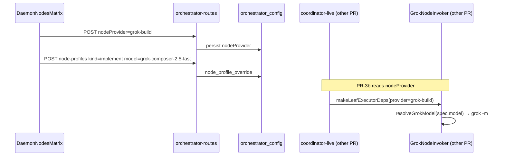

# Claude Handoff: Grok Daemon UI + Config API

| Field | Value |
|-------|-------|
| **Owner** | Claude (UI + minimal backend API) |
| **Parent design** | [`design.md`](./design.md) — read for full Grok Node Invoker context |
| **PR scope** | Design **PR-3a** (config + API) + **PR-5** (UI) |
| **Date** | 2026-06-25 |

---

## Mission

Add project-level **daemon provider** selection (`claude` vs `grok-build`) and make the **Daemon Nodes matrix** provider-aware so operators can pick **Grok models** (`grok-build`, `grok-composer-2.5-fast`) per node kind.

**You are NOT implementing** `GrokNodeInvoker`, `invokeGrokNode`, coordinator wiring, or fleet-status changes — another agent owns PR-1/2/3b/4 per the parent design.

Your work **unblocks** that agent: once `nodeProvider` is persisted and the matrix stores grok model ids, the invoker can read them.

---

## Background (30 seconds)

The leaf-executor daemon runs headless worker nodes (`blueprint` → `implement` → `review`, plus waves). Today everything uses `claude -p`. We are adding a parallel path via the **`grok` CLI**.

- **Provider** = which CLI runs (`claude` or `grok-build`)
- **Per-node model** = stored in `node_profile_override` (same table as today); values are **opaque strings** passed through to the invoker (`opus`, `grok-build`, etc.)
- **CLI `-m` resolution** happens in the invoker (`resolveGrokModel`) — UI stores what the user picked, not the resolved CLI id

---

## What to build

### 1. Backend: `nodeProvider` on `orchestrator_config` (PR-3a)

Mirror the existing `effortOverride` / `poolSize` pattern in `src/services/orchestrator-config.ts`.

#### Schema migration

```sql
ALTER TABLE orchestrator_config ADD COLUMN nodeProvider TEXT NOT NULL DEFAULT 'claude';
```

Guard with try/catch like other additive migrations in `openDb()`.

#### Types

```typescript
// Reuse existing ProviderId from src/agent/worker-agent.ts
export type ProviderId = 'claude' | 'grok-build' | 'codex';

const DAEMON_PROVIDER_CHOICES: ProviderId[] = ['claude', 'grok-build'];
// codex is NOT selectable for daemon nodes in v1
```

#### Functions

```typescript
export function getProjectNodeProvider(project: string): ProviderId;
export function setProjectNodeProvider(project: string, provider: ProviderId): void;
```

**Validation:** Only `'claude'` and `'grok-build'` accepted for daemon config. Reject `'codex'` and unknown strings.

**Dev override (optional but in parent design):**

```typescript
// In getProjectNodeProvider, before DB read:
const env = process.env.MERMAID_NODE_PROVIDER?.trim();
if (env === 'grok-build' || env === 'claude') return env;
```

#### API routes (`src/routes/orchestrator-routes.ts`)

Add dedicated endpoints (same style as `/api/orchestrator/effort`):

| Method | Path | Body / query | Response |
|--------|------|--------------|----------|
| GET | `/api/orchestrator/node-provider?project=<abs>` | — | `{ project, nodeProvider, choices: ['claude','grok-build'] }` |
| POST | `/api/orchestrator/node-provider` | `{ project, nodeProvider }` | `{ project, nodeProvider }` |

**Alternative (acceptable):** fold `nodeProvider` into an existing GET/POST if you add a combined orchestrator settings endpoint — but dedicated routes match `effort` / `pool-size` and are easier to test.

#### Tests (`src/routes/__tests__/orchestrator-routes.test.ts`)

Add a `describe('handleOrchestratorRoutes — node-provider')` block:

- GET defaults to `'claude'` for unset project
- POST persists `'grok-build'` and GET reads it back
- POST rejects invalid provider → 400
- POST without project → 400

---

### 2. Backend: provider-aware `node-profiles` (PR-5 backend half)

Update `GET /api/orchestrator/node-profiles` in `orchestrator-routes.ts`.

#### Model choice lists

Today:

```typescript
const MODEL_CHOICES = ['opus', 'sonnet', 'haiku'];
```

**Change to provider-aware:**

```typescript
const CLAUDE_MODEL_CHOICES = ['opus', 'sonnet', 'haiku'] as const;
const GROK_MODEL_CHOICES = ['grok-build', 'grok-composer-2.5-fast'] as const;
```

In GET handler:

```typescript
const nodeProvider = getProjectNodeProvider(project);
const models = nodeProvider === 'grok-build' ? [...GROK_MODEL_CHOICES] : [...CLAUDE_MODEL_CHOICES];
return Response.json({ project, nodeProvider, rows, models, levels: EFFORT_LEVELS });
```

Add `nodeProvider` to the JSON response so the UI does not need a second fetch (optional: UI can still use dedicated endpoint).

#### POST validation

When `getProjectNodeProvider(project) === 'grok-build'`:

- Reject `model` values in `['opus','sonnet','haiku']` → 400 with clear message
- Accept `grok-build`, `grok-composer-2.5-fast`, and `null` (inherit)

When provider is `'claude'`:

- Reject grok model strings → 400
- Accept opus/sonnet/haiku/null

**Do not** change `NODE_PROFILE` defaults in `leaf-executor.ts` — they stay Claude-centric (`opus`/`sonnet`). The GET response already exposes `defaultModel` per row; for grok projects the UI should label inherit options clearly (see UI section).

#### `defaultModel` display for grok provider

For grok projects, consider returning **kind-aware grok defaults** in `defaultModel` so "inherit (…)" is meaningful:

| Kind | Suggested `defaultModel` when provider is grok |
|------|-----------------------------------------------|
| blueprint, review, driveplan | `grok-build` |
| implement, research, wimplement, verify, fix, summary | `grok-composer-2.5-fast` |
| driveexec, report | `—` (MCP-only; see disabled rows) |

Implementation: small helper in orchestrator-routes (or import from future `grok-model.ts` if it exists — if not, inline the table for now).

Update existing node-profiles tests:

- GET includes `nodeProvider`
- GET returns grok models when project provider is grok-build
- POST rejects cross-provider model values

---

### 3. UI: Daemon provider toggle (PR-5)

**Mount location:** `ui/src/components/supervisor/bridge/CommandBar.tsx` — inside the expanded "⚙ nodes" panel, **above** `DaemonNodesMatrix`.

**Pattern:** Match `PoolSizeControl` / `OrchestratorLadder` — small inline control, `data-testid` attributes, `mc.invokeOnServer` + `fetch` fallback (copy from `DaemonNodesMatrix`).

#### New component (suggested)

`ui/src/components/settings/DaemonProviderControl.tsx`

```tsx
// GET  /api/orchestrator/node-provider?project=
// POST /api/orchestrator/node-provider { project, nodeProvider }
```

**UI:**

- Label: `daemon provider` or `worker CLI`
- `<select>` with options: `Claude` (`claude`), `Grok` (`grok-build`)
- Show current value on load; disable while saving
- `data-testid="daemon-provider-select"`

**On change:** POST immediately (same UX as node model dropdowns).

**Visual hint:** When `grok-build` is selected, add a one-line note under the matrix:

> Grok runs built-in tools only. Verify/reviewer leaves require Claude.

---

### 4. UI: Provider-aware `DaemonNodesMatrix` (PR-5)

File: `ui/src/components/settings/DaemonNodesMatrix.tsx`

#### Load `nodeProvider`

From GET `node-profiles` response (`nodeProvider` field) or separate GET `node-provider`.

#### Model dropdown

- When `nodeProvider === 'claude'`: current behavior (`opus`, `sonnet`, `haiku`)
- When `nodeProvider === 'grok-build'`: `grok-build`, `grok-composer-2.5-fast`

#### Disable MCP-only rows on grok

Grey out model + effort dropdowns (not effort — effort still applies) for kinds that cannot run on Grok:

| Kind | Reason |
|------|--------|
| `driveexec` | MCP gate verb |
| `report` | MCP `add_session_todo` |
| `driveplan` | verify pipeline (optional grey — no MCP in allowlist but verify mode guard applies) |

**Minimum:** disable `driveexec` and `report`. Add `title` tooltip: "Requires Claude (MCP tools)."

**Do not** hide rows — keep them visible so operators understand the matrix is complete.

#### Stale overrides when switching provider

When user switches `claude` → `grok-build` (or reverse), existing per-kind `modelOverride` values may be invalid (e.g. `opus` stored while on grok).

**v1 behavior (pick one, document in PR):**

- **Option A (simple):** Leave overrides; server POST validation rejects edits until user clears them; show inherit where override is invalid (requires GET to flag `invalidOverride: boolean` — more work)
- **Option B (recommended):** On provider change, POST clears all model overrides for the project (loop kinds, set `model: null`). Effort overrides preserved. Confirm dialog: "Switching provider clears per-node model overrides."

Implement **Option B** unless product prefers otherwise.

#### Copy / comments

Update file header comment: "claude **or grok** worker nodes" (not "claude worker nodes" only).

Update `CommandBar.tsx` comment above the matrix similarly.

#### `data-testid` additions

- `data-testid="daemon-provider-select"`
- `data-testid="node-model-{kind}-disabled"` on greyed rows (or `disabled` attribute on select)

---

## Files you will touch

| File | Change |
|------|--------|
| `src/services/orchestrator-config.ts` | Migration, get/set `nodeProvider` |
| `src/routes/orchestrator-routes.ts` | node-provider routes; provider-aware node-profiles |
| `src/routes/__tests__/orchestrator-routes.test.ts` | New tests |
| `ui/src/components/settings/DaemonProviderControl.tsx` | **New** |
| `ui/src/components/settings/DaemonNodesMatrix.tsx` | Provider-aware models, disabled rows |
| `ui/src/components/supervisor/bridge/CommandBar.tsx` | Mount provider control |

## Files you must NOT touch

| File | Why |
|------|-----|
| `src/agent/node-invoker.ts` | Grok invoker primitive (PR-1) |
| `src/agent/grok-model.ts` | Invoker model resolver (PR-1) |
| `src/services/leaf-executor.ts` | Invoker wiring (PR-2) |
| `src/services/coordinator-live.ts` | Provider routing (PR-3b) |
| `src/services/fleet-status.ts` | Liveness (PR-3b) |
| `worker-core/`, `GrokOwnHarness` | Out of scope |

---

## UI tests

No existing `DaemonNodesMatrix` tests — add if feasible:

| Test | Approach |
|------|----------|
| Provider select renders | Component test or bridge integration test |
| Grok provider shows grok models in dropdown | Mock GET response |
| MCP rows disabled on grok | Assert `disabled` on `driveexec` / `report` selects |

Follow patterns in `ui/src/components/supervisor/bridge/OrchestratorLadder.tsx` (if any tests exist) or `orchestrator-routes.test.ts` for backend.

Run:

```bash
npm run test:ci -- src/routes/__tests__/orchestrator-routes.test.ts
```

---

## Acceptance criteria

- [ ] Per-project `nodeProvider` persists across server restart (`orchestrator_config`)
- [ ] GET/POST `/api/orchestrator/node-provider` works; invalid values → 400
- [ ] `node-profiles` GET returns correct `models` array for each provider
- [ ] `node-profiles` POST rejects cross-provider model values
- [ ] CommandBar shows provider dropdown above nodes matrix
- [ ] Matrix model dropdown switches between Claude and Grok choices when provider changes
- [ ] `driveexec` and `report` rows disabled when provider is `grok-build`
- [ ] Provider switch clears incompatible model overrides (Option B) with confirm
- [ ] All new backend tests pass
- [ ] No changes to invoker / coordinator / leaf-executor

---

## How your work connects to the invoker agent



Until PR-3b lands, changing provider in UI **persists config only** — daemon still runs Claude. That is expected; document in PR description.

---

## Model id reference (for UI labels)

| UI value | User-facing label (suggested) |
|----------|-------------------------------|
| `grok-build` | Grok Build |
| `grok-composer-2.5-fast` | Grok Composer (fast) |
| `opus` | Opus |
| `sonnet` | Sonnet |
| `haiku` | Haiku |

The invoker maps `grok-build` → CLI id `grok-build-0.1` internally. **UI stores and displays `grok-build`**, not `grok-build-0.1`.

---

## Open questions (resolve in PR if unclear)

| # | Question | Default |
|---|----------|---------|
| 1 | Clear overrides on provider switch? | **Yes (Option B)** with confirm |
| 2 | Separate `node-provider` endpoint vs combined settings? | **Separate** (matches effort/pool-size) |
| 3 | Grey out `driveplan` on grok? | Optional; minimum is `driveexec` + `report` |
| 4 | Show resolved CLI model in "resolves to" column? | **No** — show stored override + effort only (contract A in parent design) |

---

## Reference links

- Parent design: [`docs/designs/grok-node-invoker/design.md`](./design.md)
- Existing matrix: `ui/src/components/settings/DaemonNodesMatrix.tsx`
- Existing orchestrator routes: `src/routes/orchestrator-routes.ts`
- Provider type: `src/agent/worker-agent.ts` (`ProviderId`)
- TieringEditor provider dropdown pattern: `ui/src/components/settings/TieringEditor.tsx` (different system — do not wire tier overrides into daemon)

---

## Suggested PR title

```
feat(orchestrator): grok daemon provider toggle + provider-aware node matrix
```

## Suggested PR description bullets

- Add `orchestrator_config.nodeProvider` with GET/POST API
- Provider-aware model choices in node-profiles endpoint
- Daemon provider dropdown in Bridge CommandBar
- Disable MCP-only node kinds when Grok selected
- Clear model overrides on provider switch