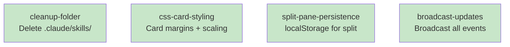

# Session: kind-quick-island

## Session Context
**Out of Scope:** (session-wide boundaries)
**Shared Decisions:** (cross-cutting choices)

---

## Work Items

### Item 1: Split position resets instead of persisting current location
**Type:** bugfix
**Status:** documented
**Problem/Goal:**
When resizing the split between the editor (raw) and preview (rendered) panes in the document editor, the position resets to the default 50% on page reload instead of remembering where the user left it.

**Root Cause:**
`document-editor.js` (lines 1481-1505) is missing localStorage persistence for the editor pane width. The diagram editor (`editor.js` lines 2999-3032) correctly:
1. Loads saved width from localStorage on init
2. Saves width to localStorage on mouseup

But the document editor does neither - it always starts at the CSS default and never saves the user's resize position.

**Approach:**
1. Add localStorage load on init - read `documentEditorPaneWidth` and apply to editor pane flexBasis
2. Add localStorage save on mouseup - save current flexBasis to `documentEditorPaneWidth`
3. Use a different key than diagram editor to allow independent persistence

**Success Criteria:**
- Resize the split pane in document editor
- Reload the page
- Split position should be restored to where it was before reload

**Decisions:**
- Use key `documentEditorPaneWidth` (different from `editorPaneWidth` used by diagram editor)

---

### Item 2: Clean up claude-mermaid-collab project - remove unneeded files, organize
**Type:** task
**Status:** documented
**Problem/Goal:**
Review the project for unneeded files and organizational improvements. Clean up any cruft that has accumulated.

**Approach:**
After reviewing the project structure, only one item needs cleanup:
1. Delete `.claude/skills/` folder - it only contains `.DS_Store` and serves no purpose (actual skills are in root `skills/` folder)

Items reviewed and kept:
- `docs/designs/` - Keep old design sessions
- `docs/plans/` - Keep as historical reference
- `diagrams/` and `documents/` - Keep test data
- `.DS_Store` files - Leave them (harmless, gitignored, auto-regenerate)
- Overall organization - No changes needed

**Success Criteria:**
- `.claude/skills/` folder is deleted
- No unintended files are removed
- Project still builds and runs correctly

**Decisions:**
- Keep old design sessions in `docs/designs/` for reference
- Keep implementation plans in `docs/plans/` as project history
- Keep test diagrams/documents for manual testing
- Don't bother deleting `.DS_Store` files (macOS regenerates them)
- Current folder structure is good, no reorganization needed

---

### Item 3: Add margin around document sidebar items and resize preview to fit
**Type:** code
**Status:** documented
**Problem/Goal:**
The card-style items in the session panel sidebar need spacing between them, and the preview thumbnails should scale their content to fit the available space.

**Approach:**
1. Add margin to `.session-panel-card` in `session-panel.css` (e.g., `margin: 8px` or similar)
2. Add CSS transform/scale to the card preview content so diagrams/documents fit within the thumbnail area
3. May need to adjust the card container padding in `.session-panel-items` to accommodate the new margins

**Success Criteria:**
- Cards in the sidebar have visible spacing between them
- Preview thumbnails show scaled-down content that fits entirely within the thumbnail area
- Layout doesn't break with various content sizes

**Decisions:**
- Focus on card-style items only (not list items)

---

### Item 4: Auto-update documents sidebar when documents/diagrams are added or updated
**Type:** code
**Status:** documented
**Problem/Goal:**
The documents sidebar doesn't update when documents/diagrams are created or updated - items only appear after a manual page refresh.

**Root Cause:**
In `src/routes/api.ts`:
- `document_created` / `diagram_created` use `wsHandler.broadcast()` (sends to ALL connections) ✓
- `document_updated` / `diagram_updated` use `wsHandler.broadcastToDocument(id)` / `wsHandler.broadcastToDiagram(id)` (sends ONLY to subscribed clients) ✗

The session panel isn't subscribed to individual items, so it only receives "created" events, not "updated" events.

**Approach:**
Change update broadcasts to use `wsHandler.broadcast()` instead of the subscription-based methods:
1. In `api.ts` line ~212: Change `wsHandler.broadcastToDiagram(id, {...})` to `wsHandler.broadcast({...})`
2. In `api.ts` line ~442: Change `wsHandler.broadcastToDocument(id, {...})` to `wsHandler.broadcast({...})`

**Success Criteria:**
- Create a new document/diagram via MCP → appears in sidebar immediately
- Update a document/diagram via MCP → sidebar shows updated lastModified and re-sorts
- No manual refresh needed

**Decisions:**
- Use broadcast() for all events (simple, consistent with create events)
- Session panel already has handlers for these events, no client-side changes needed

---

## Interface Definition

### File Structure

| File | Action | Item |
|------|--------|------|
| `public/js/document-editor.js` | Modify | Item 1 |
| `.claude/skills/` | Delete folder | Item 2 |
| `public/css/session-panel.css` | Modify | Item 3 |
| `src/routes/api.ts` | Modify | Item 4 |

### Item 1: document-editor.js Changes

**Location:** Lines 1481-1505 (resizer functionality section)

**New code to add:**
```javascript
// Before resizer mousedown listener - load saved width
const savedWidth = localStorage.getItem('documentEditorPaneWidth');
if (savedWidth) {
  editorPane.style.flex = `0 0 ${savedWidth}`;
}

// In mouseup handler - save width
localStorage.setItem('documentEditorPaneWidth', editorPane.style.flex);
```

**No new types or interfaces required.**

### Item 2: Folder Deletion

**Action:** `rm -rf .claude/skills/`

**No code changes - filesystem operation only.**

### Item 3: session-panel.css Changes

**Location:** `.session-panel-card` class (~line 173) and `.session-panel-card-thumbnail` (~line 187)

**Changes to add:**
```css
.session-panel-card {
  margin: 8px;  /* Add spacing between cards */
}

.session-panel-card-thumbnail img {
  object-fit: contain;  /* Scale to fit */
  width: 100%;
  height: 100%;
}
```

**No new types or interfaces required.**

### Item 4: api.ts Changes

**Location 1:** Line ~212 (diagram update broadcast)
```typescript
// Change from:
wsHandler.broadcastToDiagram(id, { ... });
// To:
wsHandler.broadcast({ ... });
```

**Location 2:** Line ~442 (document update broadcast)
```typescript
// Change from:
wsHandler.broadcastToDocument(id, { ... });
// To:
wsHandler.broadcast({ ... });
```

**No new types or interfaces required.**

---

## Pseudocode

### Item 1: localStorage Persistence for Split Pane

```
ON PAGE LOAD (before resizer setup):
  1. Read 'documentEditorPaneWidth' from localStorage
  2. IF value exists:
     - Parse the percentage value
     - Apply to editorPane.style.flex = "0 0 {value}"
  3. ELSE:
     - Use CSS default (50%)

ON MOUSEUP (after resize completes):
  1. IF isResizing was true:
     - Get current editorPane flex value
     - Extract the percentage (third value in "0 0 XX%")
     - Save to localStorage key 'documentEditorPaneWidth'
```

**Error Handling:**
- If localStorage read fails: silently use default (don't break page load)
- If localStorage write fails: silently ignore (don't break resize)

**Edge Cases:**
- Invalid stored value: ignore and use default
- localStorage disabled: graceful fallback to default behavior

### Item 2: Delete .claude/skills/ Folder

```
1. Verify folder exists at .claude/skills/
2. Delete folder recursively (rm -rf)
3. Verify folder no longer exists
```

**Error Handling:**
- Folder doesn't exist: no-op, success
- Permission denied: report error

### Item 3: CSS Card Styling

```
FOR .session-panel-card:
  1. Add margin: 8px to create spacing between cards
  2. Existing styles remain unchanged

FOR .session-panel-card-thumbnail img:
  1. Add object-fit: contain to scale image proportionally
  2. Add width: 100% and height: 100% to fill thumbnail area
  3. Image will scale down to fit, maintaining aspect ratio
```

**Edge Cases:**
- Very wide diagrams: will be letterboxed (horizontal bars)
- Very tall diagrams: will be pillarboxed (vertical bars)
- No image: thumbnail shows placeholder

### Item 4: Broadcast All Update Events

```
FOR diagram update (POST /api/diagram/:id):
  1. Save diagram content to disk
  2. Get updated diagram with new lastModified
  3. CHANGE: wsHandler.broadcast({
       type: 'diagram_updated',
       id,
       content,
       lastModified,
       project,
       session
     })
  (Previously: broadcastToDiagram - only sent to subscribed clients)

FOR document update (POST /api/document/:id):
  1. Save document content to disk
  2. Get updated document with new lastModified
  3. CHANGE: wsHandler.broadcast({
       type: 'document_updated',
       id,
       content,
       lastModified,
       project,
       session,
       patch (if provided)
     })
  (Previously: broadcastToDocument - only sent to subscribed clients)
```

**Side Effects:**
- All connected clients receive update events (not just viewers of that item)
- Session panel now receives updates and can re-sort/flash items

---

## Skeleton

### Files to Modify

All items modify existing files (no new files to create):

- [ ] `public/js/document-editor.js` - Add localStorage persistence (Item 1)
- [ ] `.claude/skills/` - Delete folder (Item 2)
- [ ] `public/css/session-panel.css` - Add card margins and thumbnail scaling (Item 3)
- [ ] `src/routes/api.ts` - Change broadcast methods (Item 4)

### Task Dependency Graph

```yaml
tasks:
  - id: cleanup-folder
    files: [.claude/skills/]
    description: Delete empty .claude/skills/ folder
    parallel: true

  - id: css-card-styling
    files: [public/css/session-panel.css]
    description: Add card margins and thumbnail scaling
    parallel: true

  - id: split-pane-persistence
    files: [public/js/document-editor.js]
    description: Add localStorage persistence for split pane position
    parallel: true

  - id: broadcast-updates
    files: [src/routes/api.ts]
    description: Change update events to broadcast to all clients
    parallel: true
```

**Note:** All tasks are independent and can run in parallel. No dependencies between tasks.

### Execution Order

**Parallel Batch 1 (all tasks):**
- cleanup-folder
- css-card-styling
- split-pane-persistence
- broadcast-updates

### Mermaid Visualization



Legend: Green = parallel-safe (all tasks can run simultaneously)

---

## Diagrams
(auto-synced)