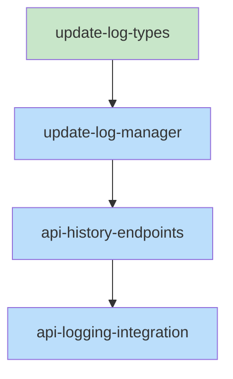

# Skeleton: Item 1 - Log document updates from update and patch operations

## Planned Files

- [ ] `src/types/update-log.ts` - Type definitions for update log
- [ ] `src/services/update-log-manager.ts` - UpdateLogManager service class
- [ ] `src/routes/api.ts` - Modification: add history endpoints and logging integration

**Note:** These files are documented but NOT created yet. They will be created during the implementation phase by executing-plans.

---

## File Contents

### Planned File: src/types/update-log.ts

```typescript
/**
 * Type definitions for document update history logging
 */

/**
 * A single change entry recording a document modification
 */
export interface ChangeEntry {
  /** ISO timestamp when the change occurred */
  timestamp: string;
  /** Diff details showing what was changed */
  diff: {
    /** Text that was replaced */
    oldString: string;
    /** Text that replaced it */
    newString: string;
  };
}

/**
 * Log entry for a single document tracking its history
 */
export interface DocumentLogEntry {
  /** Original content captured on first update */
  original: string;
  /** Array of changes in chronological order */
  changes: ChangeEntry[];
}

/**
 * Root structure of the update-log.json file
 */
export interface UpdateLog {
  /** Map of document IDs to their log entries */
  documents: Record<string, DocumentLogEntry>;
}

/**
 * Response shape for GET /api/document/:id/history
 */
export interface HistoryResponse {
  /** Original document content */
  original: string;
  /** Array of change entries */
  changes: ChangeEntry[];
}

/**
 * Response shape for GET /api/document/:id/version
 */
export interface VersionResponse {
  /** Document content at the requested timestamp */
  content: string;
  /** The timestamp that was requested */
  timestamp: string;
}
```

**Status:** [ ] Will be created during implementation

---

### Planned File: src/services/update-log-manager.ts

```typescript
import { join } from 'path';
import type { ChangeEntry, DocumentLogEntry, UpdateLog } from '../types/update-log';

/**
 * Manages document update history logging and replay
 */
export class UpdateLogManager {
  private basePath: string;
  private logFilePath: string;

  /**
   * Initialize with the session base path
   * @param basePath - Path to the session folder
   */
  constructor(basePath: string) {
    this.basePath = basePath;
    this.logFilePath = join(basePath, 'update-log.json');
  }

  /**
   * Log a document update. Captures original content on first update.
   * @param documentId - The document ID being updated
   * @param oldContent - Content before the update
   * @param newContent - Content after the update
   * @param diff - Optional patch diff if available
   */
  async logUpdate(
    documentId: string,
    oldContent: string,
    newContent: string,
    diff?: { oldString: string; newString: string }
  ): Promise<void> {
    // TODO: Implement - see pseudocode-item-1.md
    // 1. Load existing log
    // 2. Create entry if first update (capture original)
    // 3. Compute diff if not provided
    // 4. Append change entry with timestamp
    // 5. Save log atomically
    throw new Error('Not implemented');
  }

  /**
   * Get the change history for a document
   * @param documentId - The document ID to get history for
   * @returns Document log entry or null if no history
   */
  async getHistory(documentId: string): Promise<DocumentLogEntry | null> {
    // TODO: Implement - see pseudocode-item-1.md
    // 1. Load log from disk
    // 2. Return entry for documentId or null
    throw new Error('Not implemented');
  }

  /**
   * Replay changes to reconstruct document at a specific timestamp
   * @param documentId - The document ID to replay
   * @param timestamp - ISO timestamp to replay to
   * @returns Content at that point in time
   */
  async replayToTimestamp(documentId: string, timestamp: string): Promise<string> {
    // TODO: Implement - see pseudocode-item-1.md
    // 1. Get history
    // 2. Start with original
    // 3. Apply changes up to timestamp
    // 4. Return reconstructed content
    throw new Error('Not implemented');
  }

  /**
   * Load the update log from disk
   * @private
   */
  private async loadLog(): Promise<UpdateLog> {
    // TODO: Implement
    // Return empty log if file doesn't exist
    throw new Error('Not implemented');
  }

  /**
   * Save the update log to disk atomically
   * @private
   */
  private async saveLog(log: UpdateLog): Promise<void> {
    // TODO: Implement
    // Write to temp file, then rename
    throw new Error('Not implemented');
  }
}
```

**Status:** [ ] Will be created during implementation

---

### Planned Modification: src/routes/api.ts

Add after existing document routes (around line 730):

```typescript
// ============================================
// Document History Routes
// ============================================

// GET /api/document/:id/history?project=...&session=...
if (path.match(/^\/api\/document\/[^/]+\/history$/) && req.method === 'GET') {
  const params = getSessionParams(url);
  if (!params) {
    return Response.json({ error: 'project and session query params required' }, { status: 400 });
  }

  const id = path.split('/')[3];

  try {
    // TODO: Create UpdateLogManager and call getHistory
    // const updateLogManager = new UpdateLogManager(sessionPath);
    // const history = await updateLogManager.getHistory(id);
    // if (!history) return Response.json({ error: 'No history for document' }, { status: 404 });
    // return Response.json({ original: history.original, changes: history.changes });
    throw new Error('Not implemented');
  } catch (error: any) {
    return Response.json({ error: error.message }, { status: 500 });
  }
}

// GET /api/document/:id/version?project=...&session=...&timestamp=...
if (path.match(/^\/api\/document\/[^/]+\/version$/) && req.method === 'GET') {
  const params = getSessionParams(url);
  if (!params) {
    return Response.json({ error: 'project and session query params required' }, { status: 400 });
  }

  const timestamp = url.searchParams.get('timestamp');
  if (!timestamp) {
    return Response.json({ error: 'timestamp query param required' }, { status: 400 });
  }

  const id = path.split('/')[3];

  try {
    // TODO: Create UpdateLogManager and call replayToTimestamp
    // const updateLogManager = new UpdateLogManager(sessionPath);
    // const content = await updateLogManager.replayToTimestamp(id, timestamp);
    // return Response.json({ content, timestamp });
    throw new Error('Not implemented');
  } catch (error: any) {
    if (error.message.includes('No history')) {
      return Response.json({ error: error.message }, { status: 404 });
    }
    return Response.json({ error: error.message }, { status: 500 });
  }
}
```

Modify POST /api/document/:id (around line 670):

```typescript
// In the existing POST /api/document/:id handler, after documentManager.saveDocument():

// TODO: Add history logging
// 1. Get oldContent before save (requires fetching document first)
// 2. After save, create UpdateLogManager
// 3. Call logUpdate with old/new content and optional patch
// 4. Broadcast document_history_updated message
```

**Status:** [ ] Will be modified during implementation

---

## Task Dependency Graph

```yaml
tasks:
  - id: update-log-types
    files: [src/types/update-log.ts]
    tests: [src/types/update-log.test.ts, src/types/__tests__/update-log.test.ts]
    description: Type definitions for update log system
    parallel: true

  - id: update-log-manager
    files: [src/services/update-log-manager.ts]
    tests: [src/services/update-log-manager.test.ts, src/services/__tests__/update-log-manager.test.ts]
    description: UpdateLogManager service implementation
    depends-on: [update-log-types]

  - id: api-history-endpoints
    files: [src/routes/api.ts]
    tests: [src/routes/api.test.ts, src/routes/__tests__/api.test.ts]
    description: Add history and version API endpoints
    depends-on: [update-log-manager]

  - id: api-logging-integration
    files: [src/routes/api.ts]
    tests: [src/routes/api.test.ts, src/routes/__tests__/api.test.ts]
    description: Integrate logging into document update endpoint
    depends-on: [api-history-endpoints]
```

---

## Execution Order

**Wave 1 (parallel-safe):**
- `update-log-types` - No dependencies

**Wave 2:**
- `update-log-manager` - Depends on types

**Wave 3:**
- `api-history-endpoints` - Depends on manager

**Wave 4:**
- `api-logging-integration` - Depends on endpoints existing

---

## Mermaid Visualization



Legend: Green = parallel-safe, Blue = sequential

---

## Verification Checklist

- [x] All files from Interface are documented
- [x] File paths match project conventions (kebab-case)
- [x] All types are defined
- [x] All function signatures present
- [x] TODO comments reference pseudocode
- [x] Dependency graph covers all files
- [x] No circular dependencies
