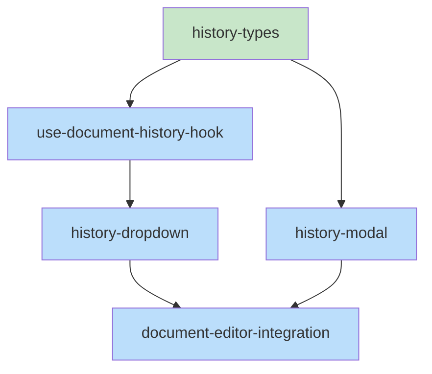

# Skeleton: Item 2 - Add UI to view document update history in desktop GUI

## Planned Files

- [ ] `ui/src/types/history.ts` - Frontend type definitions
- [ ] `ui/src/hooks/useDocumentHistory.ts` - Hook for fetching/subscribing to history
- [ ] `ui/src/components/editors/HistoryDropdown.tsx` - History dropdown component
- [ ] `ui/src/components/editors/HistoryModal.tsx` - Modal for diff view display
- [ ] `ui/src/components/editors/DocumentEditor.tsx` - Modification: integrate history components

**Note:** These files are documented but NOT created yet. They will be created during the implementation phase by executing-plans.

---

## File Contents

### Planned File: ui/src/types/history.ts

```typescript
/**
 * Type definitions for document history UI
 */

/**
 * A single change entry from the history API
 */
export interface ChangeEntry {
  /** ISO timestamp when the change occurred */
  timestamp: string;
  /** Diff details */
  diff: {
    oldString: string;
    newString: string;
  };
}

/**
 * Response from GET /api/document/:id/history
 */
export interface DocumentHistory {
  /** Original document content before any changes */
  original: string;
  /** Array of changes in chronological order */
  changes: ChangeEntry[];
}

/**
 * Props for the HistoryDropdown component
 */
export interface HistoryDropdownProps {
  /** Document ID to show history for */
  documentId: string;
  /** Current document content (for diff comparison) */
  currentContent: string;
  /** Callback when user selects a historical version */
  onVersionSelect: (timestamp: string, content: string) => void;
  /** Additional CSS classes */
  className?: string;
}

/**
 * Props for the HistoryModal component
 */
export interface HistoryModalProps {
  /** Whether the modal is open */
  isOpen: boolean;
  /** Close the modal */
  onClose: () => void;
  /** Historical content to show (left side of diff) */
  historicalContent: string;
  /** Current content to compare against (right side) */
  currentContent: string;
  /** Timestamp label for the historical version */
  timestamp: string;
  /** Optional document name for display */
  documentName?: string;
}

/**
 * Return type for useDocumentHistory hook
 */
export interface UseDocumentHistoryReturn {
  /** Document history data */
  history: DocumentHistory | null;
  /** Loading state */
  isLoading: boolean;
  /** Error message if failed */
  error: string | null;
  /** Refetch history */
  refetch: () => Promise<void>;
  /** Get content at a specific timestamp */
  getVersionAt: (timestamp: string) => Promise<string | null>;
}
```

**Status:** [ ] Will be created during implementation

---

### Planned File: ui/src/hooks/useDocumentHistory.ts

```typescript
import { useState, useEffect, useCallback } from 'react';
import { useSession } from '@/hooks/useSession';
import { useWebSocket } from '@/hooks/useWebSocket';
import type { DocumentHistory, UseDocumentHistoryReturn } from '@/types/history';

/**
 * Hook to fetch and subscribe to document history updates
 * @param documentId - Document ID to track history for
 * @returns History data, loading state, and methods
 */
export function useDocumentHistory(documentId: string | null): UseDocumentHistoryReturn {
  const [history, setHistory] = useState<DocumentHistory | null>(null);
  const [isLoading, setIsLoading] = useState(false);
  const [error, setError] = useState<string | null>(null);

  const { project, session } = useSession();

  // TODO: Implement fetchHistory
  // - Fetch GET /api/document/{documentId}/history
  // - Handle 404 as null (not error)
  // - Set loading/error states
  const fetchHistory = useCallback(async () => {
    // TODO: Implement - see pseudocode-item-2.md
    throw new Error('Not implemented');
  }, [documentId, project, session]);

  // TODO: Implement getVersionAt
  // - Fetch GET /api/document/{documentId}/version?timestamp=...
  // - Return content or null on error
  const getVersionAt = useCallback(async (timestamp: string): Promise<string | null> => {
    // TODO: Implement - see pseudocode-item-2.md
    throw new Error('Not implemented');
  }, [documentId, project, session]);

  // TODO: Subscribe to WebSocket for document_history_updated messages
  // - Refetch when message.id === documentId

  // TODO: useEffect to fetch on documentId change

  return {
    history,
    isLoading,
    error,
    refetch: fetchHistory,
    getVersionAt,
  };
}
```

**Status:** [ ] Will be created during implementation

---

### Planned File: ui/src/components/editors/HistoryDropdown.tsx

```typescript
import React, { useState, useRef, useEffect } from 'react';
import { useDocumentHistory } from '@/hooks/useDocumentHistory';
import type { HistoryDropdownProps } from '@/types/history';

/**
 * Format timestamp as relative time (e.g., "5m ago", "Yesterday")
 */
function formatRelativeTime(timestamp: string): string {
  // TODO: Implement - see pseudocode-item-2.md
  // - < 1 minute: "just now"
  // - < 1 hour: "Xm ago"
  // - < 24 hours: "Xh ago"
  // - < 48 hours: "Yesterday"
  // - < 7 days: "X days ago"
  // - else: formatted date
  return timestamp;
}

/**
 * Dropdown button showing document change history
 */
export const HistoryDropdown: React.FC<HistoryDropdownProps> = ({
  documentId,
  currentContent,
  onVersionSelect,
  className = '',
}) => {
  const [isOpen, setIsOpen] = useState(false);
  const [loadingTimestamp, setLoadingTimestamp] = useState<string | null>(null);
  const dropdownRef = useRef<HTMLDivElement>(null);

  const { history, isLoading, error, getVersionAt } = useDocumentHistory(documentId);

  const hasHistory = history !== null && history.changes.length > 0;

  // TODO: Implement click outside handler to close dropdown

  // TODO: Implement handleItemClick
  // - Set loadingTimestamp
  // - Call getVersionAt
  // - Call onVersionSelect with result
  // - Close dropdown
  const handleItemClick = async (timestamp: string) => {
    // TODO: Implement - see pseudocode-item-2.md
  };

  return (
    <div ref={dropdownRef} className={`relative ${className}`}>
      {/* TODO: Render clock icon button */}
      {/* - Disabled if !hasHistory or isLoading */}
      {/* - onClick toggles isOpen */}
      <button
        onClick={() => setIsOpen(!isOpen)}
        disabled={!hasHistory || isLoading}
        className="px-2 py-1 text-xs font-medium bg-gray-100 dark:bg-gray-700 text-gray-600 dark:text-gray-400 hover:bg-gray-200 dark:hover:bg-gray-600 disabled:opacity-50 disabled:cursor-not-allowed rounded transition-colors"
        title={hasHistory ? 'View history' : 'No history available'}
      >
        History
      </button>

      {/* TODO: Render dropdown menu when isOpen && hasHistory */}
      {/* - Map history.changes (reversed) to clickable items */}
      {/* - Show formatRelativeTime(timestamp) */}
      {/* - Show loading spinner for loadingTimestamp */}
    </div>
  );
};

export default HistoryDropdown;
```

**Status:** [ ] Will be created during implementation

---

### Planned File: ui/src/components/editors/HistoryModal.tsx

```typescript
import React, { useEffect } from 'react';
import { DiffView } from '@/components/ai-ui/display/DiffView';
import type { HistoryModalProps } from '@/types/history';

/**
 * Format timestamp as relative time for display
 */
function formatRelativeTime(timestamp: string): string {
  // TODO: Share with HistoryDropdown or extract to util
  return timestamp;
}

/**
 * Modal overlay showing diff between historical and current content
 */
export const HistoryModal: React.FC<HistoryModalProps> = ({
  isOpen,
  onClose,
  historicalContent,
  currentContent,
  timestamp,
  documentName,
}) => {
  // TODO: Handle Escape key to close
  useEffect(() => {
    const handleKeyDown = (e: KeyboardEvent) => {
      if (e.key === 'Escape') {
        onClose();
      }
    };

    if (isOpen) {
      window.addEventListener('keydown', handleKeyDown);
      // Prevent body scroll
      document.body.style.overflow = 'hidden';
    }

    return () => {
      window.removeEventListener('keydown', handleKeyDown);
      document.body.style.overflow = '';
    };
  }, [isOpen, onClose]);

  if (!isOpen) {
    return null;
  }

  return (
    <div className="fixed inset-0 z-50 flex items-center justify-center">
      {/* Backdrop */}
      <div
        className="absolute inset-0 bg-black/50"
        onClick={onClose}
        aria-hidden="true"
      />

      {/* Modal content */}
      <div className="relative bg-white dark:bg-gray-900 rounded-lg shadow-xl max-w-4xl w-full mx-4 max-h-[90vh] flex flex-col">
        {/* Header */}
        <div className="flex items-center justify-between px-4 py-3 border-b border-gray-200 dark:border-gray-700">
          <div>
            <h2 className="text-lg font-semibold text-gray-900 dark:text-white">
              {documentName ? `History: ${documentName}` : 'Document History'}
            </h2>
            <p className="text-sm text-gray-500 dark:text-gray-400">
              Version from {formatRelativeTime(timestamp)}
            </p>
          </div>
          <button
            onClick={onClose}
            className="p-1 text-gray-500 hover:text-gray-700 dark:text-gray-400 dark:hover:text-gray-200"
            aria-label="Close"
          >
            {/* X icon */}
            <svg className="w-5 h-5" fill="none" stroke="currentColor" viewBox="0 0 24 24">
              <path strokeLinecap="round" strokeLinejoin="round" strokeWidth={2} d="M6 18L18 6M6 6l12 12" />
            </svg>
          </button>
        </div>

        {/* Body - DiffView */}
        <div className="flex-1 overflow-auto p-4">
          <DiffView
            before={historicalContent}
            after={currentContent}
            fileName={documentName}
            mode="split"
          />
        </div>

        {/* Footer */}
        <div className="px-4 py-3 border-t border-gray-200 dark:border-gray-700 flex justify-end">
          <button
            onClick={onClose}
            className="px-4 py-2 text-sm font-medium text-gray-700 dark:text-gray-300 bg-gray-200 dark:bg-gray-700 hover:bg-gray-300 dark:hover:bg-gray-600 rounded-lg transition-colors"
          >
            Close
          </button>
        </div>
      </div>
    </div>
  );
};

export default HistoryModal;
```

**Status:** [ ] Will be created during implementation

---

### Planned Modification: ui/src/components/editors/DocumentEditor.tsx

Add imports at top:

```typescript
import { HistoryDropdown } from './HistoryDropdown';
import { HistoryModal } from './HistoryModal';
```

Add state (around line 107):

```typescript
// History modal state
const [historyModalOpen, setHistoryModalOpen] = useState(false);
const [selectedHistoryTimestamp, setSelectedHistoryTimestamp] = useState('');
const [selectedHistoryContent, setSelectedHistoryContent] = useState('');
```

Add handlers (around line 225):

```typescript
// Handle history version selection
const handleHistoryVersionSelect = useCallback((timestamp: string, content: string) => {
  setSelectedHistoryTimestamp(timestamp);
  setSelectedHistoryContent(content);
  setHistoryModalOpen(true);
}, []);

// Handle history modal close
const handleHistoryModalClose = useCallback(() => {
  setHistoryModalOpen(false);
}, []);
```

Add to secondary toolbar (around line 420, after Export Clean button):

```typescript
{document && (
  <HistoryDropdown
    documentId={document.id}
    currentContent={content}
    onVersionSelect={handleHistoryVersionSelect}
  />
)}
```

Add modal at end of component (before closing div, around line 500):

```typescript
{/* History Modal */}
<HistoryModal
  isOpen={historyModalOpen}
  onClose={handleHistoryModalClose}
  historicalContent={selectedHistoryContent}
  currentContent={content}
  timestamp={selectedHistoryTimestamp}
  documentName={document?.name}
/>
```

**Status:** [ ] Will be modified during implementation

---

## Task Dependency Graph

```yaml
tasks:
  - id: history-types
    files: [ui/src/types/history.ts]
    tests: [ui/src/types/history.test.ts, ui/src/types/__tests__/history.test.ts]
    description: Frontend type definitions for history UI
    parallel: true

  - id: use-document-history-hook
    files: [ui/src/hooks/useDocumentHistory.ts]
    tests: [ui/src/hooks/useDocumentHistory.test.ts, ui/src/hooks/__tests__/useDocumentHistory.test.ts]
    description: Hook for fetching and subscribing to document history
    depends-on: [history-types]

  - id: history-dropdown
    files: [ui/src/components/editors/HistoryDropdown.tsx]
    tests: [ui/src/components/editors/HistoryDropdown.test.tsx, ui/src/components/editors/__tests__/HistoryDropdown.test.tsx]
    description: Dropdown component showing history entries
    depends-on: [use-document-history-hook]

  - id: history-modal
    files: [ui/src/components/editors/HistoryModal.tsx]
    tests: [ui/src/components/editors/HistoryModal.test.tsx, ui/src/components/editors/__tests__/HistoryModal.test.tsx]
    description: Modal component for viewing historical diff
    depends-on: [history-types]

  - id: document-editor-integration
    files: [ui/src/components/editors/DocumentEditor.tsx]
    tests: [ui/src/components/editors/DocumentEditor.test.tsx, ui/src/components/editors/__tests__/DocumentEditor.test.tsx]
    description: Integrate history components into DocumentEditor
    depends-on: [history-dropdown, history-modal]
```

---

## Execution Order

**Wave 1 (parallel-safe):**
- `history-types` - No dependencies

**Wave 2 (parallel):**
- `use-document-history-hook` - Depends on types
- `history-modal` - Depends on types (can run parallel with hook)

**Wave 3:**
- `history-dropdown` - Depends on hook

**Wave 4:**
- `document-editor-integration` - Depends on dropdown and modal

---

## Mermaid Visualization



Legend: Green = parallel-safe, Blue = sequential

---

## Verification Checklist

- [x] All files from Interface are documented
- [x] File paths match project conventions (PascalCase for components)
- [x] All types are defined
- [x] All function signatures present
- [x] TODO comments reference pseudocode
- [x] Dependency graph covers all files
- [x] No circular dependencies
