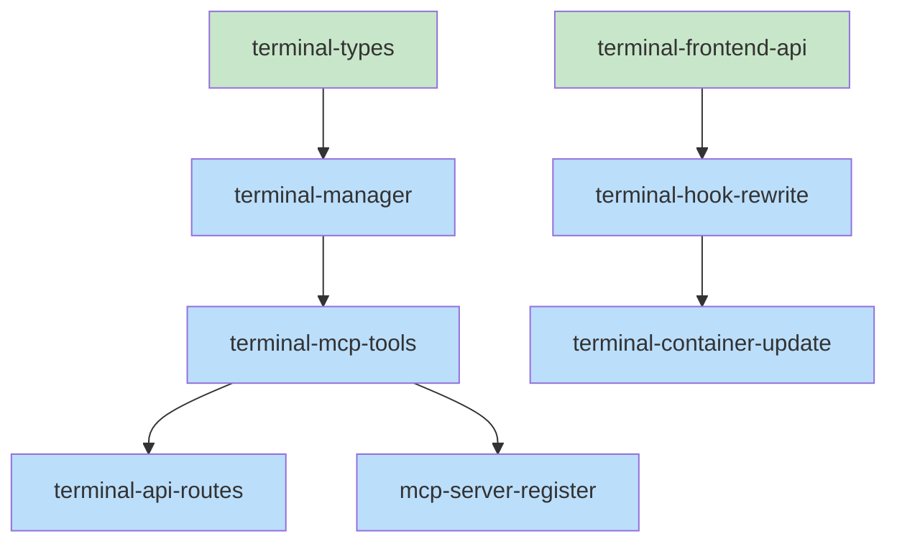

# Skeleton: Item 3 - MCP Terminal Tools (includes Items 2 & 4)

## Planned Files

### New Files
- [ ] `src/types/terminal.ts` - Type definitions
- [ ] `src/services/terminal-manager.ts` - Business logic
- [ ] `src/mcp/tools/terminal-sessions.ts` - MCP tool implementations

### Modified Files
- [ ] `src/mcp/server.ts` - Register new tools
- [ ] `src/routes/api.ts` - Add HTTP endpoints
- [ ] `ui/src/lib/api.ts` - Add frontend API methods
- [ ] `ui/src/hooks/useTerminalTabs.ts` - Rewrite to use API

**Note:** New files will be created; existing files will be modified.

---

## File Contents

### NEW FILE: src/types/terminal.ts

```typescript
/**
 * Terminal session type definitions
 * Shared between backend and can be imported by frontend
 */

export interface TerminalSession {
  /** Unique identifier (UUID) */
  id: string;
  /** Display name (e.g., "Terminal 1") */
  name: string;
  /** tmux session name (e.g., "mc-openboldmeadow-a1b2") */
  tmuxSession: string;
  /** ISO timestamp when created */
  created: string;
  /** Tab order for UI (0-indexed) */
  order: number;
}

export interface TerminalSessionsState {
  sessions: TerminalSession[];
  lastModified: string;
}

// MCP Tool Response Types

export interface CreateSessionResult {
  id: string;
  tmuxSession: string;
  wsUrl: string;
}

export interface ListSessionsResult {
  sessions: TerminalSession[];
}

export interface KillSessionResult {
  success: boolean;
}

export interface RenameSessionResult {
  success: boolean;
}

export interface ReorderSessionsResult {
  success: boolean;
}
```

---

### NEW FILE: src/services/terminal-manager.ts

```typescript
import { join, dirname } from 'path';
import { existsSync, mkdirSync, readFileSync, writeFileSync } from 'fs';
import { exec } from 'child_process';
import { promisify } from 'util';
import type { TerminalSession, TerminalSessionsState } from '../types/terminal.js';

const execAsync = promisify(exec);

export class TerminalManager {
  /**
   * Get storage path for terminal sessions
   */
  private getStoragePath(project: string, session: string): string {
    return join(project, '.collab', session, 'terminal-sessions.json');
  }

  /**
   * Read terminal sessions from storage
   */
  async readSessions(project: string, session: string): Promise<TerminalSessionsState> {
    const storagePath = this.getStoragePath(project, session);
    
    try {
      if (!existsSync(storagePath)) {
        return { sessions: [], lastModified: new Date().toISOString() };
      }
      
      const content = readFileSync(storagePath, 'utf-8');
      return JSON.parse(content) as TerminalSessionsState;
    } catch (error) {
      console.warn(`Failed to read terminal sessions from ${storagePath}:`, error);
      return { sessions: [], lastModified: new Date().toISOString() };
    }
  }

  /**
   * Write terminal sessions to storage
   */
  async writeSessions(project: string, session: string, state: TerminalSessionsState): Promise<void> {
    const storagePath = this.getStoragePath(project, session);
    const dir = dirname(storagePath);
    
    if (!existsSync(dir)) {
      mkdirSync(dir, { recursive: true });
    }
    
    state.lastModified = new Date().toISOString();
    writeFileSync(storagePath, JSON.stringify(state, null, 2));
  }

  /**
   * Generate unique tmux session name
   */
  generateTmuxSessionName(collabSession: string): string {
    // TODO: Extract session name, sanitize, add random suffix
    // See pseudocode for details
    throw new Error('Not implemented');
  }

  /**
   * Create tmux session via shell
   */
  async createTmuxSession(tmuxSessionName: string): Promise<void> {
    // TODO: Run tmux new-session -d -s {name}
    // Handle duplicate session error gracefully
    throw new Error('Not implemented');
  }

  /**
   * Kill tmux session via shell
   */
  async killTmuxSession(tmuxSessionName: string): Promise<void> {
    // TODO: Run tmux kill-session -t {name}
    // Handle "no session" error gracefully
    throw new Error('Not implemented');
  }

  /**
   * List active tmux sessions matching prefix
   */
  async listActiveTmuxSessions(prefix: string): Promise<string[]> {
    // TODO: Run tmux list-sessions, filter by prefix
    throw new Error('Not implemented');
  }

  /**
   * Reconcile stored sessions with actual tmux sessions
   */
  async reconcileSessions(project: string, session: string): Promise<void> {
    // TODO: Compare stored vs active, clean orphans
    throw new Error('Not implemented');
  }
}

// Singleton instance
export const terminalManager = new TerminalManager();
```

---

### NEW FILE: src/mcp/tools/terminal-sessions.ts

```typescript
import { terminalManager } from '../../services/terminal-manager.js';
import type {
  CreateSessionResult,
  ListSessionsResult,
  KillSessionResult,
  RenameSessionResult,
  ReorderSessionsResult,
  TerminalSession,
} from '../../types/terminal.js';

/**
 * Create a new terminal session for a collab session
 */
export async function terminalCreateSession(
  project: string,
  session: string,
  name?: string
): Promise<CreateSessionResult> {
  // TODO: Validate inputs
  // TODO: Read current sessions
  // TODO: Generate tmux session name
  // TODO: Create tmux session
  // TODO: Create session record
  // TODO: Write updated sessions
  // TODO: Return result
  throw new Error('Not implemented');
}

/**
 * List all terminal sessions for a collab session
 */
export async function terminalListSessions(
  project: string,
  session: string
): Promise<ListSessionsResult> {
  // TODO: Read sessions from storage
  // TODO: Sort by order
  // TODO: Return result
  throw new Error('Not implemented');
}

/**
 * Kill a terminal session and its tmux process
 */
export async function terminalKillSession(
  project: string,
  session: string,
  id: string
): Promise<KillSessionResult> {
  // TODO: Read current sessions
  // TODO: Find session by id
  // TODO: Kill tmux session
  // TODO: Remove from sessions
  // TODO: Write updated sessions
  // TODO: Return result
  throw new Error('Not implemented');
}

/**
 * Rename a terminal session
 */
export async function terminalRenameSession(
  project: string,
  session: string,
  id: string,
  name: string
): Promise<RenameSessionResult> {
  // TODO: Read current sessions
  // TODO: Find session by id
  // TODO: Update name
  // TODO: Write updated sessions
  // TODO: Return result
  throw new Error('Not implemented');
}

/**
 * Reorder terminal sessions
 */
export async function terminalReorderSessions(
  project: string,
  session: string,
  orderedIds: string[]
): Promise<ReorderSessionsResult> {
  // TODO: Read current sessions
  // TODO: Validate orderedIds matches sessions
  // TODO: Reorder and update order fields
  // TODO: Write updated sessions
  // TODO: Return result
  throw new Error('Not implemented');
}

// Tool schemas for MCP registration
export const terminalToolSchemas = {
  terminal_create_session: {
    name: 'terminal_create_session',
    description: 'Create a new terminal session for a collab session',
    inputSchema: {
      type: 'object',
      properties: {
        project: { type: 'string', description: 'Absolute path to project' },
        session: { type: 'string', description: 'Collab session name' },
        name: { type: 'string', description: 'Optional display name' },
      },
      required: ['project', 'session'],
    },
  },
  terminal_list_sessions: {
    name: 'terminal_list_sessions',
    description: 'List terminal sessions for a collab session',
    inputSchema: {
      type: 'object',
      properties: {
        project: { type: 'string', description: 'Absolute path to project' },
        session: { type: 'string', description: 'Collab session name' },
      },
      required: ['project', 'session'],
    },
  },
  terminal_kill_session: {
    name: 'terminal_kill_session',
    description: 'Kill a terminal session',
    inputSchema: {
      type: 'object',
      properties: {
        project: { type: 'string', description: 'Absolute path to project' },
        session: { type: 'string', description: 'Collab session name' },
        id: { type: 'string', description: 'Terminal session ID' },
      },
      required: ['project', 'session', 'id'],
    },
  },
  terminal_rename_session: {
    name: 'terminal_rename_session',
    description: 'Rename a terminal session',
    inputSchema: {
      type: 'object',
      properties: {
        project: { type: 'string', description: 'Absolute path to project' },
        session: { type: 'string', description: 'Collab session name' },
        id: { type: 'string', description: 'Terminal session ID' },
        name: { type: 'string', description: 'New display name' },
      },
      required: ['project', 'session', 'id', 'name'],
    },
  },
  terminal_reorder_sessions: {
    name: 'terminal_reorder_sessions',
    description: 'Reorder terminal sessions',
    inputSchema: {
      type: 'object',
      properties: {
        project: { type: 'string', description: 'Absolute path to project' },
        session: { type: 'string', description: 'Collab session name' },
        orderedIds: {
          type: 'array',
          items: { type: 'string' },
          description: 'Session IDs in new order',
        },
      },
      required: ['project', 'session', 'orderedIds'],
    },
  },
};
```

---

### MODIFY: src/routes/api.ts

**Add these routes after existing terminal routes:**

```typescript
// Terminal session management (MCP-backed)

// GET /api/terminal/sessions?project=...&session=...
app.get('/api/terminal/sessions', async (req, res) => {
  // TODO: Extract project, session from query
  // TODO: Call terminalListSessions
  // TODO: Return JSON response
  throw new Error('Not implemented');
});

// POST /api/terminal/sessions
app.post('/api/terminal/sessions', async (req, res) => {
  // TODO: Extract project, session, name from body
  // TODO: Call terminalCreateSession
  // TODO: Return JSON response
  throw new Error('Not implemented');
});

// DELETE /api/terminal/sessions/:id
app.delete('/api/terminal/sessions/:id', async (req, res) => {
  // TODO: Extract id from params, project/session from query
  // TODO: Call terminalKillSession
  // TODO: Return JSON response
  throw new Error('Not implemented');
});

// PATCH /api/terminal/sessions/:id
app.patch('/api/terminal/sessions/:id', async (req, res) => {
  // TODO: Extract id from params, project/session from query, name from body
  // TODO: Call terminalRenameSession
  // TODO: Return JSON response
  throw new Error('Not implemented');
});

// PUT /api/terminal/sessions/reorder
app.put('/api/terminal/sessions/reorder', async (req, res) => {
  // TODO: Extract project, session from query, orderedIds from body
  // TODO: Call terminalReorderSessions
  // TODO: Return JSON response
  throw new Error('Not implemented');
});
```

---

### MODIFY: ui/src/lib/api.ts

**Add these methods to the api object:**

```typescript
// Terminal session methods

async getTerminalSessions(project: string, session: string): Promise<TerminalSession[]> {
  const url = `/api/terminal/sessions?project=${encodeURIComponent(project)}&session=${encodeURIComponent(session)}`;
  const response = await fetch(url);
  if (!response.ok) {
    throw new Error(response.statusText);
  }
  const data = await response.json();
  return data.sessions || [];
}

async createTerminalSession(project: string, session: string, name?: string): Promise<CreateSessionResult> {
  const response = await fetch('/api/terminal/sessions', {
    method: 'POST',
    headers: { 'Content-Type': 'application/json' },
    body: JSON.stringify({ project, session, name }),
  });
  if (!response.ok) {
    throw new Error(response.statusText);
  }
  return response.json();
}

async deleteTerminalSession(project: string, session: string, id: string): Promise<void> {
  const url = `/api/terminal/sessions/${encodeURIComponent(id)}?project=${encodeURIComponent(project)}&session=${encodeURIComponent(session)}`;
  const response = await fetch(url, { method: 'DELETE' });
  if (!response.ok) {
    throw new Error(response.statusText);
  }
}

async renameTerminalSession(project: string, session: string, id: string, name: string): Promise<void> {
  const url = `/api/terminal/sessions/${encodeURIComponent(id)}?project=${encodeURIComponent(project)}&session=${encodeURIComponent(session)}`;
  const response = await fetch(url, {
    method: 'PATCH',
    headers: { 'Content-Type': 'application/json' },
    body: JSON.stringify({ name }),
  });
  if (!response.ok) {
    throw new Error(response.statusText);
  }
}

async reorderTerminalSessions(project: string, session: string, orderedIds: string[]): Promise<void> {
  const url = `/api/terminal/sessions/reorder?project=${encodeURIComponent(project)}&session=${encodeURIComponent(session)}`;
  const response = await fetch(url, {
    method: 'PUT',
    headers: { 'Content-Type': 'application/json' },
    body: JSON.stringify({ orderedIds }),
  });
  if (!response.ok) {
    throw new Error(response.statusText);
  }
}
```

---

### MODIFY: ui/src/hooks/useTerminalTabs.ts

**Complete rewrite to use API:**

```typescript
import { useState, useEffect, useCallback } from 'react';
import { api } from '../lib/api';
import type { TerminalSession, CreateSessionResult } from '../types/terminal';

export interface UseTerminalTabsOptions {
  project: string;
  session: string;
}

export interface UseTerminalTabsReturn {
  tabs: TerminalSession[];
  activeTabId: string | null;
  activeTab: TerminalSession | null;
  isLoading: boolean;
  error: Error | null;
  addTab: () => Promise<void>;
  removeTab: (id: string) => Promise<void>;
  renameTab: (id: string, name: string) => Promise<void>;
  setActiveTab: (id: string) => void;
  reorderTabs: (fromIndex: number, toIndex: number) => Promise<void>;
  refresh: () => Promise<void>;
}

export function useTerminalTabs({ project, session }: UseTerminalTabsOptions): UseTerminalTabsReturn {
  const [tabs, setTabs] = useState<TerminalSession[]>([]);
  const [activeTabId, setActiveTabId] = useState<string | null>(null);
  const [isLoading, setIsLoading] = useState(true);
  const [error, setError] = useState<Error | null>(null);

  // Fetch sessions from API
  const refresh = useCallback(async () => {
    // TODO: setIsLoading, fetch, setTabs, setActiveTabId, setError
    throw new Error('Not implemented');
  }, [project, session]);

  // Load on mount and when project/session changes
  useEffect(() => {
    refresh();
  }, [refresh]);

  const addTab = useCallback(async () => {
    // TODO: Call API, update state
    throw new Error('Not implemented');
  }, [project, session]);

  const removeTab = useCallback(async (id: string) => {
    // TODO: Call API, update state, handle active tab selection
    throw new Error('Not implemented');
  }, [project, session, tabs, activeTabId]);

  const renameTab = useCallback(async (id: string, name: string) => {
    // TODO: Call API, update state
    throw new Error('Not implemented');
  }, [project, session]);

  const reorderTabs = useCallback(async (fromIndex: number, toIndex: number) => {
    // TODO: Optimistic update, call API, revert on error
    throw new Error('Not implemented');
  }, [project, session, tabs]);

  const activeTab = tabs.find(t => t.id === activeTabId) || null;

  return {
    tabs,
    activeTabId,
    activeTab,
    isLoading,
    error,
    addTab,
    removeTab,
    renameTab,
    setActiveTab: setActiveTabId,
    reorderTabs,
    refresh,
  };
}
```

---

### MODIFY: ui/src/components/terminal/TerminalTabsContainer.tsx

**Update to use new hook signature:**

```typescript
// Change this:
const collabSessionId = useMemo(() => {
  if (!currentSession) return undefined;
  return `${currentSession.project}:${currentSession.name}`;
}, [currentSession]);

// To this:
const project = currentSession?.project || '';
const session = currentSession?.name || '';

// Change hook call from:
const { tabs, ... } = useTerminalTabs({ collabSessionId, onSessionClose: handleSessionClose });

// To:
const { tabs, isLoading, error, ... } = useTerminalTabs({ project, session });

// REMOVE: handleSessionClose callback (MCP handles cleanup)
// REMOVE: useEffect for cleanup on mount (MCP handles reconciliation)

// ADD: Loading and error states in render
if (isLoading) {
  return <div>Loading terminals...</div>;
}
if (error) {
  return <div>Error: {error.message}</div>;
}
```

---

## Task Dependency Graph

```yaml
tasks:
  - id: terminal-types
    files: [src/types/terminal.ts]
    tests: []
    description: Terminal session type definitions
    parallel: true

  - id: terminal-manager
    files: [src/services/terminal-manager.ts]
    tests: [src/services/terminal-manager.test.ts, src/services/__tests__/terminal-manager.test.ts]
    description: Terminal manager service with tmux operations
    depends-on: [terminal-types]

  - id: terminal-mcp-tools
    files: [src/mcp/tools/terminal-sessions.ts]
    tests: [src/mcp/tools/terminal-sessions.test.ts, src/mcp/tools/__tests__/terminal-sessions.test.ts]
    description: MCP tool implementations for terminal sessions
    depends-on: [terminal-manager]

  - id: terminal-api-routes
    files: [src/routes/api.ts]
    tests: [src/routes/__tests__/api-terminal.test.ts]
    description: HTTP API endpoints for terminal sessions
    depends-on: [terminal-mcp-tools]

  - id: terminal-frontend-api
    files: [ui/src/lib/api.ts]
    tests: [ui/src/lib/api.test.ts, ui/src/lib/__tests__/api.test.ts]
    description: Frontend API client methods for terminal sessions
    parallel: true

  - id: terminal-hook-rewrite
    files: [ui/src/hooks/useTerminalTabs.ts]
    tests: [ui/src/hooks/useTerminalTabs.test.ts, ui/src/hooks/__tests__/useTerminalTabs.test.ts]
    description: Rewrite useTerminalTabs to use API instead of localStorage
    depends-on: [terminal-frontend-api]

  - id: terminal-container-update
    files: [ui/src/components/terminal/TerminalTabsContainer.tsx]
    tests: [ui/src/components/terminal/TerminalTabsContainer.test.tsx, ui/src/components/terminal/__tests__/TerminalTabsContainer.test.tsx]
    description: Update container to use new hook signature
    depends-on: [terminal-hook-rewrite]

  - id: mcp-server-register
    files: [src/mcp/server.ts]
    tests: [src/mcp/__tests__/server.test.ts]
    description: Register terminal tools in MCP server
    depends-on: [terminal-mcp-tools]
```

## Execution Order

**Wave 1 (parallel):**
- terminal-types
- terminal-frontend-api

**Wave 2 (depends on Wave 1):**
- terminal-manager (depends on terminal-types)

**Wave 3 (depends on Wave 2):**
- terminal-mcp-tools (depends on terminal-manager)

**Wave 4 (depends on Wave 3):**
- terminal-api-routes (depends on terminal-mcp-tools)
- mcp-server-register (depends on terminal-mcp-tools)
- terminal-hook-rewrite (depends on terminal-frontend-api)

**Wave 5 (depends on Wave 4):**
- terminal-container-update (depends on terminal-hook-rewrite)

## Mermaid Visualization



## Verification

- [x] All files from Interface are documented
- [x] File paths match exactly
- [x] All types are defined
- [x] All function signatures present
- [x] TODO comments match pseudocode
- [x] Dependency graph covers all files
- [x] No circular dependencies
