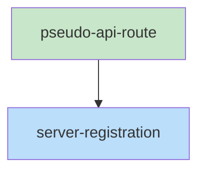

# Blueprint: Item 1 - Backend API endpoints

## 1. Structure Summary

### Files
- [ ] `src/routes/pseudo-api.ts` — New route handler for all `/api/pseudo/*` endpoints
- [ ] `src/server.ts` — Add import + route registration before `/api/` catch-all

### Type Definitions

```typescript
// In pseudo-api.ts
type SearchMatch = {
  function: string;    // Current function name when match was found ('' if in module prose)
  line: string;        // The matched line content
  lineNumber: number;  // 1-based line number
}

type SearchResultFile = {
  file: string;        // stem without .pseudo extension
  matches: SearchMatch[];
}
```

### Component Interactions
- `src/server.ts` imports `handlePseudoAPI` and calls it for `/api/pseudo` prefix
- `handlePseudoAPI` uses `Bun.Glob` to walk `project` directory for `.pseudo` files
- `handlePseudoAPI` uses `Bun.file()` to read individual files

---

## 2. Function Blueprints

### `handlePseudoAPI(req: Request): Promise<Response>` (EXPORT)

**Pseudocode:**
1. Parse URL, strip `/api/pseudo` prefix to get `path`
2. Get `project` query param; return 400 if missing
3. Route by `path`:
   - `'/files'` + GET → `handleListFiles(project)`
   - `'/file'` + GET → get `file` param, 400 if missing, call `handleGetFile(project, file)`
   - `'/search'` + GET → get `q` param, 400 if missing, call `handleSearch(project, q)`
   - else → 404

**Error Handling:** All sub-handlers return proper Response objects; top-level catches unexpected errors and returns 500.

**Stub:**
```typescript
export async function handlePseudoAPI(req: Request): Promise<Response> {
  const url = new URL(req.url);
  const path = url.pathname.replace('/api/pseudo', '');
  const project = url.searchParams.get('project');
  if (!project) return jsonError('Missing required query parameter: project', 400);
  try {
    if (path === '/files' && req.method === 'GET') return handleListFiles(project);
    if (path === '/file' && req.method === 'GET') {
      const file = url.searchParams.get('file');
      if (!file) return jsonError('Missing required query parameter: file', 400);
      return handleGetFile(project, file);
    }
    if (path === '/search' && req.method === 'GET') {
      const q = url.searchParams.get('q');
      if (!q) return jsonError('Missing required query parameter: q', 400);
      return handleSearch(project, q);
    }
    return jsonError('Not found', 404);
  } catch (err) {
    return jsonError('Internal server error', 500);
  }
}
```

---

### `handleListFiles(project: string): Promise<Response>`

**Pseudocode:**
1. Create `new Bun.Glob('**/*.pseudo')` and scan `project` directory
2. Collect all results, strip `.pseudo` extension from each
3. Sort alphabetically
4. Return `{ files: string[] }`

**Edge Cases:** Project path doesn't exist → Bun.Glob scan will return empty; return `{ files: [] }`.

**Stub:**
```typescript
async function handleListFiles(project: string): Promise<Response> {
  // TODO: Glob **/*.pseudo, strip .pseudo, sort, return { files }
  throw new Error('Not implemented');
}
```

---

### `handleGetFile(project: string, file: string): Promise<Response>`

**Pseudocode:**
1. Construct full path: `join(project, file + '.pseudo')`
2. Create `Bun.file(fullPath)`
3. If file doesn't exist → return 404
4. Read text content
5. Return `{ content, path: file }`

**Edge Cases:** Path traversal — `file` could contain `../`. Sanitize by ensuring resolved path stays within `project`.

**Stub:**
```typescript
async function handleGetFile(project: string, file: string): Promise<Response> {
  // TODO: join(project, file + '.pseudo'), check exists, read, return { content, path }
  throw new Error('Not implemented');
}
```

---

### `handleSearch(project: string, q: string): Promise<Response>`

**Pseudocode:**
1. Glob all `.pseudo` files in `project`
2. For each file:
   a. Read content line by line
   b. Track current function name (reset on `FUNCTION` lines, clear on `---`)
   c. For each line: if contains `q` (case-insensitive), record `{ function, line, lineNumber }`
   d. Flag `isFunctionLine: true` for matches on a `FUNCTION` line
3. Skip files with no matches
4. Sort matches within each file: FUNCTION-line matches first, then body matches
5. Cap at 50 total matches across all files
6. Return array of `{ file, matches }`

**Edge Cases:** Empty query → return 400 (handled upstream). Very large files → stream line-by-line with Bun.

**Stub:**
```typescript
async function handleSearch(project: string, q: string): Promise<Response> {
  // TODO: Glob all .pseudo, scan line-by-line, track FUNCTION, collect matches, cap 50
  throw new Error('Not implemented');
}
```

---

### Helper: `jsonResponse(data: unknown, status = 200): Response`

Returns `new Response(JSON.stringify(data), { status, headers: { 'Content-Type': 'application/json' } })`.

### Helper: `jsonError(message: string, status: number): Response`

Returns `jsonResponse({ error: message }, status)`.

---

## 3. Task Dependency Graph

### YAML Graph

```yaml
tasks:
  - id: pseudo-api-route
    files: [src/routes/pseudo-api.ts]
    tests: [src/routes/pseudo-api.test.ts]
    description: "Create handlePseudoAPI with /files, /file, /search endpoints using Bun.Glob"
    parallel: true
    depends-on: []

  - id: server-registration
    files: [src/server.ts]
    tests: []
    description: "Import handlePseudoAPI and register /api/pseudo route before /api/ catch-all"
    parallel: false
    depends-on: [pseudo-api-route]
```

### Execution Waves

**Wave 1 (parallel):**
- pseudo-api-route

**Wave 2 (sequential):**
- server-registration

### Mermaid Visualization



### Summary
- Total tasks: 2
- Total waves: 2
- Max parallelism: 1
