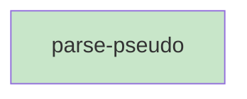

# Blueprint: Item 2 - Pseudo parser

## 1. Structure Summary

### Files
- [ ] `ui/src/pages/pseudo/parsePseudo.ts` — Pure function, no dependencies, no imports

### Type Definitions

```typescript
export type CallsRef = {
  name: string;      // Function name referenced
  fileStem: string;  // File stem (e.g., 'api', 'diagram-manager')
}

export type ParsedFunction = {
  name: string;
  params: string;        // Raw params string
  returnType: string;    // Raw return type ('' if none)
  isExport: boolean;
  calls: CallsRef[];
  body: string[];        // Lines after FUNCTION header and CALLS
}

export type ParsedPseudo = {
  titleLine: string;
  subtitleLine: string;
  moduleProse: string[];   // Lines before first FUNCTION
  functions: ParsedFunction[];
}
```

### Component Interactions
- `parsePseudo` is a pure function — no external calls
- Consumed by `PseudoViewer` (renders blocks) and `CallsPopover` (extracts exports)

---

## 2. Function Blueprints

### `parsePseudo(content: string): ParsedPseudo` (EXPORT)

**Pseudocode:**
1. Split content into lines
2. Init state: `titleLine=''`, `subtitleLine=''`, `moduleProse=[]`, `functions=[]`, `inFunction=false`, `current=null`
3. For each line:
   a. If not yet in a function and line starts with `//`:
      - If `titleLine` empty → set titleLine
      - Else if `subtitleLine` empty → set subtitleLine
      - Else skip (multi-line comment)
   b. If not yet in a function and line is `---` → skip
   c. If not yet in a function and line starts with `FUNCTION`:
      - Parse signature with regex: `/^FUNCTION\s+(\w[\w.]*)\s*(\([^)]*\))?\s*(?:->\s*(.+?))?\s*(EXPORT)?$/`
      - Set `inFunction=true`, create new `current` block
   d. If not yet in a function → append to `moduleProse` (non-empty lines only)
   e. If in function and line is `---`:
      - Push `current` to `functions`, reset `current=null`, `inFunction=false`
   f. If in function and line starts with `CALLS:`:
      - Regex `/(\w[\w.]+)\s+\(([^)]+)\)/g` to extract `{name, fileStem}` pairs
      - Add all to `current.calls`
   g. If in function and line starts with `FUNCTION`:
      - Push current (if any), parse new function header, create new `current`
   h. If in function → push line to `current.body`
4. After loop: if `current` is non-null, push to `functions`
5. Return `{ titleLine, subtitleLine, moduleProse, functions }`

**Edge Cases:**
- File with no FUNCTION blocks (module-only) → `functions: []`, all non-comment lines in `moduleProse`
- Multiple CALLS lines in one function → all parsed and merged into `calls[]`
- `---` at end of file with no trailing FUNCTION → handled by step 4
- FUNCTION line with no params or return type → empty strings

**Test Strategy:**
- Parse a minimal file (header + 1 function)
- Parse module-only file (no FUNCTION blocks)
- Parse file with EXPORT marker
- Parse CALLS with multiple references on one line
- Parse file ending without `---`

**Stub:**
```typescript
export function parsePseudo(content: string): ParsedPseudo {
  // TODO: Split into lines
  // TODO: Single linear pass tracking state
  // TODO: Parse // header lines
  // TODO: Parse FUNCTION lines with regex
  // TODO: Parse CALLS lines with regex
  // TODO: Handle --- separators
  // TODO: Collect moduleProse
  // TODO: Push final function if file ends without ---
  throw new Error('Not implemented');
}
```

---

## 3. Task Dependency Graph

### YAML Graph

```yaml
tasks:
  - id: parse-pseudo
    files: [ui/src/pages/pseudo/parsePseudo.ts]
    tests: [ui/src/pages/pseudo/parsePseudo.test.ts]
    description: "Implement parsePseudo pure function with single linear pass"
    parallel: true
    depends-on: []
```

### Execution Waves

**Wave 1 (parallel):**
- parse-pseudo

### Mermaid Visualization



### Summary
- Total tasks: 1
- Total waves: 1
- Max parallelism: 1
