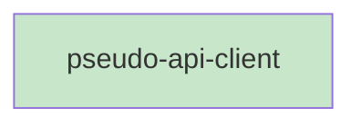

# Blueprint: Item 3 - API client

## 1. Structure Summary

### Files
- [ ] `ui/src/lib/pseudo-api.ts` — Three typed fetch wrappers for `/api/pseudo` endpoints

### Type Definitions

```typescript
export type SearchMatch = {
  function: string;
  line: string;
  lineNumber: number;
}

export type SearchResult = {
  file: string;
  matches: SearchMatch[];
}
```

### Component Interactions
- `fetchPseudoFiles` called by `PseudoPage` on mount / project change
- `fetchPseudoFile` called by `PseudoViewer` on path change (cache miss)
- `searchPseudo` called by `PseudoSearch` on debounced input

---

## 2. Function Blueprints

### `fetchPseudoFiles(project: string): Promise<string[]>` (EXPORT)

**Pseudocode:**
1. GET `/api/pseudo/files?project=<encoded project>`
2. Throw if response not ok
3. Parse JSON, return `data.files`

**Stub:**
```typescript
export async function fetchPseudoFiles(project: string): Promise<string[]> {
  // TODO: GET /api/pseudo/files?project=, throw on error, return data.files
  throw new Error('Not implemented');
}
```

---

### `fetchPseudoFile(project: string, file: string): Promise<string>` (EXPORT)

**Pseudocode:**
1. GET `/api/pseudo/file?project=<encoded>&file=<encoded>`
2. Throw if response not ok (including 404)
3. Parse JSON, return `data.content`

**Stub:**
```typescript
export async function fetchPseudoFile(project: string, file: string): Promise<string> {
  // TODO: GET /api/pseudo/file?project=&file=, throw on error, return data.content
  throw new Error('Not implemented');
}
```

---

### `searchPseudo(project: string, q: string): Promise<SearchResult[]>` (EXPORT)

**Pseudocode:**
1. GET `/api/pseudo/search?project=<encoded>&q=<encoded>`
2. Throw if response not ok
3. Parse JSON, return array directly

**Stub:**
```typescript
export async function searchPseudo(project: string, q: string): Promise<SearchResult[]> {
  // TODO: GET /api/pseudo/search?project=&q=, throw on error, return data
  throw new Error('Not implemented');
}
```

---

## 3. Task Dependency Graph

### YAML Graph

```yaml
tasks:
  - id: pseudo-api-client
    files: [ui/src/lib/pseudo-api.ts]
    tests: [ui/src/lib/pseudo-api.test.ts]
    description: "Implement three typed fetch wrappers for /api/pseudo endpoints"
    parallel: true
    depends-on: []
```

### Execution Waves

**Wave 1 (parallel):**
- pseudo-api-client

### Mermaid Visualization



### Summary
- Total tasks: 1
- Total waves: 1
- Max parallelism: 1
