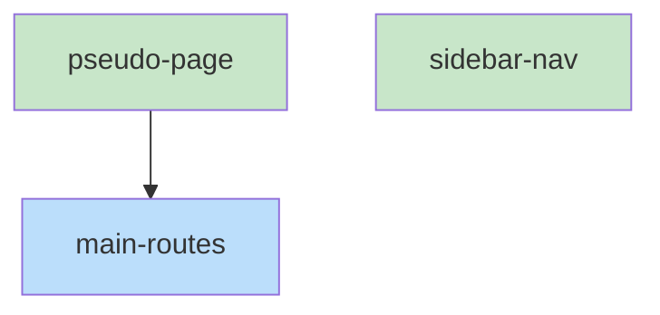

# Blueprint: Item 4 - PseudoPage + routing

## 1. Structure Summary

### Files
- [ ] `ui/src/pages/pseudo/PseudoPage.tsx` — Top-level layout shell and state owner
- [ ] `ui/src/main.tsx` — Add `/pseudo` and `/pseudo/*` routes
- [ ] `ui/src/components/layout/Sidebar.tsx` — Add pseudo nav link in cross-links section

### Type Definitions

```typescript
// PseudoPage internal state
type PseudoPageState = {
  fileList: string[];
  fileCache: Map<string, string>;
  searchQuery: string;
  searchOpen: boolean;
}
```

### Component Interactions
- `PseudoPage` reads `project` from `useSessionStore` (same source as other routes)
- `PseudoPage` uses `useParams<{ '*': string }>()` to get `currentPath` from URL
- `PseudoPage` uses `useNavigate()` to push new paths on file selection
- Children `PseudoFileTree`, `PseudoViewer`, `FunctionJumpPanel` are laid out by PseudoPage
- `viewerRef` (`useRef<PseudoViewerHandle>`) passed from PseudoPage to FunctionJumpPanel and PseudoSearch

---

## 2. Function Blueprints

### `PseudoPage(): JSX.Element` (EXPORT default)

**Pseudocode:**
1. Get `currentPath` from `useParams` (`params['*']`)
2. Get `project` from `useSessionStore` (the active project path)
3. State: `fileList`, `fileCache`, `searchQuery`, `searchOpen`
4. `viewerRef = useRef<PseudoViewerHandle>(null)`
5. On `project` change: clear fileList, clear fileCache, navigate to `/pseudo`
6. On mount / project change: call `fetchPseudoFiles(project)`, set `fileList`
7. Render 3-column flex layout:
   - Left (280px, shrink-0): `<PseudoFileTree fileList=... currentPath=... onNavigate=... project=... />`
   - Center (flex-1, overflow-auto): `<PseudoViewer ref=viewerRef currentPath=... project=... fileCache=... onCacheFile=... onNavigate=... />`
   - Right (220px, shrink-0): `<FunctionJumpPanel viewerRef=viewerRef />`
8. Render `<PseudoSearch>` overlay (shown when searchOpen)
9. Global keydown: Cmd+K / Cmd+F → set searchOpen=true

**Edge Cases:**
- No project selected → show "Select a project to browse" placeholder
- File list load error → show error state

**Stub:**
```typescript
export default function PseudoPage(): JSX.Element {
  // TODO: useParams, useSessionStore, state, viewerRef
  // TODO: useEffect: project change → clear + refetch fileList
  // TODO: keydown handler for Cmd+K
  // TODO: 3-col flex layout with children
  throw new Error('Not implemented');
}
```

---

### Route additions in `main.tsx`

Add before the `<Route path="/*" element={<App />} />` catch-all:
```tsx
<Route path="/pseudo" element={<PseudoPage />} />
<Route path="/pseudo/*" element={<PseudoPage />} />
```

### Nav link addition in `Sidebar.tsx`

Add a new `<Link to="/pseudo">` in the cross-links section with a code/file icon and "Pseudo" label, following the same pattern as the Kodex and Onboarding links.

---

## 3. Task Dependency Graph

### YAML Graph

```yaml
tasks:
  - id: pseudo-page
    files: [ui/src/pages/pseudo/PseudoPage.tsx]
    tests: [ui/src/pages/pseudo/PseudoPage.test.tsx]
    description: "Implement PseudoPage layout shell with state, 3-col layout, Cmd+K handler"
    parallel: true
    depends-on: []

  - id: main-routes
    files: [ui/src/main.tsx]
    tests: []
    description: "Add /pseudo and /pseudo/* routes before App catch-all"
    parallel: false
    depends-on: [pseudo-page]

  - id: sidebar-nav
    files: [ui/src/components/layout/Sidebar.tsx]
    tests: []
    description: "Add pseudo nav link in cross-links section"
    parallel: true
    depends-on: []
```

### Execution Waves

**Wave 1 (parallel):**
- pseudo-page
- sidebar-nav

**Wave 2:**
- main-routes (depends on pseudo-page)

### Mermaid Visualization



### Summary
- Total tasks: 3
- Total waves: 2
- Max parallelism: 2
