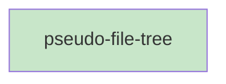

# Blueprint: Item 5 - PseudoFileTree

## 1. Structure Summary

### Files
- [ ] `ui/src/pages/pseudo/PseudoFileTree.tsx` — Left sidebar with tree, filter, and project dropdown

### Type Definitions

```typescript
type TreeNode = {
  name: string;
  path: string;        // Full stem path from project root
  children: TreeNode[];
  isDir: boolean;
}

type PseudoFileTreeProps = {
  fileList: string[];
  currentPath: string;
  onNavigate: (stem: string) => void;
  project: string;
  onProjectChange: (project: string) => void;
}
```

### Component Interactions
- Receives flat `fileList` from `PseudoPage`, builds tree internally
- Calls `onNavigate(stem)` when a file is clicked
- Reads/writes localStorage for collapse state
- Reads registered projects from `useSessionStore` for dropdown

---

## 2. Function Blueprints

### `buildTree(fileList: string[]): TreeNode`

**Pseudocode:**
1. Create root node `{ name: '', path: '', children: [], isDir: true }`
2. For each stem in fileList:
   a. Split on `/` to get segments
   b. Walk/create nodes from root: for each segment (except last), find-or-create dir node
   c. Create leaf file node at the final segment
3. Sort each node's children: dirs first (alpha), then files (alpha)
4. Return root

**Stub:**
```typescript
function buildTree(fileList: string[]): TreeNode {
  // TODO: split stems, build nested tree, sort dirs-first alpha
  throw new Error('Not implemented');
}
```

---

### `countFiles(node: TreeNode): number`

Returns total number of file descendants of a directory node (for collapsed `(N)` badge).

---

### `PseudoFileTree(props: PseudoFileTreeProps): JSX.Element` (EXPORT default)

**Pseudocode:**
1. State: `filter` (string), `collapsed` (Set<string>) from localStorage
2. `tree = useMemo(() => buildTree(fileList), [fileList])`
3. Filtered tree: when filter non-empty, only show files whose stem contains filter (case-insensitive); auto-expand parent dirs of matches
4. Render:
   a. Project dropdown at top (registered projects from `useSessionStore`)
   b. Filter input (clear button when non-empty, Esc clears)
   c. Recursive tree render starting from root children
5. Each dir node: chevron + name + `(N)` if collapsed; click toggles collapse, persists to localStorage
6. Each file node: name only; click calls `onNavigate(node.path)`; active file (`node.path === currentPath`) gets `bg-purple-50 text-purple-700`

**Edge Cases:**
- Filter matches no files → show "No results"
- Empty fileList → show "No .pseudo files found"
- Very deep nesting → indent by `depth * 12px`

**Stub:**
```typescript
export default function PseudoFileTree(props: PseudoFileTreeProps): JSX.Element {
  // TODO: useState filter, collapsed (from localStorage)
  // TODO: useMemo buildTree
  // TODO: project dropdown
  // TODO: filter input
  // TODO: recursive tree render
  throw new Error('Not implemented');
}
```

---

## 3. Task Dependency Graph

### YAML Graph

```yaml
tasks:
  - id: pseudo-file-tree
    files: [ui/src/pages/pseudo/PseudoFileTree.tsx]
    tests: [ui/src/pages/pseudo/PseudoFileTree.test.tsx]
    description: "Implement PseudoFileTree with buildTree, filter, collapse, localStorage persistence"
    parallel: true
    depends-on: []
```

### Execution Waves

**Wave 1 (parallel):**
- pseudo-file-tree

### Mermaid Visualization



### Summary
- Total tasks: 1
- Total waves: 1
- Max parallelism: 1
