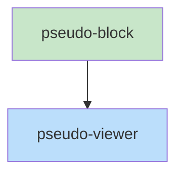

# Blueprint: Item 6 - PseudoViewer + PseudoBlock

## 1. Structure Summary

### Files
- [ ] `ui/src/pages/pseudo/PseudoViewer.tsx` — Main content area; fetches, parses, renders; exposes scrollToFunction
- [ ] `ui/src/pages/pseudo/PseudoBlock.tsx` — Renders one FUNCTION block with full styling

### Type Definitions

```typescript
export type PseudoViewerHandle = {
  scrollToFunction: (name: string) => void;
  getFunctions: () => ParsedFunction[];
}

type PseudoViewerProps = {
  currentPath: string;
  project: string;
  fileCache: Map<string, string>;
  onCacheFile: (path: string, content: string) => void;
  onNavigate: (stem: string) => void;
}

type PseudoBlockProps = {
  func: ParsedFunction;
  onNavigate: (stem: string) => void;
}
```

### Component Interactions
- `PseudoViewer` calls `fetchPseudoFile` on cache miss
- `PseudoViewer` calls `parsePseudo` on loaded content
- `PseudoViewer` renders `PseudoBlock` per function
- `PseudoViewer` passes `onNavigate` down to `PseudoBlock` → `CallsLink`
- `FunctionJumpPanel` and `PseudoSearch` call `viewerRef.current.scrollToFunction(name)`
- `FunctionJumpPanel` calls `viewerRef.current.getFunctions()` to get the list

---

## 2. Function Blueprints

### `PseudoViewer` (forwardRef, EXPORT default)

**Pseudocode:**
1. On `currentPath` change:
   a. Check `fileCache.get(currentPath)`
   b. If miss → `fetchPseudoFile(project, currentPath)` → call `onCacheFile` → set local `content`
   c. If hit → use cached content
2. `parsed = useMemo(() => parsePseudo(content), [content])`
3. `useImperativeHandle(ref, () => ({ scrollToFunction, getFunctions: () => parsed.functions }))`
4. `scrollToFunction(name)`: find `[data-function="${name}"]` element, `scrollIntoView({ behavior: 'smooth', block: 'start' })`, add `flash` CSS class, remove after 1500ms
5. Render:
   - Header section: `titleLine` (bold lg), `subtitleLine` (muted)
   - Module prose: each line as muted paragraph
   - Divider
   - `PseudoBlock` for each function (with `data-function={func.name}`)

**Stub:**
```typescript
export const PseudoViewer = forwardRef<PseudoViewerHandle, PseudoViewerProps>(
  function PseudoViewer(props, ref) {
    // TODO: fetch on currentPath change, cache check
    // TODO: parsePseudo, useImperativeHandle
    // TODO: scrollToFunction with yellow flash
    // TODO: render header + moduleProse + PseudoBlocks
    throw new Error('Not implemented');
  }
);
export default PseudoViewer;
```

---

### `PseudoBlock(props: PseudoBlockProps): JSX.Element` (EXPORT default)

**Pseudocode:**
Render one function block:
1. Header line: `FUNCTION` (bold purple `#7c3aed`) + space + `name` (bold `#1c1917`) + params/return (`#44403c`) + EXPORT badge if `func.isExport` (right-aligned, `bg-green-100 text-green-700 text-xs rounded px-1`)
2. If `func.calls.length > 0`: CALLS label (`#78716c text-xs`) + `CallsLink` per call
3. `<hr>` separator (subtle `border-stone-200`)
4. Body lines: each as `<p className="pl-5 text-stone-600 text-sm">`, IF/ELSE lines slightly bold

**Stub:**
```typescript
export default function PseudoBlock({ func, onNavigate }: PseudoBlockProps): JSX.Element {
  // TODO: FUNCTION keyword purple, name bold, EXPORT badge
  // TODO: CALLS row with CallsLink per call
  // TODO: hr separator
  // TODO: body lines pl-5, IF/ELSE bold
  throw new Error('Not implemented');
}
```

---

## 3. Task Dependency Graph

### YAML Graph

```yaml
tasks:
  - id: pseudo-block
    files: [ui/src/pages/pseudo/PseudoBlock.tsx]
    tests: [ui/src/pages/pseudo/PseudoBlock.test.tsx]
    description: "Render one FUNCTION block with purple/green/orange/muted styling"
    parallel: true
    depends-on: []

  - id: pseudo-viewer
    files: [ui/src/pages/pseudo/PseudoViewer.tsx]
    tests: [ui/src/pages/pseudo/PseudoViewer.test.tsx]
    description: "Fetch+parse+render file, forwardRef with scrollToFunction + getFunctions"
    parallel: false
    depends-on: [pseudo-block]
```

### Execution Waves

**Wave 1 (parallel):**
- pseudo-block

**Wave 2:**
- pseudo-viewer

### Mermaid Visualization



### Summary
- Total tasks: 2
- Total waves: 2
- Max parallelism: 1
