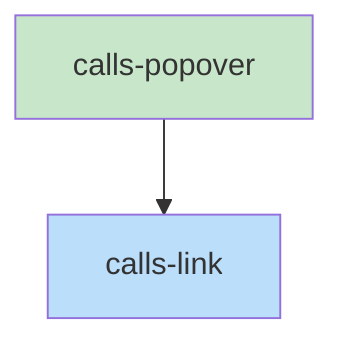

# Blueprint: Item 7 - CallsLink + CallsPopover

## 1. Structure Summary

### Files
- [ ] `ui/src/pages/pseudo/CallsLink.tsx` — Orange link with hover timer → popover
- [ ] `ui/src/pages/pseudo/CallsPopover.tsx` — 320px portal card with file preview

### Type Definitions

```typescript
type CallsLinkProps = {
  name: string;          // Function name
  fileStem: string;      // Target file stem
  project: string;
  onNavigate: (stem: string) => void;
}

type PopoverState = {
  visible: boolean;
  content: string | null;   // raw pseudo content of target file
  position: { top: number; left: number };
}

type CallsPopoverProps = {
  content: string;           // Raw pseudo text of target file
  fileStem: string;
  position: { top: number; left: number };
  onNavigate: (stem: string) => void;
  onMouseEnter: () => void;
  onMouseLeave: () => void;
}
```

### Component Interactions
- `CallsLink` is rendered by `PseudoBlock` for each `calls` entry
- `CallsLink` fetches target file content via `fetchPseudoFile` on hover
- `CallsPopover` is portal-mounted on `document.body`
- `CallsPopover` calls `parsePseudo` to extract title, subtitle, and exports for display

---

## 2. Function Blueprints

### `CallsLink(props: CallsLinkProps): JSX.Element` (EXPORT default)

**Pseudocode:**
1. State: `popoverState` (visible, content, position)
2. Refs: `hoverTimer`, `graceTimer`, `anchorRef`
3. `handleMouseEnter`:
   a. Clear any grace timer
   b. Start 400ms timer → fetch `fetchPseudoFile(project, fileStem)` → set popover visible with position from `anchorRef.getBoundingClientRect()`
4. `handleMouseLeave`:
   a. Clear hover timer (cancel if still pending)
   b. Start 300ms grace timer → hide popover
5. Render: `<span ref=anchorRef>` with orange `text-orange-600 underline cursor-pointer text-sm`
   - Text: `functionName (fileStem)`
   - `onClick`: call `onNavigate(fileStem)`
   - Pass `onMouseEnter`/`onMouseLeave` to anchor
6. If popover visible: render `<CallsPopover>` via portal

**Stub:**
```typescript
export default function CallsLink({ name, fileStem, project, onNavigate }: CallsLinkProps): JSX.Element {
  // TODO: popoverState, hoverTimer, graceTimer, anchorRef
  // TODO: handleMouseEnter: 400ms → fetch → show
  // TODO: handleMouseLeave: clear timer, 300ms grace → hide
  // TODO: orange span with click + portal popover
  throw new Error('Not implemented');
}
```

---

### `CallsPopover(props: CallsPopoverProps): JSX.Element` (EXPORT default)

**Pseudocode:**
1. `parsed = useMemo(() => parsePseudo(content), [content])`
2. `exports = parsed.functions.filter(f => f.isExport)`
3. Position: fixed, `{ top: props.position.top, left: props.position.left }`, adjust if would overflow viewport
4. Render (320px portal card):
   - File path stem (mono, muted, small)
   - `<hr>`
   - `titleLine` (bold)
   - `subtitleLine` (muted, small) if present
   - `<hr>`
   - "Exports:" label + list of `functionName(params)` in green for each export
5. `onMouseEnter` / `onMouseLeave` wired to div for grace period management

**Stub:**
```typescript
export default function CallsPopover(props: CallsPopoverProps): JSX.Element {
  // TODO: parsePseudo, filter exports
  // TODO: fixed position card portal via createPortal
  // TODO: path + title + subtitle + exports list
  throw new Error('Not implemented');
}
```

---

## 3. Task Dependency Graph

### YAML Graph

```yaml
tasks:
  - id: calls-popover
    files: [ui/src/pages/pseudo/CallsPopover.tsx]
    tests: [ui/src/pages/pseudo/CallsPopover.test.tsx]
    description: "320px portal card showing path, title, subtitle, exports from parsed pseudo"
    parallel: true
    depends-on: []

  - id: calls-link
    files: [ui/src/pages/pseudo/CallsLink.tsx]
    tests: [ui/src/pages/pseudo/CallsLink.test.tsx]
    description: "Orange link with 400ms hover → fetch + show popover; 300ms grace period"
    parallel: false
    depends-on: [calls-popover]
```

### Execution Waves

**Wave 1 (parallel):**
- calls-popover

**Wave 2:**
- calls-link

### Mermaid Visualization



### Summary
- Total tasks: 2
- Total waves: 2
- Max parallelism: 1
