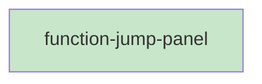

# Blueprint: Item 9 - FunctionJumpPanel

## 1. Structure Summary

### Files
- [ ] `ui/src/pages/pseudo/FunctionJumpPanel.tsx` — 220px right panel with scroll-tracking jump list

### Type Definitions

```typescript
type FunctionJumpPanelProps = {
  functions: ParsedFunction[];
  viewerRef: RefObject<PseudoViewerHandle>;
}
```

### Component Interactions
- `PseudoPage` passes `parsed.functions` (from PseudoViewer via getFunctions or lifted state) and `viewerRef`
- On click: calls `viewerRef.current.scrollToFunction(name)`
- `IntersectionObserver` observes `[data-function]` elements in the viewer scroll container

---

## 2. Function Blueprints

### `FunctionJumpPanel(props: FunctionJumpPanelProps): JSX.Element | null` (EXPORT default)

**Pseudocode:**
1. If `functions.length === 0` → return null
2. State: `activeFunction` (string, name of currently visible function)
3. On mount and on `functions` change:
   a. Create `IntersectionObserver` with threshold `0.3`
   b. Query all `[data-function]` elements from the viewer container
   c. Observe each element
   d. Observer callback: for each entry, if `isIntersecting`, set `activeFunction = entry.target.dataset.function`
   e. Return cleanup: `observer.disconnect()`
4. Render:
   - Panel: `w-[220px] shrink-0 border-l border-stone-200 overflow-y-auto px-3 py-4`
   - Header: "FUNCTIONS" (`text-[11px] text-stone-400 uppercase tracking-wide font-medium mb-2`)
   - For each function:
     - Entry div: `flex items-center justify-between py-1 px-2 rounded cursor-pointer text-sm`
     - Active: `bg-purple-50 text-purple-700 font-semibold`
     - Inactive: `text-stone-600 hover:bg-stone-100`
     - Function name (truncated if >24 chars)
     - If `isExport`: small green dot (`w-1.5 h-1.5 rounded-full bg-green-600 ml-1`)
     - `onClick`: `viewerRef.current?.scrollToFunction(func.name)`

**Edge Cases:**
- `viewerRef.current` may be null on initial render — guard with optional chaining
- `[data-function]` elements may not exist yet when observer sets up — use a short `setTimeout` or effect dependency on functions

**Stub:**
```typescript
export default function FunctionJumpPanel({ functions, viewerRef }: FunctionJumpPanelProps): JSX.Element | null {
  // TODO: return null if empty
  // TODO: activeFunction state
  // TODO: IntersectionObserver on data-function blocks, cleanup on unmount
  // TODO: render panel with header + function entries + export dots
  if (functions.length === 0) return null;
  throw new Error('Not implemented');
}
```

---

## 3. Task Dependency Graph

### YAML Graph

```yaml
tasks:
  - id: function-jump-panel
    files: [ui/src/pages/pseudo/FunctionJumpPanel.tsx]
    tests: [ui/src/pages/pseudo/FunctionJumpPanel.test.tsx]
    description: "220px panel with IntersectionObserver active tracking and click-to-scroll"
    parallel: true
    depends-on: []
```

### Execution Waves

**Wave 1 (parallel):**
- function-jump-panel

### Mermaid Visualization



### Summary
- Total tasks: 1
- Total waves: 1
- Max parallelism: 1
