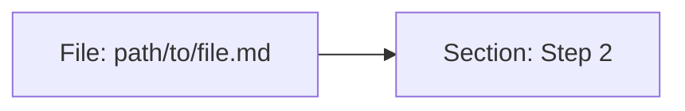
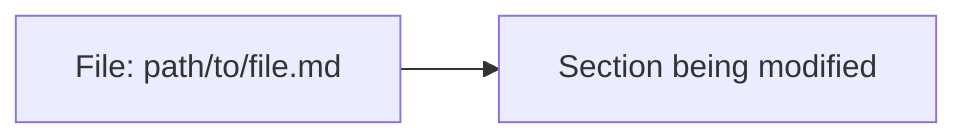

# Session: pure-light-beach

## Session Context
**Out of Scope:** (session-wide boundaries)
**Shared Decisions:** (cross-cutting choices)

---

## Work Items

### Item 1: Simplify gather-session-goals questioning
**Type:** refactor
**Status:** documented
**Problem/Goal:**
The current gather-session-goals skill asks 4 separate follow-up questions (bugs? features? refactors? spikes?) after the initial open question. This is tedious when users have already stated everything they want to accomplish.

**Approach:**
1. Keep Step 1 (open question): "What do you want to accomplish this session?"
2. Replace Step 2 (4 typed questions) with a single loop:
   - Parse items from user response, infer type from context
   - Ask: "Anything else?" 
   - Repeat until user says no
3. Keep Step 3 (classify unknown) but only for items where type couldn't be inferred
4. Keep Step 4 (summary) and Step 5 (write to doc) unchanged

**Success Criteria:**
- Users are asked at most 1 follow-up question ("anything else?") instead of 4 typed questions
- Types are correctly inferred from context (e.g., "fix the login bug" → bugfix)
- Items with ambiguous types still get classified via explicit question

**Decisions:**
- Infer type from context rather than asking explicitly for each item
- Only ask for type classification when inference fails

---

### Item 2: Auto-create collab-state.json and design.md with session
**Type:** bugfix
**Status:** documented
**Problem/Goal:**
When MCP creates the session folders, these files should be created atomically - not as a separate step that can fail

**Root Cause:**
Session initialization is split across multiple operations in different systems:
1. MCP `create_document` calls `sessionRegistry.register()` which creates `diagrams/` and `documents/` folders (`src/services/session-registry.ts:87-90`)
2. Claude's Write tool writes `collab-state.json` separately (collab skill Step 3.2)

If step 2 fails or is interrupted (context lost, session ends), folders exist but required files don't. This creates an "incomplete session" that needs manual repair.

**Approach:**
Modify `sessionRegistry.register()` in `src/services/session-registry.ts` to atomically create all required session files when folders are created:
1. Create `diagrams/` folder (existing)
2. Create `documents/` folder (existing)
3. **NEW:** Create `collab-state.json` with initial state if it doesn't exist
4. **NEW:** Create `documents/design.md` with template if it doesn't exist

Use "if doesn't exist" checks so registration remains idempotent.

**Success Criteria:**
- After calling any MCP tool that triggers `sessionRegistry.register()`, all session files exist
- Cannot have a "half-created" session with folders but missing files
- Existing sessions are not overwritten (idempotent)

**Decisions:**
- Put initialization logic in `sessionRegistry.register()` rather than creating a new MCP tool
- Use "create if not exists" pattern to maintain idempotency

---

### Item 3: Create task progress diagram during collab
**Type:** feature
**Status:** documented
**Problem/Goal:**
The task execution diagram (showing task dependencies and progress) is already specified in `executing-plans` skill Step 1.6, but it's inconsistently created - sometimes it happens, sometimes it doesn't. Need to make it mandatory.

**Approach:**
Add a verification gate after Step 1.6 in `skills/executing-plans/SKILL.md`:

1. After Step 1.6 (Create Task Execution Diagram), add Step 1.7 (Verify Diagram Exists):
   ```
   ### Step 1.7: Verify Task Diagram Created
   
   **REQUIRED:** Verify the task execution diagram exists before proceeding.
   
   Tool: mcp__mermaid__get_diagram
   Args: { "project": "<cwd>", "session": "<session>", "id": "task-execution" }
   
   **If diagram not found:** STOP. Return to Step 1.6 and create it.
   **If diagram exists:** Proceed to Step 2.
   ```

2. This follows the same pattern as Step 1.5 (Pre-Flight Check) which blocks on missing prerequisites.

**Success Criteria:**
- Task execution diagram is always created before plan execution begins
- Execution cannot proceed without the diagram existing
- Clear error message if diagram is missing

**Decisions:**
- Use verification gate pattern (same as Step 1.5)
- Keep diagram creation in Step 1.6, add verification as separate Step 1.7
- Fail explicitly rather than silently skipping

---

### Item 4: More proactive diagram creation
**Type:** feature
**Status:** documented
**Problem/Goal:**
Diagrams are cheap to create and provide high clarification value, but they're currently treated as optional during brainstorming. Should default to creating diagrams rather than skipping.

**Approach:**
Update `skills/brainstorming/SKILL.md` to add explicit diagram checkpoints:

1. **After EXPLORING phase** - Add required step:
   ```
   ### Checkpoint: Current State Diagram
   
   **REQUIRED:** Before proceeding to CLARIFYING, create a diagram showing:
   - Existing components/files relevant to this work item
   - Current data flow or architecture (if applicable)
   
   Tool: mcp__mermaid__create_diagram
   Args: { "name": "current-state", "content": <flowchart-or-architecture> }
   
   Display preview URL to user.
   ```

2. **During DESIGNING phase** - For each proposed approach:
   ```
   Before presenting an approach to the user, create a diagram visualizing it.
   Do not describe architecture/flow in text alone - show it.
   ```

3. **Change language** from "When brainstorming involves visual artifacts, use..." to "**Create diagrams at these checkpoints:**" (mandatory, not optional)

**Success Criteria:**
- At least one diagram created during every brainstorming session
- Diagrams created before asking user to validate approaches
- Users see visual representations, not just text descriptions

**Decisions:**
- Default to "create diagram" rather than "skip unless necessary"
- Add mandatory checkpoints rather than relying on Claude to decide
- Current-state diagram after EXPLORING, approach diagrams during DESIGNING

---

## Interface Definition

### File Structure
- `skills/gather-session-goals/SKILL.md` - Step 2 replacement (Item 1)
- `src/services/session-registry.ts` - register() method enhancement (Item 2)
- `skills/executing-plans/SKILL.md` - Step 1.7 addition (Item 3)
- `skills/brainstorming/SKILL.md` - Diagram checkpoint additions (Item 4)

### Item 1: gather-session-goals - Step 2 Replacement

**Location:** Lines 40-55 in `skills/gather-session-goals/SKILL.md`

**Current:**
```markdown
### Step 2: Explore Iteratively

Ask targeted follow-up questions **one at a time** (never batch):

1. "Any bugs you're trying to fix?"
   - If user mentions bugs, add each as type = "bugfix"

2. "Any new features to add?"
   - If user mentions features, add each as type = "feature"

3. "Any code to refactor or clean up?"
   - If user mentions refactors, add each as type = "refactor"

4. "Any unknowns to investigate?"
   - If user mentions spikes, add each as type = "spike"
```

**New:**
```markdown
### Step 2: Anything Else Loop

After parsing the initial response:

1. Infer type for each item from context:
   - Contains "fix", "bug", "broken", "error" → type = "bugfix"
   - Contains "add", "new", "create", "implement" → type = "feature"  
   - Contains "refactor", "clean", "reorganize", "simplify" → type = "refactor"
   - Contains "investigate", "explore", "research", "spike" → type = "spike"
   - Otherwise → type = "unknown"

2. Ask: **"Anything else?"**

3. If user provides more items:
   - Parse and infer types
   - Repeat from step 2

4. If user says no/done/that's it:
   - Proceed to Step 3
```

### Item 2: session-registry.ts - register() Enhancement

**Location:** `src/services/session-registry.ts`, lines 60-91

**Type Definitions (no changes needed):**
```typescript
// Existing types are sufficient
export interface Session {
  project: string;
  session: string;
  lastAccess: string;
}
```

**New Constants (add after line 17):**
```typescript
const INITIAL_COLLAB_STATE = {
  phase: 'brainstorming',
  lastActivity: '', // Set at runtime
  currentItem: null
};

const INITIAL_DESIGN_TEMPLATE = (sessionName: string) => `# Session: ${sessionName}

## Session Context
**Out of Scope:** (session-wide boundaries)
**Shared Decisions:** (cross-cutting choices)

---

## Work Items

*To be filled by gather-session-goals*

---

## Diagrams
(auto-synced)`;
```

**Modified register() signature (unchanged):**
```typescript
async register(project: string, session: string): Promise<void>
```

**New helper function:**
```typescript
private async createFileIfNotExists(filePath: string, content: string): Promise<void>
```

### Item 3: executing-plans - Step 1.7 Addition

**Location:** After line 193 in `skills/executing-plans/SKILL.md`

**New Section:**
```markdown
### Step 1.7: Verify Task Diagram Created

**REQUIRED:** Verify the task execution diagram exists before proceeding to execution.

```
Tool: mcp__mermaid__get_diagram
Args: { "project": "<cwd>", "session": "<session>", "id": "task-execution" }
```

**If diagram not found:**
```
Task execution diagram not found. Creating now...
```
→ Return to Step 1.6 and create the diagram.

**If diagram exists:**
```
Task execution diagram verified. Proceeding to execution.
```
→ Proceed to Step 2.

**This gate ensures the diagram is always created before any tasks execute.**
```

### Item 4: brainstorming - Diagram Checkpoints

**Location 1:** After line 88 (after EXPLORING → CLARIFYING transition)

**New Section:**
```markdown
### Checkpoint: Current State Diagram

**REQUIRED** before proceeding to CLARIFYING:

Create a diagram showing the current state relevant to this work:

```
Tool: mcp__mermaid__create_diagram
Args: { 
  "project": "<cwd>", 
  "session": "<session>", 
  "name": "current-state-item-N", 
  "content": <flowchart showing existing components/flow>
}
```

Display: "Current state diagram: [previewUrl]"

If the work item doesn't involve architecture/flow (e.g., pure text changes), create a simple diagram showing the file(s) being modified:


```

**Location 2:** After line 105 (during DESIGNING phase, after proposed tag workflow)

**New Section:**
```markdown
### Checkpoint: Approach Diagram

**REQUIRED** for each proposed approach:

Before presenting an approach to the user, create a diagram visualizing it:

```
Tool: mcp__mermaid__create_diagram
Args: { 
  "project": "<cwd>", 
  "session": "<session>", 
  "name": "approach-N", 
  "content": <flowchart/sequence showing the proposed approach>
}
```

Do NOT describe architecture or flow in text alone. Show it visually, then explain.
```

### Component Interactions

```
gather-session-goals ─────────────────────────────────────────────────────────────
     │
     │ (Step 2: infer types, ask "anything else?")
     │
     └─> collab skill (manages work item loop)

session-registry.register() ──────────────────────────────────────────────────────
     │
     ├─> mkdir diagrams/
     ├─> mkdir documents/
     ├─> createFileIfNotExists(collab-state.json)  [NEW]
     └─> createFileIfNotExists(documents/design.md) [NEW]

executing-plans ──────────────────────────────────────────────────────────────────
     │
     ├─> Step 1.5: Pre-Flight Check
     ├─> Step 1.6: Create Task Execution Diagram
     ├─> Step 1.7: Verify Task Diagram Created [NEW]
     └─> Step 2: Execute Batch

brainstorming ────────────────────────────────────────────────────────────────────
     │
     ├─> EXPLORING phase
     ├─> Checkpoint: Current State Diagram [NEW]
     ├─> CLARIFYING phase
     ├─> DESIGNING phase
     ├─> Checkpoint: Approach Diagram (per approach) [NEW]
     └─> VALIDATING phase
```

---

## Pseudocode

### Item 1: gather-session-goals Step 2 Logic

```
FUNCTION inferType(itemText):
  lowercased = itemText.toLowerCase()
  
  IF lowercased contains any of ["fix", "bug", "broken", "error", "crash", "fail"]:
    RETURN "bugfix"
  ELSE IF lowercased contains any of ["add", "new", "create", "implement", "build"]:
    RETURN "feature"
  ELSE IF lowercased contains any of ["refactor", "clean", "reorganize", "simplify", "restructure"]:
    RETURN "refactor"
  ELSE IF lowercased contains any of ["investigate", "explore", "research", "spike", "understand"]:
    RETURN "spike"
  ELSE:
    RETURN "unknown"

FUNCTION gatherItems():
  items = []
  
  // Step 1: Open question
  response = ASK "What do you want to accomplish this session?"
  newItems = PARSE response into individual items
  FOR each item in newItems:
    item.type = inferType(item.title)
    items.ADD(item)
  
  // Step 2: Anything else loop
  LOOP:
    response = ASK "Anything else?"
    IF response indicates "no" / "done" / "that's it":
      BREAK
    newItems = PARSE response into individual items
    FOR each item in newItems:
      item.type = inferType(item.title)
      items.ADD(item)
  
  RETURN items
```

**Error Handling:**
- Empty response: Treat as "no more items"
- Ambiguous parsing: Ask for clarification on specific item

### Item 2: session-registry.ts register() Logic

```
FUNCTION createFileIfNotExists(filePath, content):
  IF NOT existsSync(filePath):
    // Ensure parent directory exists
    AWAIT mkdir(dirname(filePath), { recursive: true })
    AWAIT writeFile(filePath, content)
  // If file exists, do nothing (idempotent)

FUNCTION register(project, session):
  // Validate inputs (existing)
  IF NOT project OR NOT project.startsWith('/'):
    THROW "Invalid project path"
  IF NOT session OR NOT /^[a-zA-Z0-9-]+$/.test(session):
    THROW "Invalid session name"
  
  // Update registry (existing)
  registry = AWAIT load()
  now = new Date().toISOString()
  existingIndex = registry.sessions.findIndex(matching project+session)
  IF existingIndex >= 0:
    registry.sessions[existingIndex].lastAccess = now
  ELSE:
    registry.sessions.push({ project, session, lastAccess: now })
  AWAIT save(registry)
  
  // Create directories (existing)
  sessionPath = join(project, '.collab', session)
  AWAIT mkdir(join(sessionPath, 'diagrams'), { recursive: true })
  AWAIT mkdir(join(sessionPath, 'documents'), { recursive: true })
  
  // NEW: Create session files if they don't exist
  collabStatePath = join(sessionPath, 'collab-state.json')
  collabStateContent = JSON.stringify({
    phase: 'brainstorming',
    lastActivity: now,
    currentItem: null
  }, null, 2)
  AWAIT createFileIfNotExists(collabStatePath, collabStateContent)
  
  designDocPath = join(sessionPath, 'documents', 'design.md')
  designDocContent = INITIAL_DESIGN_TEMPLATE(session)
  AWAIT createFileIfNotExists(designDocPath, designDocContent)
```

**Error Handling:**
- File system errors: Let them propagate (caller handles)
- Race conditions: existsSync + writeFile is not atomic, but acceptable for this use case (worst case: file gets overwritten with same content)

**Edge Cases:**
- Session already exists with files: Files are not overwritten (idempotent)
- Documents folder doesn't exist yet: mkdir with recursive handles this
- Concurrent registrations: Last write wins, but content is identical

### Item 3: executing-plans Step 1.7 Logic

```
FUNCTION verifyTaskDiagramCreated(project, session):
  TRY:
    result = CALL mcp__mermaid__get_diagram({
      project: project,
      session: session,
      id: "task-execution"
    })
    
    IF result.error OR result NOT contains diagram content:
      DISPLAY "Task execution diagram not found. Creating now..."
      GOTO Step 1.6  // Return to diagram creation
    
    DISPLAY "Task execution diagram verified. Proceeding to execution."
    PROCEED to Step 2
    
  CATCH error:
    DISPLAY "Failed to verify diagram: " + error.message
    DISPLAY "Task execution diagram not found. Creating now..."
    GOTO Step 1.6
```

**Error Handling:**
- MCP tool fails: Treat as "diagram not found", return to Step 1.6
- Network timeout: Same handling

### Item 4: brainstorming Checkpoint Logic

```
FUNCTION checkpointCurrentStateDiagram(project, session, itemNumber):
  // Determine what to visualize based on work item context
  IF work item involves code/architecture:
    content = BUILD flowchart showing relevant files and their relationships
  ELSE:
    content = BUILD simple diagram showing file(s) being modified
    // Example: graph LR; A[File: path] --> B[Section]
  
  result = CALL mcp__mermaid__create_diagram({
    project: project,
    session: session,
    name: "current-state-item-" + itemNumber,
    content: content
  })
  
  DISPLAY "Current state diagram: " + result.previewUrl
  
  // Gate: must have diagram before proceeding
  IF result.error:
    DISPLAY "Failed to create diagram, but proceeding anyway"
    // Don't block on diagram creation failure

FUNCTION checkpointApproachDiagram(project, session, approachNumber):
  content = BUILD flowchart/sequence showing the proposed approach
  
  result = CALL mcp__mermaid__create_diagram({
    project: project,
    session: session,
    name: "approach-" + approachNumber,
    content: content
  })
  
  DISPLAY "Approach diagram: " + result.previewUrl
  
  // Proceed to present the approach in text after showing diagram
```

**Error Handling:**
- Diagram creation fails: Log warning but don't block brainstorming
- Invalid mermaid syntax: Let MCP validation catch it, retry with simpler diagram

---

## Skeleton

### Planned Files

All 4 tasks modify independent files and can be executed in parallel:

- [ ] `skills/gather-session-goals/SKILL.md` - Replace Step 2 section (Item 1)
- [ ] `src/services/session-registry.ts` - Add createFileIfNotExists helper and enhance register() (Item 2)
- [ ] `skills/executing-plans/SKILL.md` - Insert Step 1.7 after line 193 (Item 3)
- [ ] `skills/brainstorming/SKILL.md` - Insert two checkpoint sections (Item 4)

**Note:** These modifications are documented but NOT applied yet. They will be implemented during the execution phase.

### File Contents

#### Item 1: skills/gather-session-goals/SKILL.md

**Change type:** Replace lines 40-55

**Before:**
```markdown
### Step 2: Explore Iteratively

Ask targeted follow-up questions **one at a time** (never batch):

1. "Any bugs you're trying to fix?"
   - If user mentions bugs, add each as type = "bugfix"

2. "Any new features to add?"
   - If user mentions features, add each as type = "feature"

3. "Any code to refactor or clean up?"
   - If user mentions refactors, add each as type = "refactor"

4. "Any unknowns to investigate?"
   - If user mentions spikes, add each as type = "spike"
```

**After:**
```markdown
### Step 2: Anything Else Loop

After parsing the initial response:

1. Infer type for each item from context:
   - Contains "fix", "bug", "broken", "error", "crash", "fail" → type = "bugfix"
   - Contains "add", "new", "create", "implement", "build" → type = "feature"
   - Contains "refactor", "clean", "reorganize", "simplify", "restructure" → type = "refactor"
   - Contains "investigate", "explore", "research", "spike", "understand" → type = "spike"
   - Otherwise → type = "unknown"

2. Ask: **"Anything else?"**

3. If user provides more items:
   - Parse and infer types
   - Repeat from step 2

4. If user says no/done/that's it:
   - Proceed to Step 3
```

---

#### Item 2: src/services/session-registry.ts

**Change type:** Add constants after imports, add helper method, modify register()

**Add after imports (around line 17):**
```typescript
const INITIAL_DESIGN_TEMPLATE = (sessionName: string) => `# Session: ${sessionName}

## Session Context
**Out of Scope:** (session-wide boundaries)
**Shared Decisions:** (cross-cutting choices)

---

## Work Items

*To be filled by gather-session-goals*

---

## Diagrams
(auto-synced)`;
```

**Add helper method to SessionRegistry class:**
```typescript
private async createFileIfNotExists(filePath: string, content: string): Promise<void> {
  if (!existsSync(filePath)) {
    await mkdir(dirname(filePath), { recursive: true });
    await writeFile(filePath, content, 'utf-8');
  }
}
```

**Modify register() - add after directory creation (around line 90):**
```typescript
// Create session files if they don't exist
const collabStatePath = join(sessionPath, 'collab-state.json');
const collabStateContent = JSON.stringify({
  phase: 'brainstorming',
  lastActivity: now,
  currentItem: null
}, null, 2);
await this.createFileIfNotExists(collabStatePath, collabStateContent);

const designDocPath = join(sessionPath, 'documents', 'design.md');
const designDocContent = INITIAL_DESIGN_TEMPLATE(session);
await this.createFileIfNotExists(designDocPath, designDocContent);
```

---

#### Item 3: skills/executing-plans/SKILL.md

**Change type:** Insert new section after line 193

**Insert after Step 1.6:**
```markdown
### Step 1.7: Verify Task Diagram Created

**REQUIRED:** Verify the task execution diagram exists before proceeding to execution.

```
Tool: mcp__mermaid__get_diagram
Args: { "project": "<cwd>", "session": "<session>", "id": "task-execution" }
```

**If diagram not found:**
```
Task execution diagram not found. Creating now...
```
→ Return to Step 1.6 and create the diagram.

**If diagram exists:**
```
Task execution diagram verified. Proceeding to execution.
```
→ Proceed to Step 2.

**This gate ensures the diagram is always created before any tasks execute.**
```

---

#### Item 4: skills/brainstorming/SKILL.md

**Change type:** Insert two new sections

**Insert 1 - After EXPLORING → CLARIFYING transition (around line 88):**
```markdown
### Checkpoint: Current State Diagram

**REQUIRED** before proceeding to CLARIFYING:

Create a diagram showing the current state relevant to this work:

```
Tool: mcp__mermaid__create_diagram
Args: { 
  "project": "<cwd>", 
  "session": "<session>", 
  "name": "current-state-item-N", 
  "content": <flowchart showing existing components/flow>
}
```

Display: "Current state diagram: [previewUrl]"

If the work item doesn't involve architecture/flow (e.g., pure text changes), create a simple diagram showing the file(s) being modified:


```

**Insert 2 - During DESIGNING phase (around line 105):**
```markdown
### Checkpoint: Approach Diagram

**REQUIRED** for each proposed approach:

Before presenting an approach to the user, create a diagram visualizing it:

```
Tool: mcp__mermaid__create_diagram
Args: { 
  "project": "<cwd>", 
  "session": "<session>", 
  "name": "approach-N", 
  "content": <flowchart/sequence showing the proposed approach>
}
```

Do NOT describe architecture or flow in text alone. Show it visually, then explain.
```

---

### Task Dependency Graph

```yaml
tasks:
  - id: gather-goals-step2
    files: [skills/gather-session-goals/SKILL.md]
    description: Replace Step 2 with Anything Else Loop
    parallel: true

  - id: session-registry-init
    files: [src/services/session-registry.ts]
    description: Add atomic session file creation to register()
    parallel: true

  - id: executing-plans-verify
    files: [skills/executing-plans/SKILL.md]
    description: Add Step 1.7 verification gate for task diagram
    parallel: true

  - id: brainstorming-checkpoints
    files: [skills/brainstorming/SKILL.md]
    description: Add mandatory diagram checkpoints
    parallel: true
```

**Execution Order:**
All 4 tasks are independent (no shared files, no dependencies). They can all execute in parallel as a single batch.

---

## Diagrams
(auto-synced)