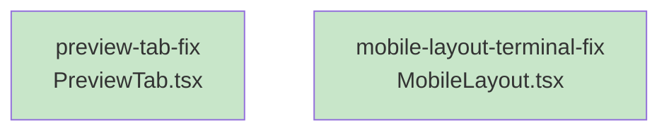

# Skeleton: Item 2 - Fix Terminal Button on Mobile UI

## Planned Files

- [x] `ui/src/components/layout/MobileLayout.tsx` - **MODIFY** existing file

**Note:** This is a modification to an existing file, not a new file. The changes are documented below.

## File Changes

### ui/src/components/layout/MobileLayout.tsx

**New Import (add useMemo to existing React import, line 13):**

```typescript
import React, { useState, useCallback, useMemo } from 'react';
```

**Add New State (after line 67):**

```typescript
// Manage terminal ID for the current terminal session
const [terminalId, setTerminalId] = useState<string | null>(null);
// ADD: Store WebSocket URL for the terminal
const [terminalWsUrl, setTerminalWsUrl] = useState<string | null>(null);
```

**Update handleCreateTerminal (replace lines 80-103):**

```typescript
// Handler for creating a new terminal session
const handleCreateTerminal = useCallback(async () => {
  const session = sessions.length > 0 ? sessions[0] : null;

  if (!session) {
    console.error('No active session available to create terminal');
    return;
  }

  try {
    // Create a new terminal session via API
    const result = await api.createTerminalSession(session.project, session.name);

    // Update BOTH terminal ID and WebSocket URL
    setTerminalId(result.id);
    setTerminalWsUrl(result.wsUrl);

    // Auto-switch to terminal tab to display the new terminal
    setActiveTab('terminal');
  } catch (error) {
    console.error('Failed to create terminal:', error);
  }
}, [sessions]);
```

**Add Computed Terminal Config (after handleCreateTerminal):**

```typescript
// Compute terminal configuration for TerminalTab
const terminalConfig = useMemo(() => {
  if (terminalId && terminalWsUrl) {
    return { sessionId: terminalId, wsUrl: terminalWsUrl };
  }
  return null;
}, [terminalId, terminalWsUrl]);
```

**Update TerminalTab Props (replace lines 166-170):**

```typescript
<TerminalTab
  terminal={terminalConfig}
  hasSession={terminalConfig !== null}
  onCreateTerminal={handleCreateTerminal}
/>
```

## Task Dependency Graph

```yaml
tasks:
  - id: mobile-layout-terminal-fix
    files: [ui/src/components/layout/MobileLayout.tsx]
    tests: [ui/src/components/layout/MobileLayout.test.tsx, ui/src/components/layout/__tests__/MobileLayout.test.tsx]
    description: Connect terminal state to TerminalTab props
    parallel: true
```

## Execution Order

**Wave 1 (parallel-safe):**
- `mobile-layout-terminal-fix` - No dependencies, can run immediately

## Combined Task Graph (Both Items)

```yaml
tasks:
  - id: preview-tab-fix
    files: [ui/src/components/mobile/PreviewTab.tsx]
    tests: [ui/src/components/mobile/PreviewTab.test.tsx]
    description: Update PreviewTab to use store directly
    parallel: true

  - id: mobile-layout-terminal-fix
    files: [ui/src/components/layout/MobileLayout.tsx]
    tests: [ui/src/components/layout/MobileLayout.test.tsx]
    description: Connect terminal state to TerminalTab props
    parallel: true
```

## Mermaid Visualization



Legend: Green = parallel-safe (no dependencies between tasks)

## Verification

- [x] File path documented: `ui/src/components/layout/MobileLayout.tsx`
- [x] All type definitions present (uses existing TerminalConfig type)
- [x] All function signatures documented
- [x] State changes documented
- [x] Dependency graph covers all files
- [x] No circular dependencies
- [x] Both tasks are independent (can run in parallel)
