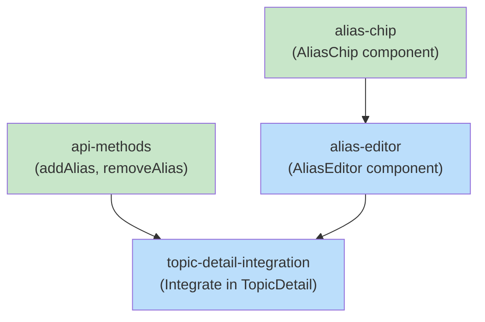

# Blueprint: Item 2.1 - UI for Kodex Alias Management

## 1. Structure Summary

### Files

- [ ] `ui/src/components/kodex/AliasChip.tsx` - Display single alias with remove button
- [ ] `ui/src/components/kodex/AliasEditor.tsx` - Edit aliases list (add/remove)
- [ ] `ui/src/pages/kodex/TopicDetail.tsx` - Integrate AliasEditor in header
- [ ] `ui/src/lib/kodex-api.ts` - Add addAlias and removeAlias methods

### Type Definitions

```typescript
// ui/src/components/kodex/AliasChip.tsx
export interface AliasChipProps {
  alias: string;
  onRemove?: () => void | Promise<void>;
  disabled?: boolean;
}

// ui/src/components/kodex/AliasEditor.tsx
export interface AliasEditorProps {
  aliases: string[];
  onAdd: (alias: string) => Promise<void>;
  onRemove: (alias: string) => Promise<void>;
  loading?: boolean;
  error?: string | null;
}

// In kodex-api.ts (extend existing)
export interface Topic {
  // ... existing fields
  aliases: string[];  // Already available from Item 2
}
```

### Component Interactions

- **TopicDetail.tsx** → Uses AliasEditor component below topic name
- **AliasEditor** → Displays AliasChip components in a list
- **AliasEditor** → Calls kodexApi.addAlias() and kodexApi.removeAlias()
- **kodexApi** → Makes HTTP requests to backend (uses KodexManager from Item 2)

### Component Dependencies

- **Cross-item dependency:** Requires Item 2 (Core alias infrastructure) to be complete
  - Depends on `addAlias()` and `removeAlias()` MCP tools being registered
  - Depends on `getTopic()` returning updated topic with aliases field

---

## 2. Function Blueprints

### Component: AliasChip

**Props:**
```typescript
interface AliasChipProps {
  alias: string;
  onRemove?: () => void | Promise<void>;
  disabled?: boolean;
}
```

**Pseudocode:**
1. Render alias text in a badge/chip style
2. If onRemove provided, show × button
3. If disabled, gray out and disable click handler
4. On × click, call onRemove()

**Error Handling:**
- onRemove throws error: Don't catch (let parent handle)
- onRemove is async: Show loading state on button

**Edge Cases:**
- Very long alias text: Truncate with ellipsis
- onRemove not provided: Hide × button entirely

**Test Strategy:**
- Test rendering with/without onRemove
- Test click handler
- Test disabled state
- Test long alias truncation

**Stub:**
```typescript
import React from 'react';

export interface AliasChipProps {
  alias: string;
  onRemove?: () => void | Promise<void>;
  disabled?: boolean;
}

export const AliasChip: React.FC<AliasChipProps> = ({ alias, onRemove, disabled }) => {
  // TODO: Step 1 - Create chip container with alias text
  // TODO: Step 2 - Conditionally render remove button
  // TODO: Step 3 - Handle click event for remove button
  // TODO: Step 4 - Apply disabled styling if needed
  
  throw new Error('Not implemented');
};
```

---

### Component: AliasEditor

**Props:**
```typescript
export interface AliasEditorProps {
  aliases: string[];
  onAdd: (alias: string) => Promise<void>;
  onRemove: (alias: string) => Promise<void>;
  loading?: boolean;
  error?: string | null;
}
```

**State:**
```typescript
// Local state
const [isAddingNew, setIsAddingNew] = useState(false);
const [newAlias, setNewAlias] = useState('');
const [loadingAlias, setLoadingAlias] = useState<string | null>(null);
```

**Pseudocode:**
1. Render list of AliasChip components from props.aliases
2. Show "+ Add alias" button or input field (toggled by state)
3. Input field: text input with Enter to submit, Escape to cancel
4. When submitting:
   - Validate: non-empty, doesn't match existing, not too long
   - Call onAdd(alias), show loading state
   - Clear input on success
5. When removing alias:
   - Set loadingAlias state
   - Call onRemove(alias)
   - Clear loading state on success

**Error Handling:**
- onAdd/onRemove throws: Display error message, keep input open
- Validation fails: Show inline error message
- Network error: Show toast or inline error

**Edge Cases:**
- Duplicate alias submitted: Show validation error
- Very long alias: Truncate or reject (max 50 chars)
- No aliases: Show "No aliases yet" message
- Adding while loading: Disable input

**Test Strategy:**
- Test rendering aliases list
- Test add button toggle
- Test input validation
- Test successful add/remove calls
- Test error states
- Test loading states

**Stub:**
```typescript
import React, { useState } from 'react';
import { AliasChip } from './AliasChip';

export interface AliasEditorProps {
  aliases: string[];
  onAdd: (alias: string) => Promise<void>;
  onRemove: (alias: string) => Promise<void>;
  loading?: boolean;
  error?: string | null;
}

export const AliasEditor: React.FC<AliasEditorProps> = ({
  aliases,
  onAdd,
  onRemove,
  loading,
  error,
}) => {
  const [isAddingNew, setIsAddingNew] = useState(false);
  const [newAlias, setNewAlias] = useState('');
  const [loadingAlias, setLoadingAlias] = useState<string | null>(null);

  // TODO: Step 1 - Render aliases list with AliasChip components
  // TODO: Step 2 - Handle add button click to show input field
  // TODO: Step 3 - Validate and submit new alias
  // TODO: Step 4 - Handle remove click for existing alias
  // TODO: Step 5 - Show loading/error states

  throw new Error('Not implemented');
};
```

---

### Integration: TopicDetail.tsx

**Changes:**
```typescript
// Add to TopicDetail component after title/name section

import { AliasEditor } from '@/components/kodex/AliasEditor';

// In component JSX (after metadata section):
{topic.aliases && topic.aliases.length > 0 && (
  <AliasEditor
    aliases={topic.aliases}
    onAdd={async (alias) => {
      await kodexApi.addAlias(selectedProject, topic.name, alias);
      // Reload topic to get updated aliases
      const updated = await kodexApi.getTopic(selectedProject, topic.name);
      setTopic(updated);
    }}
    onRemove={async (alias) => {
      await kodexApi.removeAlias(selectedProject, topic.name, alias);
      // Reload topic
      const updated = await kodexApi.getTopic(selectedProject, topic.name);
      setTopic(updated);
    }}
  />
)}
```

**Pseudocode:**
1. Add AliasEditor component below topic name in header
2. Pass topic.aliases and handlers
3. On success, reload topic to get updated data
4. On error, display toast/notification

**Error Handling:**
- API error: Show toast notification

**Test Strategy:**
- Test add alias flow
- Test remove alias flow
- Test topic reload after changes

---

### API Method: kodexApi.addAlias()

**Signature:**
```typescript
async addAlias(
  project: string,
  topicName: string,
  alias: string
): Promise<void>
```

**Pseudocode:**
1. Build URL: `/api/kodex/topics/{topicName}/alias`
2. Make PUT request with `{ alias }`
3. Handle response errors
4. Return void on success

**Error Handling:**
- 404: Topic not found error
- 400: Invalid alias (validation error)
- Other: Generic API error

**Stub:**
```typescript
async addAlias(
  project: string,
  topicName: string,
  alias: string
): Promise<void> {
  // TODO: Step 1 - Build URL with project param
  // TODO: Step 2 - Make PUT request
  // TODO: Step 3 - Check response status
  // TODO: Step 4 - Throw error on failure
  
  throw new Error('Not implemented');
}
```

---

### API Method: kodexApi.removeAlias()

**Signature:**
```typescript
async removeAlias(
  project: string,
  topicName: string,
  alias: string
): Promise<void>
```

**Pseudocode:**
1. Build URL: `/api/kodex/topics/{topicName}/alias?alias={alias}`
2. Make DELETE request
3. Handle response errors
4. Return void on success

**Error Handling:**
- 404: Topic or alias not found
- Other: Generic API error

**Stub:**
```typescript
async removeAlias(
  project: string,
  topicName: string,
  alias: string
): Promise<void> {
  // TODO: Step 1 - Build URL with project and alias params
  // TODO: Step 2 - Make DELETE request
  // TODO: Step 3 - Check response status
  // TODO: Step 4 - Throw error on failure
  
  throw new Error('Not implemented');
}
```

---

## 3. Task Dependency Graph

### YAML Graph

```yaml
tasks:
  - id: alias-chip
    files: [ui/src/components/kodex/AliasChip.tsx]
    tests: [ui/src/components/kodex/__tests__/AliasChip.test.tsx]
    description: Create AliasChip component for rendering single alias with remove button
    parallel: true
    depends-on: []

  - id: alias-editor
    files: [ui/src/components/kodex/AliasEditor.tsx]
    tests: [ui/src/components/kodex/__tests__/AliasEditor.test.tsx]
    description: Create AliasEditor component for managing alias list
    parallel: false
    depends-on: [alias-chip]

  - id: api-methods
    files: [ui/src/lib/kodex-api.ts]
    tests: [ui/src/lib/__tests__/kodex-api.test.ts]
    description: Add addAlias and removeAlias HTTP methods to API client
    parallel: true
    depends-on: []

  - id: topic-detail-integration
    files: [ui/src/pages/kodex/TopicDetail.tsx]
    tests: [ui/src/pages/kodex/__tests__/TopicDetail.test.tsx]
    description: Integrate AliasEditor in TopicDetail page
    parallel: false
    depends-on: [alias-editor, api-methods]
```

### Execution Waves

**Wave 1 (no dependencies):**
- `alias-chip` - Create AliasChip component
- `api-methods` - Add HTTP API methods

**Wave 2 (depends on Wave 1):**
- `alias-editor` - Create AliasEditor using AliasChip

**Wave 3 (depends on Wave 2):**
- `topic-detail-integration` - Integrate components in page

### Mermaid Visualization



Legend: Green = parallel-safe (no dependencies), Blue = sequential

### Summary
- **Total tasks:** 4
- **Total waves:** 3
- **Max parallelism:** 2 tasks in wave 1, 1 task in wave 2, 1 task in wave 3
- **Critical path:** alias-chip → alias-editor → topic-detail-integration (3 waves)

---

## Cross-Item Dependencies

**Depends on Item 2:** Core alias infrastructure
- Requires KodexManager.addAlias() and .removeAlias() methods to be implemented
- Requires /topics endpoint to return aliases field
- Requires MCP tools (kodex_add_alias, kodex_remove_alias) to be registered (for potential future use)

**Does not block other items.**