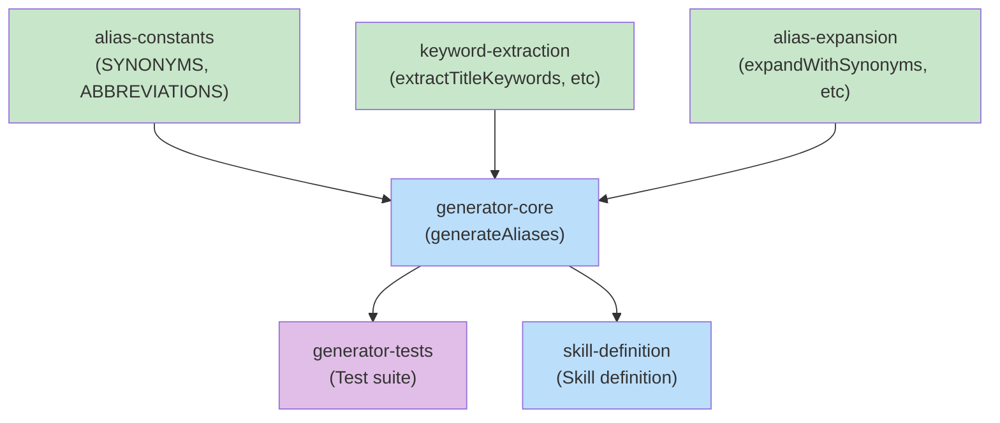

# Blueprint: Item 2.2 - Alias Generation Skill

## 1. Structure Summary

### Files

- [ ] `src/services/alias-generator.ts` - Core alias generation logic
- [ ] `skills/kodex-generate-aliases/SKILL.md` - Skill definition for manual invocation
- [ ] `src/mcp/setup.ts` - Hook into topic creation for auto-generation (optional)
- [ ] `src/services/__tests__/alias-generator.test.ts` - Tests for generator

### Type Definitions

```typescript
// src/services/alias-generator.ts

export interface AliasGeneratorOptions {
  maxAliases?: number;  // Default: 10
  minAliasLength?: number;  // Default: 2
  includeSynonyms?: boolean;  // Default: true
  includeAbbreviations?: boolean;  // Default: true
  includeContentKeywords?: boolean;  // Default: false
}

export interface TopicContent {
  conceptual: string;
  technical: string;
  files: string;
  related: string;
}

export function generateAliases(
  name: string,
  title: string,
  content?: TopicContent,
  options?: AliasGeneratorOptions
): string[]
```

### Constants

```typescript
// src/services/alias-generator.ts

const SYNONYMS: Record<string, string[]> = {
  'auth': ['authentication', 'login', 'signin', 'authorization'],
  'ui': ['interface', 'frontend', 'gui', 'visual'],
  'api': ['endpoints', 'routes', 'rest', 'graphql'],
  'db': ['database', 'storage', 'data', 'persistence'],
  'config': ['configuration', 'settings', 'options', 'preferences'],
  // ... more entries
};

const ABBREVIATIONS: Record<string, string> = {
  'authentication': 'auth',
  'configuration': 'config',
  'development': 'dev',
  'application': 'app',
  'documentation': 'docs',
  // ... more entries
};

const MIN_ALIAS_LENGTH = 2;
const MAX_ALIASES = 10;
const CONTENT_KEYWORD_LIMIT = 5;
```

### Component Interactions

- **KodexManager.createTopic()** → Calls generateAliases() with title + content
- **generateAliases()** → Returns string[] of aliases
- **Manual skill** → Invokes generateAliases() via MCP endpoint

---

## 2. Function Blueprints

### Function: generateAliases()

**Signature:**
```typescript
export function generateAliases(
  name: string,
  title: string,
  content?: TopicContent,
  options?: AliasGeneratorOptions
): string[]
```

**Pseudocode:**
1. Initialize empty Set for aliases
2. Extract title keywords (split on spaces, lowercase, filter length > 2)
3. If includeSynonyms: Look up synonyms for each keyword
4. If includeAbbreviations: Add abbreviations for long words
5. If includeContentKeywords: Extract top N keywords from content (conceptual + technical)
6. Remove canonical name from set
7. Slice to maxAliases limit
8. Return as sorted array

**Error Handling:**
- Invalid inputs: Return empty array (fail silently)
- No content provided: Use title only

**Edge Cases:**
- Very short title (1 word): Still generate aliases
- Title with special characters: Strip before splitting
- Empty title: Return empty array
- Content is very long: Still extract keywords efficiently

**Test Strategy:**
- Test with title only
- Test with content
- Test with custom options
- Test synonym expansion
- Test abbreviation expansion
- Test content keyword extraction
- Test duplicate removal
- Test max alias limit

**Dependencies:**
- Relies on SYNONYMS and ABBREVIATIONS constants
- No external dependencies (pure function)

**Stub:**
```typescript
export function generateAliases(
  name: string,
  title: string,
  content?: TopicContent,
  options?: AliasGeneratorOptions
): string[] {
  const opts = {
    maxAliases: options?.maxAliases ?? MAX_ALIASES,
    minAliasLength: options?.minAliasLength ?? MIN_ALIAS_LENGTH,
    includeSynonyms: options?.includeSynonyms ?? true,
    includeAbbreviations: options?.includeAbbreviations ?? true,
    includeContentKeywords: options?.includeContentKeywords ?? false,
  };

  // TODO: Step 1 - Initialize Set for aliases
  // TODO: Step 2 - Extract keywords from title
  // TODO: Step 3 - Expand with synonyms if enabled
  // TODO: Step 4 - Expand with abbreviations if enabled
  // TODO: Step 5 - Extract keywords from content if enabled
  // TODO: Step 6 - Remove canonical name
  // TODO: Step 7 - Slice to max limit
  // TODO: Step 8 - Return sorted array

  throw new Error('Not implemented');
}
```

---

### Function: extractTitleKeywords()

**Signature:**
```typescript
function extractTitleKeywords(title: string, minLength: number): string[]
```

**Pseudocode:**
1. Convert title to lowercase
2. Split on whitespace/punctuation
3. Filter: only words >= minLength
4. Filter: exclude common stop words (the, a, an, etc.)
5. Return unique words

**Error Handling:**
- Invalid input: Return empty array

**Edge Cases:**
- Title with hyphens: Split on hyphens too
- All capitals: Still lowercase correctly
- Numbers: Strip or keep (keep for now)

**Test Strategy:**
- Test simple title
- Test title with stop words
- Test title with hyphens
- Test title with special characters

**Stub:**
```typescript
function extractTitleKeywords(title: string, minLength: number): string[] {
  // TODO: Step 1 - Lowercase and normalize
  // TODO: Step 2 - Split on whitespace and punctuation
  // TODO: Step 3 - Filter by length
  // TODO: Step 4 - Remove stop words
  // TODO: Step 5 - Return unique words

  throw new Error('Not implemented');
}
```

---

### Function: expandWithSynonyms()

**Signature:**
```typescript
function expandWithSynonyms(keywords: Set<string>): void
```

**Pseudocode:**
1. Iterate over SYNONYMS map
2. For each key that exists in keywords:
   - Add all synonyms to keywords set
3. For each keyword that matches a synonym value:
   - Find the key and add it to keywords
4. Modifies set in place

**Error Handling:**
- No errors expected (pure set manipulation)

**Edge Cases:**
- Circular synonym relationships: Not an issue (sets prevent duplicates)
- Very large keyword set: Still efficient

**Test Strategy:**
- Test one-way expansion (key → synonyms)
- Test reverse expansion (synonym → key)
- Test no matches

**Stub:**
```typescript
function expandWithSynonyms(keywords: Set<string>): void {
  // TODO: Step 1 - Iterate SYNONYMS keys
  // TODO: Step 2 - Add synonyms for matching keys
  // TODO: Step 3 - Reverse lookup: find keys for synonym values
  // TODO: Step 4 - Add found keys to set

  throw new Error('Not implemented');
}
```

---

### Function: expandWithAbbreviations()

**Signature:**
```typescript
function expandWithAbbreviations(keywords: Set<string>): void
```

**Pseudocode:**
1. Iterate over ABBREVIATIONS map
2. For each long form in keywords:
   - Add short form to keywords
3. For each short form in keywords:
   - Add long form to keywords
4. Modifies set in place

**Error Handling:**
- No errors expected

**Edge Cases:**
- Abbreviation that's already in keywords: Set prevents duplicates
- Same word as both short and long form: Unlikely but handled

**Test Strategy:**
- Test long → short expansion
- Test short → long expansion
- Test bidirectional

**Stub:**
```typescript
function expandWithAbbreviations(keywords: Set<string>): void {
  // TODO: Step 1 - Iterate ABBREVIATIONS entries
  // TODO: Step 2 - Add abbreviations for matching long forms
  // TODO: Step 3 - Add long forms for matching abbreviations

  throw new Error('Not implemented');
}
```

---

### Function: extractContentKeywords()

**Signature:**
```typescript
function extractContentKeywords(
  content: TopicContent,
  limit: number
): string[]
```

**Pseudocode:**
1. Combine conceptual and technical sections
2. Extract all words (lowercase, min length 3)
3. Count frequency of each word
4. Sort by frequency descending
5. Take top N words (exclude stop words)
6. Return

**Error Handling:**
- Empty content: Return empty array
- Very long content: Still process efficiently

**Edge Cases:**
- No meaningful keywords: Return empty
- All stop words: Return empty

**Test Strategy:**
- Test with real content
- Test frequency counting
- Test stop word filtering
- Test limit enforcement

**Stub:**
```typescript
function extractContentKeywords(
  content: TopicContent,
  limit: number
): string[] {
  // TODO: Step 1 - Combine conceptual and technical
  // TODO: Step 2 - Extract and lowercase words
  // TODO: Step 3 - Count frequency
  // TODO: Step 4 - Remove stop words
  // TODO: Step 5 - Sort by frequency
  // TODO: Step 6 - Return top N words

  throw new Error('Not implemented');
}
```

---

### Skill: kodex-generate-aliases

**File:** `skills/kodex-generate-aliases/SKILL.md`

**Purpose:** Allow manual alias generation for existing topics or batch generation

**Pseudocode:**
1. Show UI to select topics (or batch generate for all)
2. For each topic:
   - Load full topic (with content)
   - Call generateAliases(name, title, content)
   - Show current aliases vs generated
   - Ask user to approve
3. If approved:
   - Call kodexApi.addAlias() for each new alias
4. Show summary

**Dependencies:**
- generateAliases() function
- kodexApi.getTopic() to load full topics
- kodexApi.addAlias() to add aliases

---

## 3. Task Dependency Graph

### YAML Graph

```yaml
tasks:
  - id: alias-constants
    files: [src/services/alias-generator.ts]
    tests: []
    description: Define SYNONYMS and ABBREVIATIONS constant maps
    parallel: true
    depends-on: []

  - id: keyword-extraction
    files: [src/services/alias-generator.ts]
    tests: [src/services/__tests__/alias-generator.test.ts]
    description: Implement extractTitleKeywords and extractContentKeywords
    parallel: true
    depends-on: []

  - id: alias-expansion
    files: [src/services/alias-generator.ts]
    tests: [src/services/__tests__/alias-generator.test.ts]
    description: Implement expandWithSynonyms and expandWithAbbreviations
    parallel: true
    depends-on: []

  - id: generator-core
    files: [src/services/alias-generator.ts]
    tests: [src/services/__tests__/alias-generator.test.ts]
    description: Implement main generateAliases() function
    parallel: false
    depends-on: [alias-constants, keyword-extraction, alias-expansion]

  - id: generator-tests
    files: [src/services/__tests__/alias-generator.test.ts]
    tests: []
    description: Complete test suite for generator
    parallel: false
    depends-on: [generator-core]

  - id: skill-definition
    files: [skills/kodex-generate-aliases/SKILL.md]
    tests: []
    description: Create skill definition for manual alias generation
    parallel: true
    depends-on: [generator-core]
```

### Execution Waves

**Wave 1 (no dependencies):**
- `alias-constants` - Define synonym and abbreviation maps
- `keyword-extraction` - Implement keyword extraction functions
- `alias-expansion` - Implement expansion functions

**Wave 2 (depends on Wave 1):**
- `generator-core` - Main generateAliases function

**Wave 3 (depends on Wave 2):**
- `generator-tests` - Test suite
- `skill-definition` - Skill definition

### Mermaid Visualization



Legend: Green = parallel-safe (no dependencies), Blue = sequential, Purple = tests

### Summary
- **Total tasks:** 6
- **Total waves:** 3
- **Max parallelism:** 3 tasks in wave 1, 1 task in wave 2, 2 tasks in wave 3
- **Critical path:** alias-constants/keyword-extraction/alias-expansion → generator-core → generator-tests (3 waves)

---

## Cross-Item Dependencies

**Depends on Item 2:** Core alias infrastructure
- Requires KodexManager to have addAlias() method
- Requires Topic type to include aliases field
- Requires kodexApi.addAlias() method

**Optional auto-generation on topic creation:**
- Could hook into KodexManager.createTopic() to auto-generate aliases
- Would call generateAliases() before storing topic
- Not required for MVP, can be added later

**Does not block other items.**