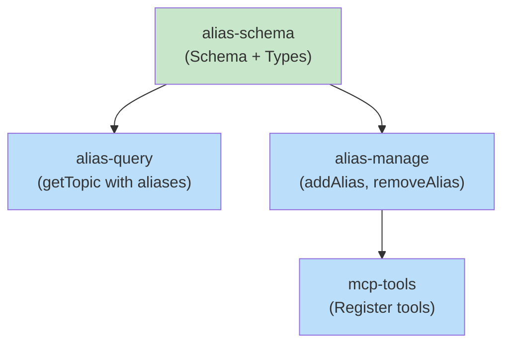

# Blueprint: Item 2 - Core Alias Infrastructure for Kodex

## 1. Structure Summary

### Files

- [ ] `src/services/kodex-manager.ts` - Add aliases column, query logic, add/remove methods
- [ ] `src/mcp/setup.ts` - Register kodex_add_alias and kodex_remove_alias MCP tools
- [ ] `src/routes/kodex-api.ts` - (Optional) HTTP endpoint updates if needed

### Type Definitions

```typescript
// In src/services/kodex-manager.ts

export interface TopicMetadata {
  name: string;
  title: string;
  confidence: 'low' | 'medium' | 'high';
  verified: boolean;
  verifiedAt: string | null;
  verifiedBy: string | null;
  createdAt: string;
  updatedAt: string;
  hasDraft: boolean;
  aliases: string[];  // ADD THIS
}

export interface TopicWithMatch extends Topic {
  matchedVia: 'name' | 'alias';
  queriedName?: string;  // Only set when matchedVia === 'alias'
}
```

### Component Interactions

- **KodexManager** (backend)
  - Manages database schema and queries
  - Provides `getTopic()`, `addAlias()`, `removeAlias()` methods
  - `getTopic()` checks both names and aliases

- **MCP Tools** (`kodex_add_alias`, `kodex_remove_alias`)
  - Allow Claude and users to manage aliases programmatically
  - Call KodexManager methods to update database

---

## 2. Function Blueprints

### Class: KodexManager

#### Constructor/Initialization

**Pseudocode:**
1. Ensure database file exists
2. Ensure schema includes aliases column (migration-safe)
3. Initialize connection pool

**Error Handling:**
- Database connection failure: Throw error with message

**Edge Cases:**
- First run (no database): Create tables with aliases column
- Existing database (old schema): ALTER TABLE ADD COLUMN (idempotent)

**Test Strategy:**
- Test first-run database creation
- Test schema migration on existing database
- Test connection pool behavior

---

#### Method: `async getTopic(name: string, includeContent: boolean): Promise<TopicWithMatch | null>`

**Signature:**
```typescript
async getTopic(
  name: string,
  includeContent: boolean = true
): Promise<TopicWithMatch | null>
```

**Pseudocode:**
1. Validate input: name is non-empty string
2. Try exact name match: `SELECT * FROM topics WHERE name = ?`
3. If not found, try alias match: `SELECT * FROM topics WHERE aliases LIKE ?`
4. If found (either way), load content if requested
5. Return topic with matchedVia flag, or null if not found

**Error Handling:**
- Database query error: Log and throw
- Invalid JSON in aliases column: Log warning, treat as empty array

**Edge Cases:**
- Empty name: Return null (don't search)
- Name is valid but topic doesn't exist: Log to missing_topics, return null
- Multiple topics have same alias: Return first match (order by updated_at DESC)

**Test Strategy:**
- Test exact name match
- Test alias match (single and multiple aliases per topic)
- Test missing topic (logged to missing_topics)
- Test malformed JSON in aliases column
- Test with/without includeContent flag

**Dependencies:**
- SQLite database (via ensureInitialized())
- logMissing() method for tracking missing topic queries

**Stub:**
```typescript
async getTopic(
  name: string,
  includeContent: boolean = true
): Promise<TopicWithMatch | null> {
  const db = this.ensureInitialized();
  
  // TODO: Step 1 - Validate input (name is non-empty)
  // TODO: Step 2 - Try exact name match
  // TODO: Step 3 - If not found, try alias search
  // TODO: Step 4 - If found, load content if requested
  // TODO: Step 5 - Return with matchedVia flag
  
  throw new Error('Not implemented');
}
```

---

#### Method: `async addAlias(name: string, alias: string): Promise<void>`

**Signature:**
```typescript
async addAlias(name: string, alias: string): Promise<void>
```

**Pseudocode:**
1. Validate inputs: name and alias are non-empty strings
2. Find topic by name (must exist)
3. Load current aliases array (parse JSON)
4. Check if alias already exists (prevent duplicates)
5. Add alias to array
6. Update database: `UPDATE topics SET aliases = ? WHERE name = ?`
7. Return (no output)

**Error Handling:**
- Topic not found: Throw with message "Topic not found: {name}"
- Invalid JSON in aliases: Reset to empty array
- Duplicate alias: Silently skip (idempotent)

**Edge Cases:**
- Alias is same as canonical name: Reject
- Alias already exists: Do nothing (idempotent)
- Large alias list (>100): Allow but log warning

**Test Strategy:**
- Test adding new alias
- Test adding duplicate alias (idempotent)
- Test alias that matches canonical name (reject)
- Test topic not found
- Test malformed JSON reset

**Dependencies:**
- getTopic() to validate topic exists
- SQLite database

**Stub:**
```typescript
async addAlias(name: string, alias: string): Promise<void> {
  const db = this.ensureInitialized();
  
  // TODO: Step 1 - Validate inputs
  // TODO: Step 2 - Check topic exists
  // TODO: Step 3 - Load and parse current aliases
  // TODO: Step 4 - Check for duplicates
  // TODO: Step 5 - Add alias and update database
  
  throw new Error('Not implemented');
}
```

---

#### Method: `async removeAlias(name: string, alias: string): Promise<void>`

**Signature:**
```typescript
async removeAlias(name: string, alias: string): Promise<void>
```

**Pseudocode:**
1. Validate inputs: name and alias are non-empty strings
2. Find topic by name (must exist)
3. Load current aliases array (parse JSON)
4. Remove alias from array (filter)
5. Update database with new array
6. Return (no output)

**Error Handling:**
- Topic not found: Throw with message
- Alias doesn't exist: Silently skip (idempotent)
- Invalid JSON: Reset to empty array

**Edge Cases:**
- Removing non-existent alias: Do nothing (idempotent)
- Last alias: Allow removal, results in empty array
- Invalid JSON: Reset before removing

**Test Strategy:**
- Test removing existing alias
- Test removing non-existent alias (idempotent)
- Test topic not found
- Test last alias removal (empty array)

**Dependencies:**
- getTopic() to validate topic exists
- SQLite database

**Stub:**
```typescript
async removeAlias(name: string, alias: string): Promise<void> {
  const db = this.ensureInitialized();
  
  // TODO: Step 1 - Validate inputs
  // TODO: Step 2 - Check topic exists
  // TODO: Step 3 - Load and parse current aliases
  // TODO: Step 4 - Remove alias from array
  // TODO: Step 5 - Update database
  
  throw new Error('Not implemented');
}
```

---

#### Method: `private rowToTopicMetadata(row: any): TopicMetadata`

**Pseudocode:**
1. Extract fields from database row
2. Parse aliases JSON: `row.aliases ? JSON.parse(row.aliases) : []`
3. Return TopicMetadata object

**Error Handling:**
- JSON parse error in aliases: Default to empty array, log warning

**Edge Cases:**
- NULL aliases column: Treat as empty array
- Invalid JSON: Default to empty array

**Test Strategy:**
- Test valid JSON array
- Test NULL aliases
- Test invalid JSON (malformed)

**Stub:**
```typescript
private rowToTopicMetadata(row: any): TopicMetadata {
  // TODO: Step 1 - Extract fields from row
  // TODO: Step 2 - Parse aliases JSON safely
  // TODO: Step 3 - Return TopicMetadata object
  
  throw new Error('Not implemented');
}
```

---

### MCP Tool Handler: `kodex_add_alias`

**Input Schema:**
```json
{
  "project": "string (absolute path)",
  "name": "string (topic name)",
  "alias": "string (alias to add)"
}
```

**Pseudocode:**
1. Validate project path
2. Initialize KodexManager for project
3. Call kodexManager.addAlias(name, alias)
4. Return success message

**Error Handling:**
- Project not found: Return error
- Topic not found: Return error
- Invalid alias: Return validation error

**Stub:**
```typescript
async function handleKodexAddAlias(input: {
  project: string;
  name: string;
  alias: string;
}): Promise<{ success: boolean; message: string }> {
  // TODO: Step 1 - Validate project path
  // TODO: Step 2 - Initialize KodexManager
  // TODO: Step 3 - Call addAlias()
  // TODO: Step 4 - Return success message
  
  throw new Error('Not implemented');
}
```

---

### MCP Tool Handler: `kodex_remove_alias`

**Input Schema:**
```json
{
  "project": "string (absolute path)",
  "name": "string (topic name)",
  "alias": "string (alias to remove)"
}
```

**Pseudocode:**
1. Validate project path
2. Initialize KodexManager for project
3. Call kodexManager.removeAlias(name, alias)
4. Return success message

**Error Handling:**
- Project not found: Return error
- Topic not found: Return error
- Alias doesn't exist: Return success (idempotent)

**Stub:**
```typescript
async function handleKodexRemoveAlias(input: {
  project: string;
  name: string;
  alias: string;
}): Promise<{ success: boolean; message: string }> {
  // TODO: Step 1 - Validate project path
  // TODO: Step 2 - Initialize KodexManager
  // TODO: Step 3 - Call removeAlias()
  // TODO: Step 4 - Return success message
  
  throw new Error('Not implemented');
}
```

---

## 3. Task Dependency Graph

### YAML Graph

```yaml
tasks:
  - id: alias-schema
    files: [src/services/kodex-manager.ts]
    tests: [src/services/__tests__/kodex-manager.test.ts]
    description: Add aliases column to topics table, update TypeScript types
    parallel: true
    depends-on: []

  - id: alias-query
    files: [src/services/kodex-manager.ts]
    tests: [src/services/__tests__/kodex-manager.test.ts]
    description: Implement getTopic() with alias fallback search
    parallel: false
    depends-on: [alias-schema]

  - id: alias-manage
    files: [src/services/kodex-manager.ts]
    tests: [src/services/__tests__/kodex-manager.test.ts]
    description: Implement addAlias() and removeAlias() methods
    parallel: false
    depends-on: [alias-schema]

  - id: mcp-tools
    files: [src/mcp/setup.ts]
    tests: [src/mcp/__tests__/tools.test.ts]
    description: Register kodex_add_alias and kodex_remove_alias tools
    parallel: false
    depends-on: [alias-manage]
```

### Execution Waves

**Wave 1 (no dependencies, schema must be ready first):**
- `alias-schema` - Add column and types

**Wave 2 (depends on schema):**
- `alias-query` - Query logic with alias fallback
- `alias-manage` - Add/remove methods

**Wave 3 (depends on manage methods):**
- `mcp-tools` - Register MCP tools

### Mermaid Visualization



Legend: Green = parallel-safe (no dependencies), Blue = sequential

### Summary
- **Total tasks:** 4
- **Total waves:** 3
- **Max parallelism:** 1 task in wave 1, 2 tasks in wave 2, 1 task in wave 3
- **Critical path:** alias-schema → alias-manage → mcp-tools (3 waves)

---

## Cross-Item Dependencies

**This item is independent.** It doesn't depend on other code items in the session.

However, Items 2.1 (UI for Kodex alias management) and 2.2 (Alias generation skill) depend on this item completing first. They will use the `addAlias()`, `removeAlias()`, and updated `getTopic()` methods defined here.