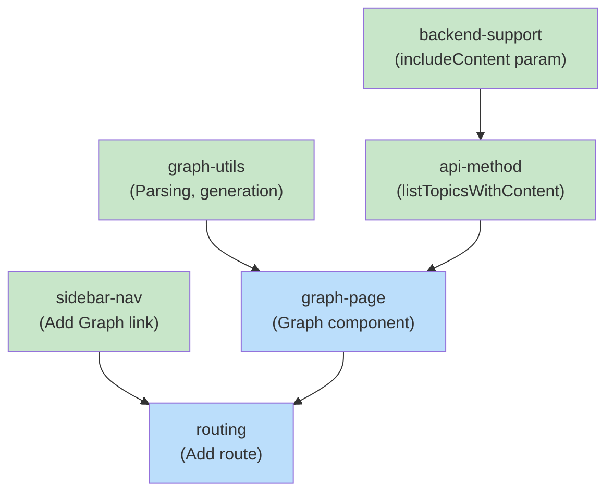

# Blueprint: Item 3 - Add Graph Visualization for Kodex Topic Connections

## 1. Structure Summary

### Files

- [ ] `ui/src/lib/graph-utils.ts` - Utility functions for parsing and graph generation
- [ ] `ui/src/pages/kodex/Graph.tsx` - Graph page component
- [ ] `ui/src/components/kodex/KodexSidebar.tsx` - Add "Graph" nav item
- [ ] `ui/src/App.tsx` - Add /kodex/graph route
- [ ] `ui/src/lib/kodex-api.ts` - Add listTopicsWithContent() method

### Type Definitions

```typescript
// ui/src/lib/graph-utils.ts

export interface GraphEdge {
  source: string;  // topic name
  target: string;  // related topic name
}

export interface GraphNode {
  id: string;
  label: string;
  title?: string;
}

export interface GraphData {
  nodes: GraphNode[];
  edges: GraphEdge[];
}

// In kodex-api.ts (extend existing)
export interface Topic {
  // ... existing fields
  content?: TopicContent;  // Already available
}
```

### Component Interactions

- **KodexSidebar** → Links to Graph page (/kodex/graph)
- **App routing** → Routes /kodex/graph to Graph component
- **Graph component** → Uses graph-utils to parse topics
- **graph-utils** → Parses related field and generates Mermaid syntax
- **Mermaid renderer** → Displays the generated diagram (existing infrastructure)

### Component Dependencies

- No cross-item dependencies (standalone feature)
- Depends on existing Mermaid rendering infrastructure in the project

---

## 2. Function Blueprints

### Function: parseRelatedTopics()

**Signature:**
```typescript
export function parseRelatedTopics(relatedText: string): string[]
```

**Pseudocode:**
1. Validate input: string, non-empty
2. Use regex to find backtick-wrapped topic names: /`([a-z0-9-]+)`/g
3. Extract names from regex matches
4. Return unique names (no duplicates)
5. Return empty array if no matches

**Error Handling:**
- Invalid input: Return empty array
- Malformed markdown: Still extract what matches

**Edge Cases:**
- Empty string: Return empty array
- No backticks: Return empty array
- Backticks with spaces: Don't match (by design)
- Repeated references: Return unique only

**Test Strategy:**
- Test valid backtick format
- Test multiple references
- Test no matches
- Test malformed markdown
- Test case sensitivity

**Dependencies:**
- None (pure function)

**Stub:**
```typescript
export function parseRelatedTopics(relatedText: string): string[] {
  // TODO: Step 1 - Validate input
  // TODO: Step 2 - Use regex to find backtick patterns
  // TODO: Step 3 - Extract topic names from matches
  // TODO: Step 4 - Ensure unique values
  // TODO: Step 5 - Return array

  throw new Error('Not implemented');
}
```

---

### Function: buildGraphEdges()

**Signature:**
```typescript
export function buildGraphEdges(
  topics: Array<{ name: string; related?: string }>
): GraphEdge[]
```

**Pseudocode:**
1. Initialize empty edges array
2. For each topic:
   - Skip if no related field
   - Parse related field to get topic names
   - For each referenced topic:
     - Create edge { source: topic.name, target: referenced }
     - Add to edges array
3. Return edges

**Error Handling:**
- Missing related field: Skip (no error)
- Invalid related format: Gracefully skip malformed parts

**Edge Cases:**
- Self-referencing topic: Include edge (even if unusual)
- Circular references: Include both directions (A→B and B→A)
- Empty related field: Skip
- Topic references non-existent topic: Include edge anyway (will show as dangling node)

**Test Strategy:**
- Test single topic with relations
- Test multiple topics
- Test empty related
- Test circular references
- Test self-reference

**Dependencies:**
- parseRelatedTopics() function

**Stub:**
```typescript
export function buildGraphEdges(
  topics: Array<{ name: string; related?: string }>
): GraphEdge[] {
  const edges: GraphEdge[] = [];

  // TODO: Step 1 - Iterate over topics
  // TODO: Step 2 - Skip topics without related field
  // TODO: Step 3 - Parse related field for topic names
  // TODO: Step 4 - Create edges for each reference
  // TODO: Step 5 - Return edges array

  throw new Error('Not implemented');
}
```

---

### Function: generateMermaidGraph()

**Signature:**
```typescript
export function generateMermaidGraph(
  edges: GraphEdge[],
  topics: Map<string, { title: string; name: string }>
): string
```

**Pseudocode:**
1. Initialize empty Set for connected nodes
2. Iterate edges:
   - Add source and target to connected nodes set
3. Build Mermaid syntax:
   - Start with "graph LR"
   - Define each node: `{name}["title"]`
   - Define each edge: `{source} --> {target}`
4. Join all lines with newlines
5. Return complete Mermaid syntax

**Error Handling:**
- Invalid node ID (special chars): Escape or sanitize
- Very long titles: Still include (Mermaid handles wrapping)
- Missing topic metadata: Use name as fallback label

**Edge Cases:**
- No edges: Return minimal valid Mermaid (no nodes or edges)
- Single node: Return single node definition
- Dangling edges (target not in topics map): Still include edge

**Test Strategy:**
- Test with multiple edges
- Test single edge
- Test no edges
- Test long titles
- Test special characters in names
- Test missing topic metadata

**Dependencies:**
- None (pure function)

**Stub:**
```typescript
export function generateMermaidGraph(
  edges: GraphEdge[],
  topics: Map<string, { title: string; name: string }>
): string {
  const lines: string[] = ['graph LR'];

  // TODO: Step 1 - Collect connected nodes from edges
  // TODO: Step 2 - Define nodes with titles
  // TODO: Step 3 - Define edges
  // TODO: Step 4 - Handle sanitization if needed
  // TODO: Step 5 - Join and return

  throw new Error('Not implemented');
}
```

---

### Component: Graph.tsx

**Signature:**
```typescript
export const Graph: React.FC = () => { ... }
```

**State:**
```typescript
const [mermaidSrc, setMermaidSrc] = useState<string>('');
const [loading, setLoading] = useState(true);
const [error, setError] = useState<string | null>(null);
const navigate = useNavigate();
const selectedProject = useKodexStore((s) => s.selectedProject);
```

**Pseudocode:**
1. On mount (when selectedProject changes):
   - Check if selectedProject is set
   - Fetch all topics with content
   - Build edges from related fields
   - Generate Mermaid syntax
   - Set state and loading = false
2. Render:
   - Show loading spinner if loading
   - Show error message if error
   - Show Mermaid diagram with click handler if loaded
3. Handle node click:
   - Navigate to /kodex/topics/{nodeId}

**Error Handling:**
- No project selected: Show message
- API call fails: Show error message, don't crash
- Graph generation fails: Show error message

**Edge Cases:**
- No topics with relationships: Show empty graph message
- Very large graph: Still renders (relies on Mermaid)
- User navigates away during fetch: Ignore results

**Test Strategy:**
- Test loading state
- Test error state
- Test empty graph
- Test with data and click handler
- Test navigation on click

**Dependencies:**
- kodexApi.listTopicsWithContent()
- graph-utils functions
- useNavigate() hook
- MermaidDiagram component (existing)

**Stub:**
```typescript
export const Graph: React.FC = () => {
  const [mermaidSrc, setMermaidSrc] = useState<string>('');
  const [loading, setLoading] = useState(true);
  const [error, setError] = useState<string | null>(null);
  const navigate = useNavigate();
  const selectedProject = useKodexStore((s) => s.selectedProject);

  useEffect(() => {
    if (!selectedProject) {
      setLoading(false);
      return;
    }

    const loadGraph = async () => {
      // TODO: Step 1 - Fetch topics with content
      // TODO: Step 2 - Build edges from related fields
      // TODO: Step 3 - Generate Mermaid syntax
      // TODO: Step 4 - Set state
      // TODO: Step 5 - Handle errors
    };

    loadGraph();
  }, [selectedProject]);

  const handleNodeClick = (nodeId: string) => {
    // TODO: Step 1 - Navigate to topic detail
  };

  // TODO: Step 2 - Render loading/error/diagram states
  return <div>Not implemented</div>;
};
```

---

### Integration: KodexSidebar

**Change:**
Add new nav item to navItems array:
```typescript
{
  path: '/kodex/graph',
  label: 'Graph',
  icon: (
    <svg className="w-5 h-5" fill="none" stroke="currentColor" viewBox="0 0 24 24">
      <path strokeLinecap="round" strokeLinejoin="round" strokeWidth={2} 
        d="M7 21a4 4 0 01-4-4V5a2 2 0 012-2h4a2 2 0 012 2v12a4 4 0 01-4 4zm0 0h12a2 2 0 002-2v-4a2 2 0 00-2-2h-2.343M11 7.343l1.657-1.657a2 2 0 012.828 0l2.829 2.829a2 2 0 010 2.828l-8.486 8.485M7 17h.01" />
    </svg>
  ),
}
```

---

### Integration: App.tsx

**Change:**
Add route inside Kodex layout routes:
```typescript
<Route path="graph" element={<Graph />} />
```

---

### API Method: listTopicsWithContent()

**Signature:**
```typescript
async listTopicsWithContent(project: string): Promise<Topic[]>
```

**Pseudocode:**
1. Build URL: `/api/kodex/topics?includeContent=true`
2. Make GET request with project query param
3. Check response status
4. Parse JSON and return
5. Throw error on failure

**Error Handling:**
- 4xx/5xx error: Throw with message
- Parse error: Throw with message

**Test Strategy:**
- Test successful fetch
- Test error response
- Test content is included

**Dependencies:**
- Backend /topics endpoint with includeContent support

**Stub:**
```typescript
async listTopicsWithContent(project: string): Promise<Topic[]> {
  // TODO: Step 1 - Build URL with query param
  // TODO: Step 2 - Fetch from API
  // TODO: Step 3 - Check response
  // TODO: Step 4 - Parse and return

  throw new Error('Not implemented');
}
```

---

## 3. Task Dependency Graph

### YAML Graph

```yaml
tasks:
  - id: graph-utils
    files: [ui/src/lib/graph-utils.ts]
    tests: [ui/src/lib/__tests__/graph-utils.test.ts]
    description: Implement graph utility functions (parsing, edge building, Mermaid generation)
    parallel: true
    depends-on: []

  - id: api-method
    files: [ui/src/lib/kodex-api.ts]
    tests: [ui/src/lib/__tests__/kodex-api.test.ts]
    description: Add listTopicsWithContent() method to API client
    parallel: true
    depends-on: []

  - id: graph-page
    files: [ui/src/pages/kodex/Graph.tsx]
    tests: [ui/src/pages/kodex/__tests__/Graph.test.tsx]
    description: Create Graph page component
    parallel: false
    depends-on: [graph-utils, api-method]

  - id: sidebar-nav
    files: [ui/src/components/kodex/KodexSidebar.tsx]
    tests: [ui/src/components/kodex/__tests__/KodexSidebar.test.tsx]
    description: Add Graph link to sidebar navigation
    parallel: true
    depends-on: []

  - id: routing
    files: [ui/src/App.tsx]
    tests: []
    description: Add /kodex/graph route
    parallel: false
    depends-on: [graph-page]

  - id: backend-support
    files: [src/routes/kodex-api.ts]
    tests: [src/routes/__tests__/kodex-api.test.ts]
    description: Add includeContent query param support to /topics endpoint
    parallel: true
    depends-on: []
```

### Execution Waves

**Wave 1 (no dependencies):**
- `graph-utils` - Utility functions
- `api-method` - API client method
- `sidebar-nav` - Sidebar nav item
- `backend-support` - Backend endpoint update

**Wave 2 (depends on Wave 1):**
- `graph-page` - Graph component

**Wave 3 (depends on Wave 2):**
- `routing` - Add route

### Mermaid Visualization



Legend: Green = parallel-safe (no dependencies), Blue = sequential

### Summary
- **Total tasks:** 6
- **Total waves:** 3
- **Max parallelism:** 4 tasks in wave 1, 1 task in wave 2, 1 task in wave 3
- **Critical path:** graph-utils/api-method → graph-page → routing (3 waves)

---

## Cross-Item Dependencies

**No cross-item dependencies.** This item is independent and can be implemented in parallel with Items 2 and 2.1-2.2.

Note: The graph will automatically include alias references once Item 2 is complete and topics have aliases populated. The parsing logic doesn't depend on aliases - it extracts from the `related` field only.