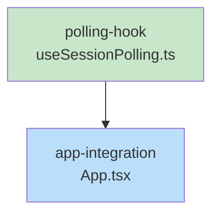

# Blueprint: Item 1 - Update GUI status when skill completes

## 1. Structure Summary

### Files
- [ ] `ui/src/hooks/useSessionPolling.ts` - New hook for polling session state
- [ ] `ui/src/App.tsx` - Integration of polling hook

### Type Definitions

```typescript
// No new types needed - uses existing CollabState from ui/src/types/session.ts
```

### Component Interactions
- `useSessionPolling` hook fetches from `/api/session-state` endpoint
- Hook updates `sessionStore.collabState` via `setCollabState()`
- Runs alongside existing WebSocket handler (dual-channel approach)
- Both channels write to same store - last write wins

---

## 2. Function Blueprints

### `useSessionPolling(project: string | null, session: string | null, intervalMs?: number): void`

**Pseudocode:**
1. Get `collabState` and `setCollabState` from `useSession()` hook
2. Set up `useEffect` with dependencies `[project, session, intervalMs]`
3. If `project` or `session` is null, return early (no cleanup needed)
4. Define async `poll()` function:
   a. Fetch `/api/session-state?project={project}&session={session}`
   b. Parse response as JSON
   c. Compare `newState.lastActivity` with `collabState?.lastActivity`
   d. If different, call `setCollabState(newState)`
5. Call `poll()` immediately for initial fetch
6. Set up `setInterval(poll, intervalMs)` 
7. Return cleanup function that calls `clearInterval()`

**Error Handling:**
- Network errors: Silently catch and log (polling continues on next interval)
- JSON parse errors: Log and skip update
- No throw - polling should be resilient

**Edge Cases:**
- `project` or `session` is null: Skip polling, no interval set
- Component unmounts mid-fetch: Cleanup clears interval, stale response ignored
- Session changes: Effect re-runs, old interval cleared, new one started
- `lastActivity` unchanged: No state update (prevents unnecessary re-renders)

**Dependencies:**
- `useSession()` hook from `ui/src/hooks/useSession.ts`
- Fetch API (browser native)

**Test Strategy:**
- Test hook initializes polling when project/session provided
- Test hook skips polling when project/session null
- Test state updates only when lastActivity changes
- Test cleanup on unmount
- Test interval restart on session change

**Stub:**
```typescript
import { useEffect, useRef } from 'react';
import { useSession } from './useSession';

export function useSessionPolling(
  project: string | null,
  session: string | null,
  intervalMs = 5000
): void {
  // TODO: Step 1 - Get collabState and setCollabState from useSession
  // TODO: Step 2 - Set up useEffect with dependencies
  // TODO: Step 3 - Early return if project/session null
  // TODO: Step 4 - Define async poll() function
  // TODO: Step 5 - Call poll() immediately
  // TODO: Step 6 - Set up setInterval
  // TODO: Step 7 - Return cleanup function
}
```

---

## 3. Task Dependency Graph

### YAML Graph

```yaml
tasks:
  - id: polling-hook
    files: [ui/src/hooks/useSessionPolling.ts]
    tests: [ui/src/hooks/__tests__/useSessionPolling.test.ts]
    description: Create useSessionPolling hook that polls session state every 5s
    parallel: true
    depends-on: []

  - id: app-integration
    files: [ui/src/App.tsx]
    tests: []
    description: Add useSessionPolling hook call to App component
    parallel: false
    depends-on: [polling-hook]
```

### Execution Waves

**Wave 1 (no dependencies):**
- polling-hook

**Wave 2 (depends on Wave 1):**
- app-integration

### Mermaid Visualization



Legend: Green = parallel-safe (no dependencies), Blue = sequential

### Summary
- Total tasks: 2
- Total waves: 2
- Max parallelism: 1
