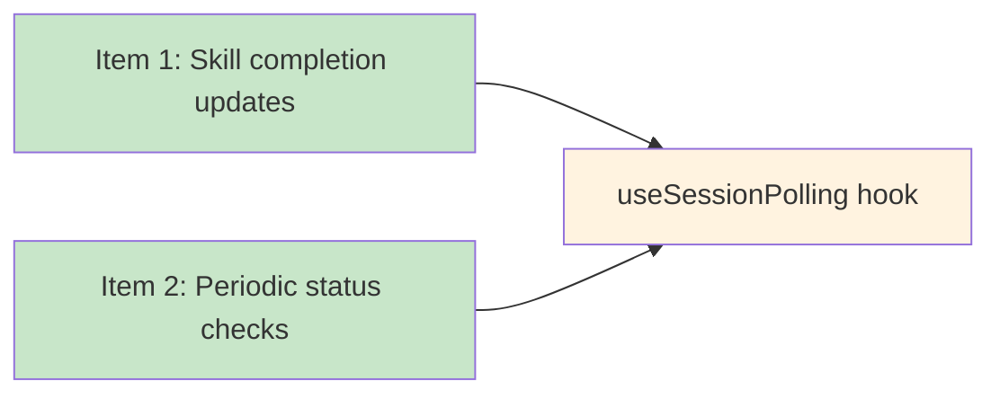

# Blueprint: Item 2 - GUI periodically checks status

## Shared Implementation with Item 1

Items 1 and 2 were designed together as **"Dual-Channel Status Sync"**:
- Item 1: Update GUI status when skill completes (WebSocket + polling)
- Item 2: GUI periodically checks status (the polling part)

**Both items are implemented by the same code:** `useSessionPolling` hook from blueprint-item-1.

---

## 1. Structure Summary

### Files
- [x] `ui/src/hooks/useSessionPolling.ts` - **Same as Item 1** - Polling hook
- [x] `ui/src/App.tsx` - **Same as Item 1** - Hook integration

### Why No Additional Files

Item 2's requirements are:
- Poll session state every 5 seconds ✓ (useSessionPolling does this)
- Use existing get_session_state API ✓ (useSessionPolling calls /api/session-state)
- Only update if state changed ✓ (compares lastActivity)
- Stop polling when session inactive ✓ (cleanup on unmount/session change)

All covered by blueprint-item-1.

---

## 2. Function Blueprints

**No additional functions needed.**

See `useSessionPolling` in blueprint-item-1.md for the complete function blueprint.

---

## 3. Task Dependency Graph

### YAML Graph

```yaml
tasks: []
# All tasks are in blueprint-item-1
# This item shares implementation with Item 1
```

### Execution Waves

**No additional waves** - Item 2's work is completed by Item 1's tasks.

### Cross-Item Dependency



### Summary
- Total additional tasks: 0
- Item 2 is satisfied by Item 1's implementation
- Both items complete when useSessionPolling is integrated
