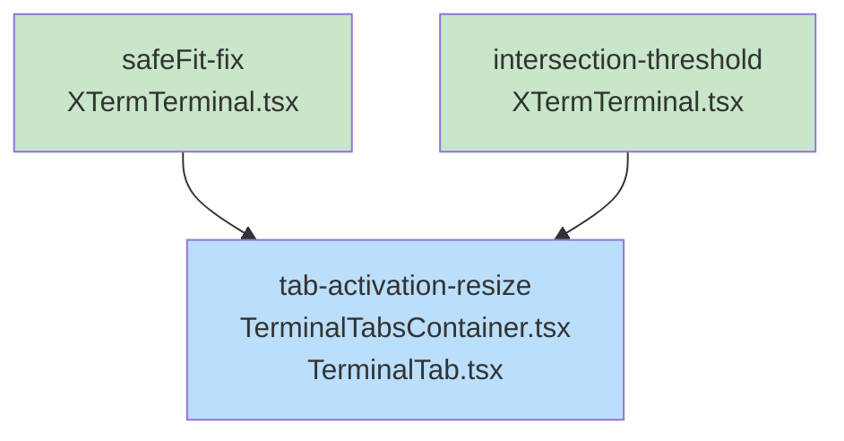

# Blueprint: Item 3 - Fix terminal resize/display issues with xterm.js fit addon

## 1. Structure Summary

### Files
- [ ] `ui/src/components/terminal/XTermTerminal.tsx` - Fix safeFit() timing issues
- [ ] `ui/src/components/terminal/TerminalTabsContainer.tsx` - Fix display:none handling
- [ ] `ui/src/components/mobile/TerminalTab.tsx` - Fix display:none handling

### Root Cause (from systematic-debugging)

The FitAddon IS installed, but **timing issues between visibility changes and FitAddon measurements** cause corruption:

1. `display:none` prevents accurate fit calculations
2. `safeFit()` called in same frame as visibility change (before DOM settles)
3. IntersectionObserver threshold too low (10%) - fires too early
4. No dimension validation before calling `fit()`

### Proposed Fix

1. **Add dimension validation** in `safeFit()` - check non-zero width/height before `fit()`
2. **Use double RAF** - two consecutive requestAnimationFrame calls for DOM to settle
3. **Increase IntersectionObserver threshold** from `0.1` to `1.0`
4. **Add explicit resize on tab activation** from parent component state

---

## 2. Function Blueprints

### `safeFit()` in XTermTerminal.tsx

**Current location:** `ui/src/components/terminal/XTermTerminal.tsx` lines 62-85

**Pseudocode (fixed version):**
1. Check if fitAddon exists, return early if not
2. Get container element reference
3. **NEW: Validate dimensions** - if container width or height is 0, return early
4. **NEW: Use double RAF** for timing:
   ```
   requestAnimationFrame(() => {
     requestAnimationFrame(() => {
       // Now DOM has settled
       fitAddon.fit();
     });
   });
   ```
5. Call fitAddon.fit() inside the double RAF

**Error Handling:**
- Container not found: Return silently
- Zero dimensions: Return silently (will retry on next visibility change)
- FitAddon throws: Catch and log, don't crash terminal

**Edge Cases:**
- Container hidden (`display: none`): Dimensions will be 0, skip fit
- Rapid visibility toggling: Each toggle queues new double-RAF, last one wins
- Window resize during animation: Double RAF ensures latest dimensions used

**Stub:**
```typescript
const safeFit = useCallback(() => {
  // TODO: Step 1 - Check fitAddon exists
  // TODO: Step 2 - Get container reference
  // TODO: Step 3 - Validate container has non-zero dimensions
  // TODO: Step 4 - Use double RAF for timing
  // TODO: Step 5 - Call fitAddon.fit() inside double RAF
}, [fitAddon, containerRef]);
```

---

### IntersectionObserver setup in XTermTerminal.tsx

**Pseudocode (fixed version):**
1. Create IntersectionObserver with **threshold: 1.0** (was 0.1)
2. On intersection callback:
   a. Check `entry.isIntersecting` is true
   b. Check `entry.intersectionRatio >= 1.0` (fully visible)
   c. Call `safeFit()` (which now has its own validation)

**Stub:**
```typescript
const observer = new IntersectionObserver(
  (entries) => {
    // TODO: Step 1 - Check entry.isIntersecting
    // TODO: Step 2 - Check intersectionRatio >= 1.0
    // TODO: Step 3 - Call safeFit()
  },
  { threshold: 1.0 } // Changed from 0.1
);
```

---

### Tab activation handler in TerminalTabsContainer.tsx / TerminalTab.tsx

**Pseudocode:**
1. On tab selection change (activeTabId state change)
2. After state update, trigger resize for newly active terminal
3. Use the terminal's exposed resize/fit method

**Stub:**
```typescript
useEffect(() => {
  // TODO: Step 1 - Detect active tab changed
  // TODO: Step 2 - Find the active terminal's fit function
  // TODO: Step 3 - Call fit after DOM settles (double RAF or setTimeout)
}, [activeTabId]);
```

---

## 3. Task Dependency Graph

### YAML Graph

```yaml
tasks:
  - id: safeFit-fix
    files: [ui/src/components/terminal/XTermTerminal.tsx]
    tests: [ui/src/components/terminal/__tests__/XTermTerminal.test.tsx]
    description: Add dimension validation and double-RAF timing to safeFit()
    parallel: true
    depends-on: []

  - id: intersection-threshold
    files: [ui/src/components/terminal/XTermTerminal.tsx]
    tests: [ui/src/components/terminal/__tests__/XTermTerminal.test.tsx]
    description: Increase IntersectionObserver threshold from 0.1 to 1.0
    parallel: true
    depends-on: []

  - id: tab-activation-resize
    files: 
      - ui/src/components/terminal/TerminalTabsContainer.tsx
      - ui/src/components/mobile/TerminalTab.tsx
    tests: 
      - ui/src/components/terminal/__tests__/TerminalTabsContainer.test.tsx
      - ui/src/components/mobile/__tests__/TerminalTab.test.tsx
    description: Add explicit resize trigger on tab activation
    parallel: false
    depends-on: [safeFit-fix]
```

### Execution Waves

**Wave 1 (no dependencies):**
- safeFit-fix
- intersection-threshold

**Wave 2 (depends on Wave 1):**
- tab-activation-resize

### Mermaid Visualization



Legend: Green = parallel-safe (Wave 1), Blue = sequential (Wave 2)

### Summary
- Total tasks: 3
- Total waves: 2
- Max parallelism: 2 (safeFit-fix and intersection-threshold can run in parallel)
