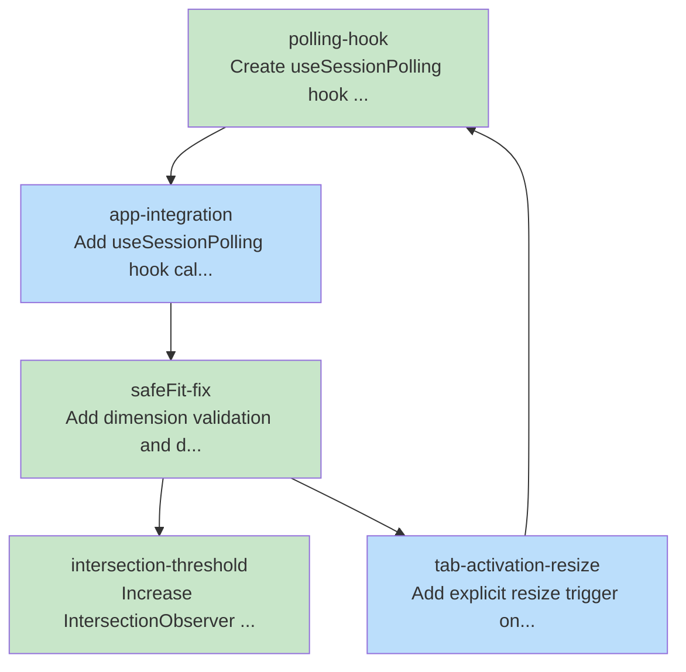

# Consolidated Task Graph

This document was auto-generated from blueprint documents.

## Summary

- **Total tasks:** 5
- **Total waves:** 2
- **Max parallelism:** 3

## Execution Waves

**Wave 1:** polling-hook, safeFit-fix, intersection-threshold
**Wave 2:** app-integration, tab-activation-resize

## Task Graph (YAML)

```yaml
tasks:
  - id: polling-hook
    files: [ui/src/hooks/useSessionPolling.ts]
    tests: [ui/src/hooks/__tests__/useSessionPolling.test.ts]
    description: Create useSessionPolling hook that polls session state every 5s
    parallel: true
    depends-on: []
  - id: app-integration
    files: [ui/src/App.tsx]
    tests: []
    description: Add useSessionPolling hook call to App component
    parallel: false
    depends-on: [polling-hook]
  - id: safeFit-fix
    files: [ui/src/components/terminal/XTermTerminal.tsx]
    tests: [ui/src/components/terminal/__tests__/XTermTerminal.test.tsx]
    description: Add dimension validation and double-RAF timing to safeFit()
    parallel: true
    depends-on: []
  - id: intersection-threshold
    files: [ui/src/components/terminal/XTermTerminal.tsx]
    tests: [ui/src/components/terminal/__tests__/XTermTerminal.test.tsx]
    description: Increase IntersectionObserver threshold from 0.1 to 1.0
    parallel: true
    depends-on: []
  - id: tab-activation-resize
    files: []
    description: Add explicit resize trigger on tab activation
    parallel: false
    depends-on: [safeFit-fix]
```

## Dependency Visualization



## Tasks by Wave

### Wave 1

- **polling-hook**: Create useSessionPolling hook that polls session state every 5s
- **safeFit-fix**: Add dimension validation and double-RAF timing to safeFit()
- **intersection-threshold**: Increase IntersectionObserver threshold from 0.1 to 1.0

### Wave 2

- **app-integration**: Add useSessionPolling hook call to App component
- **tab-activation-resize**: Add explicit resize trigger on tab activation
