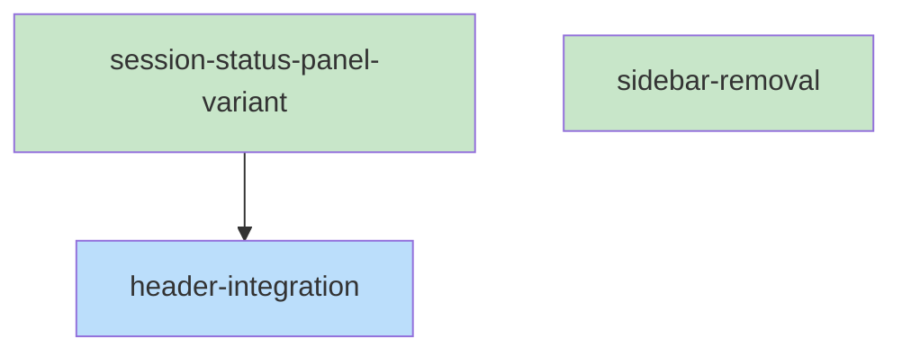

# Skeleton: Item 1 - Move Status to Header

## Planned Files
- [ ] `ui/src/components/SessionStatusPanel.tsx` - Will be modified to add variant prop
- [ ] `ui/src/components/layout/Header.tsx` - Will be modified to import and render SessionStatusPanel
- [ ] `ui/src/components/layout/Sidebar.tsx` - Will be modified to remove SessionStatusPanel

**Note:** These files are documented but modifications will be made during the implementation phase by executing-plans.

## File Contents

### File: ui/src/components/SessionStatusPanel.tsx (MODIFY)

```typescript
/**
 * SessionStatusPanel Component
 *
 * Displays collab session status information including:
 * - Phase badge
 * - Current item being processed
 * - Last activity (relative time)
 * - Task progress bar (if tasks exist)
 */

import { useSessionStore } from '@/stores/sessionStore';

/** Variant for SessionStatusPanel layout */
export type SessionStatusPanelVariant = 'default' | 'inline';

export interface SessionStatusPanelProps {
  /** Layout variant - 'default' for sidebar (stacked), 'inline' for header (horizontal) */
  variant?: SessionStatusPanelVariant;
  /** Optional custom class name */
  className?: string;
}

/**
 * Formats ISO timestamp to relative time string
 */
function formatRelativeTime(isoString: string): string {
  // ... existing implementation unchanged ...
}

/**
 * Get phase badge color classes based on state or displayName
 */
function getPhaseColor(state: string | undefined, displayName: string | undefined): string {
  // ... existing implementation unchanged ...
}

/**
 * Session status panel showing collab state info
 * Displays phase, current item, last activity
 */
export function SessionStatusPanel({ variant = 'default', className = '' }: SessionStatusPanelProps) {
  const collabState = useSessionStore((state) => state.collabState);

  // Don't render if no collab state
  if (!collabState) {
    return null;
  }

  const { state, displayName, currentItem, lastActivity, completedTasks, pendingTasks, totalItems, documentedItems } = collabState;

  // ... existing progress calculation logic unchanged ...

  // NEW: Inline variant rendering
  if (variant === 'inline') {
    return (
      <div className={`flex items-center gap-2 text-xs ${className}`}>
        {/* Phase badge */}
        <span className={`px-2 py-0.5 rounded font-medium ${getPhaseColor(state, displayName)}`}>
          {displayName || 'Unknown'}
        </span>
        
        {/* Timestamp */}
        {lastActivity && (
          <span className="text-gray-400 dark:text-gray-500">
            {formatRelativeTime(lastActivity)}
          </span>
        )}
        
        {/* Current item */}
        {currentItem !== null && (
          <span className="text-gray-500 dark:text-gray-400">
            Item {currentItem}
          </span>
        )}
        
        {/* Progress bar (inline) */}
        {showProgress && (
          <div className="flex items-center gap-1.5">
            <div className="w-20 h-1.5 bg-gray-200 dark:bg-gray-700 rounded-full overflow-hidden">
              <div
                className={`h-full ${progressColorClass} transition-all duration-300`}
                style={{ width: `${progressPercentage}%` }}
              />
            </div>
            <span className="text-gray-500 dark:text-gray-400 text-xs">
              {progressValue}/{progressMax}
            </span>
          </div>
        )}
      </div>
    );
  }

  // DEFAULT: Existing stacked layout (unchanged)
  return (
    <div className={`px-3 py-2 border-t border-gray-200 dark:border-gray-700 bg-gray-50 dark:bg-gray-800/50 ${className}`}>
      {/* ... existing default layout unchanged ... */}
    </div>
  );
}

SessionStatusPanel.displayName = 'SessionStatusPanel';
```

### File: ui/src/components/layout/Header.tsx (MODIFY)

```typescript
// ... existing imports ...
import { SessionStatusPanel } from '@/components/SessionStatusPanel';

// ... existing code until Connection Status Badge (line ~278) ...

          {/* Connection Status Badge */}
          <div
            data-testid="connection-badge"
            className={`
              flex items-center gap-1.5
              px-2 py-1
              text-xs font-medium
              rounded-full
              ${/* ... existing classes ... */}
            `}
          >
            {/* ... existing badge content ... */}
          </div>

          {/* NEW: Session Status Panel (inline variant) */}
          <SessionStatusPanel variant="inline" />

        </div>

// ... rest unchanged ...
```

### File: ui/src/components/layout/Sidebar.tsx (MODIFY)

```typescript
// REMOVE this import:
// import { SessionStatusPanel } from '@/components/SessionStatusPanel';

// ... rest of imports unchanged ...

// In the JSX, REMOVE this block (around lines 172-175):
// {/* Session Status Panel */}
// <div className={isDisabled ? 'opacity-50 pointer-events-none' : ''}>
//   <SessionStatusPanel />
// </div>

// The Kodex link section remains as is
```

## Task Dependency Graph

```yaml
tasks:
  - id: session-status-panel-variant
    files: [ui/src/components/SessionStatusPanel.tsx]
    tests: [ui/src/components/SessionStatusPanel.test.tsx, ui/src/components/__tests__/SessionStatusPanel.test.tsx]
    description: Add variant prop to SessionStatusPanel with inline rendering mode
    parallel: true

  - id: header-integration
    files: [ui/src/components/layout/Header.tsx]
    tests: [ui/src/components/layout/Header.test.tsx, ui/src/components/layout/__tests__/Header.test.tsx]
    description: Import and render SessionStatusPanel with variant="inline" after connection badge
    depends-on: [session-status-panel-variant]

  - id: sidebar-removal
    files: [ui/src/components/layout/Sidebar.tsx]
    tests: [ui/src/components/layout/Sidebar.test.tsx, ui/src/components/layout/__tests__/Sidebar.test.tsx]
    description: Remove SessionStatusPanel import and usage from Sidebar
    parallel: true
```

## Execution Order

**Wave 1 (parallel):**
- `session-status-panel-variant` - Add variant prop support
- `sidebar-removal` - Remove from sidebar (no dependency on variant)

**Wave 2 (sequential):**
- `header-integration` - Depends on variant prop being available

## Mermaid Visualization



Legend: Green = parallel-safe, Blue = has dependencies

## Verification

- [x] All files from Interface are documented (NOT created)
- [x] File paths match exactly
- [x] All types are defined (SessionStatusPanelVariant, SessionStatusPanelProps)
- [x] All function signatures present
- [x] TODO comments match pseudocode logic
- [x] Dependency graph covers all files
- [x] No circular dependencies
