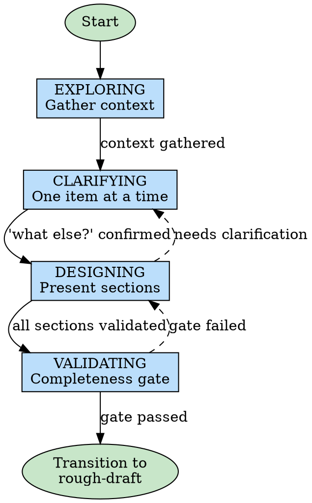

# Brainstorming Ideas Into Designs

## Collab Session Required

Before proceeding, check for active collab session:

1. Check if `.collab/` directory exists
2. Check if any session folders exist within
3. If no session found:
   ```
   No active collab session found.

   Use /collab to start a session first.
   ```
   **STOP** - do not proceed with this skill.

4. If multiple sessions exist, check `COLLAB_SESSION_PATH` env var or ask user which session.

## Get Current Work Item

Check if this skill is being invoked for a specific work item:

1. Read collab state via MCP:
   ```
   Tool: mcp__mermaid__get_session_state
   Args: { "project": "<absolute-path-to-cwd>", "session": "<session-name>" }
   ```
   Returns: `{ "phase": "...", "currentItem": ..., ... }`
2. If `currentItem` field exists:
   - This is **single-item mode** - focus on documenting only that item
   - Read design doc and find the item by number
   - Scope all phases to this specific item
3. If `currentItem` is null or missing:
   - This is **full-session mode** - use existing behavior for entire design

**Single-item mode behavior:**
- EXPLORING: Gather context relevant to this specific item
- CLARIFYING: Discuss only this item's requirements
- DESIGNING: Document only this item's fields (Problem/Goal, Approach, Success Criteria, Decisions)
- VALIDATING: Check only this item has all required fields filled
- On completion: Return to collab skill (do NOT transition to rough-draft)

## Overview

Help turn ideas into fully formed designs and specs through natural collaborative dialogue.

Start by understanding the current project context, then ask questions one at a time to refine the idea. Once you understand what you're building, present the design in small sections (200-300 words), checking after each section whether it looks right so far.

**When invoked from collab skill:** The design doc location is `.collab/<name>/documents/design.md`. Create it immediately and update continuously.

## Phase State Machine

Brainstorming follows a strict 5-phase state machine. **You cannot skip phases.**



| Phase | Purpose | Exit Criteria |
|-------|---------|---------------|
| **EXPLORING** | Gather context - read files, check git, understand scope | Context gathered, initial list of items formed |
| **CLARIFYING** | Discuss each item one at a time, ask "what else?" | Every item discussed individually, user confirmed nothing else |
| **DESIGNING** | Present approach in 200-300 word sections, get validation | Each section validated by user |
| **VALIDATING** | Run completeness gate checklist | All required sections present, no TBDs |

## EXPLORING Phase

Gather context about the project and form an initial understanding of what needs to be built.

- Check out the current project state first (files, docs, recent commits)
- Form an initial list of items/topics to discuss
- Focus on gathering context, not making decisions yet

**Invoke skill: brainstorming-exploring** for detailed instructions.

## CLARIFYING Phase

Discuss each item one at a time to fully understand requirements before designing.

- Discuss ONE item at a time - never batch multiple items
- Ask questions to refine each item before moving to the next
- Prefer multiple choice questions when possible
- After discussing all items, ask: "Is there anything else?"
- Only proceed when user confirms nothing else to discuss

**Invoke skill: brainstorming-clarifying** for detailed instructions.

## DESIGNING Phase

Present the design approach in small, validated sections.

- Propose 2-3 different approaches with trade-offs
- Present options conversationally with your recommendation and reasoning
- Write each section to design doc with `[PROPOSED]` tag
- Present sections of 200-300 words, one at a time
- Get explicit validation before moving to next section

**Invoke skill: brainstorming-designing** for detailed instructions.

## VALIDATING Phase

Run the completeness gate to ensure the design is ready for implementation.

- Verify all required sections are present
- Check for completeness and clarity
- Ensure no TBDs or ambiguous items remain
- Gate the transition to rough-draft

**Invoke skill: brainstorming-validating** for detailed instructions.

## Red Flags - Phase Violations

If you catch yourself doing any of these, STOP and correct:

| Violation | Correction |
|-----------|------------|
| Presenting multiple items at once | Go back to CLARIFYING, discuss one at a time |
| Asking for batch selection ("which of these 5?") | Discuss each item individually first |
| Moving to DESIGNING without asking "what else?" | Return to CLARIFYING, ask the question |
| Editing files during brainstorming | Cannot edit until after rough-draft completes |
| Skipping to implementation | Must go through rough-draft first |

## Template-Specific Focus

Different templates require different emphasis during brainstorming:

| Template | Primary Focus | Key Questions | Artifacts |
|----------|---------------|---------------|-----------|
| **feature** | Full design, complete solution | What problem does it solve? Who uses it? How does it integrate? | Wireframes, architecture diagram, data flow |
| **bugfix** | Minimal intervention | How to reproduce? What's the root cause? Smallest fix? | Reproduction steps, root cause analysis, fix verification |
| **task** | Bounded work scope | What's the goal? What's the scope? What's success? | Scope document, success criteria, acceptance tests |

**Feature template:** Explore fully - wireframes for every screen, architecture for every component, data flow for every interaction. No ambiguity allowed.

**Bugfix template:** Focus on understanding before fixing. Reproduction steps first, root cause analysis second, minimal fix third. Resist scope creep.

**Task template:** Define clear boundaries upfront. Document the goal, scope, and success criteria. Keep focused on the specific deliverable.

## Key Principles

- **One question at a time** - Don't overwhelm with multiple questions
- **Multiple choice preferred** - Easier to answer than open-ended when possible
- **YAGNI ruthlessly** - Remove unnecessary features from all designs
- **Explore alternatives** - Always propose 2-3 approaches before settling
- **Incremental validation** - Present design in sections, validate each
- **Be flexible** - Go back and clarify when something doesn't make sense
- **Live documentation** - Update design doc as you go, not at the end

## Writing Quality

When writing design doc sections, use clear, concise prose.

**If `obra/the-elements-of-style` plugin is available**, invoke it for guidance on:
- Omitting needless words
- Using active voice
- Being specific, not vague

Apply these principles to all design doc prose.

## After the Design

**Within collab workflow (called from collab skill):**
- Design doc already exists at `.collab/<name>/documents/design.md`
- Run completeness gate (see validating.md)
- If gate passes, transition to **rough-draft** skill
- Update collab-state.json phase to `rough-draft/interface`

**Invoke skill: brainstorming-transition** for the detailed transition process.

**Standalone (not in collab workflow):**
- Design remains in the collab session at `.collab/<name>/documents/design.md`
- Use `/collab-cleanup` to archive when session ends

**Implementation (if continuing without collab):**
- Ask: "Ready to set up for implementation?"
- Use superpowers:using-git-worktrees to create isolated workspace
- Use superpowers:writing-plans to create detailed implementation plan

## Browser-Based Questions

When a collab session is active, prefer `render_ui` for user interactions instead of terminal prompts.

**Component selection by question type:**

| Question Type | Component | When to Use |
|--------------|-----------|-------------|
| Yes/No | Card with action buttons | Confirmations, proceed checks |
| Choose 1 of 2-5 | RadioGroup | Approach selection, options |
| Choose 1 of 6+ | MultipleChoice | Large option lists |
| Multiple selections | Checkbox | Feature toggles |
| Free text | TextInput | Names, descriptions |

**See sub-phase skills for specific patterns:**
- `clarifying.md` - Patterns for clarifying questions
- `designing.md` - Patterns for design validation

## Diagram Opportunities

**Diagrams are cheap. When in doubt, make one.**

### When to Create a Diagram

CHECK these triggers as you work:

| Trigger | Diagram Type |
|---------|--------------|
| Discussing 3+ interacting components | Architecture diagram |
| Explaining data flow | Sequence or flowchart |
| Describing state transitions | State diagram |
| Showing dependencies | Dependency graph |
| Tracing execution path | Sequence diagram |
| Debugging complex flow | Flowchart with decision points |

### How to Create

```
cwd = getCurrentWorkingDirectory()
session = getCurrentSession()

mcp__mermaid__create_diagram({
  project: cwd,
  session: session,
  name: "<descriptive-name>",
  content: "<mermaid-syntax>"
})
```

### Example Triggers for This Skill

**DURING EXPLORING phase:**
- IF user mentions 3+ components: CREATE architecture diagram showing relationships
- IF user describes data flow: CREATE sequence diagram showing flow

**DURING DESIGNING phase:**
- BEFORE presenting design options: CREATE diagram showing proposed architecture
- IF design involves state changes: CREATE state diagram

**AFTER user approves design section:**
- IF section involves multiple files: CREATE dependency diagram

## Integration

**Called by:**
- **collab** skill - When starting new collab or resuming at brainstorming phase
- User directly via `/brainstorming` command for standalone design work

**Transitions to:**
- **rough-draft** skill - After completeness gate passes (within collab workflow)
- **writing-plans** skill - For standalone design work leading to implementation

**Collab workflow context:**
When invoked from collab skill, the following are already set up:
- `.collab/<name>/` folder exists
- `collab-state.json` tracks phase as `brainstorming`
- Mermaid-collab server running on assigned port
- Design doc location: `.collab/<name>/documents/design.md`

**State updates:**
- On completion: Use `mcp__mermaid__update_session_state({ project, session, phase: "rough-draft/interface" })`
- The MCP tool automatically updates `lastActivity` timestamp
