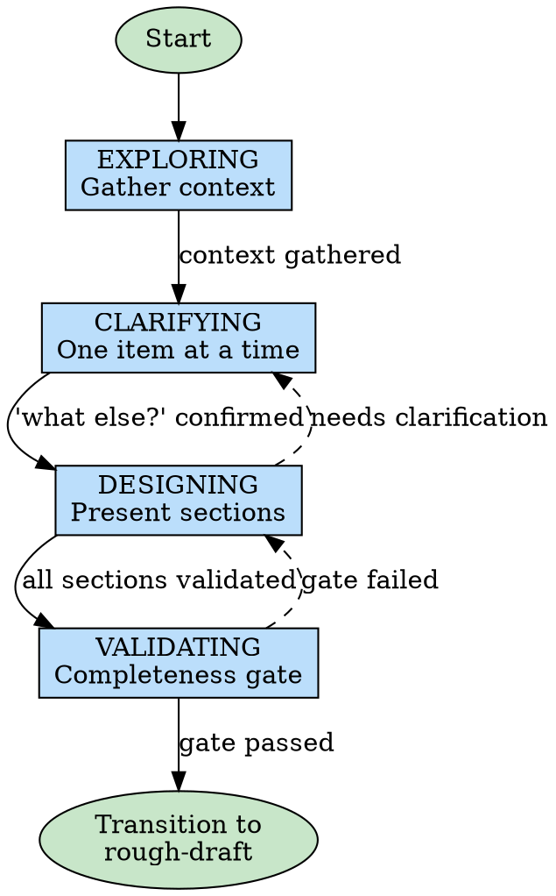
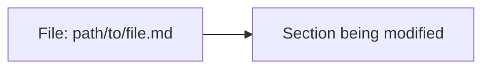

# Brainstorming Ideas Into Designs

## Collab Session Required

Before proceeding, check for active collab session:

1. Check if `.collab/` directory exists
2. Check if any session folders exist within
3. If no session found:
   ```
   No active collab session found.

   Use /collab to start a session first.
   ```
   **STOP** - do not proceed with this skill.

4. If multiple sessions exist, check `COLLAB_SESSION_PATH` env var or ask user which session.

## Get Current Work Item

Check if this skill is being invoked for a specific work item:

1. Read `collab-state.json` from the active session
2. If `currentItem` field exists:
   - This is **single-item mode** - focus on documenting only that item
   - Read design doc and find the item by number
   - Scope all phases to this specific item
3. If `currentItem` is null or missing:
   - This is **full-session mode** - use existing behavior for entire design

**Single-item mode behavior:**
- EXPLORING: Gather context relevant to this specific item
- CLARIFYING: Discuss only this item's requirements
- DESIGNING: Document only this item's fields (Problem/Goal, Approach, Success Criteria, Decisions)
- VALIDATING: Check only this item has all required fields filled
- On completion: Return to collab skill (do NOT transition to rough-draft)

## Overview

Help turn ideas into fully formed designs and specs through natural collaborative dialogue.

Start by understanding the current project context, then ask questions one at a time to refine the idea. Once you understand what you're building, present the design in small sections (200-300 words), checking after each section whether it looks right so far.

**When invoked from collab skill:** The design doc location is `.collab/<name>/documents/design.md`. Create it immediately and update continuously.

## Phase State Machine

Brainstorming follows a strict 5-phase state machine. **You cannot skip phases.**



| Phase | Purpose | Exit Criteria |
|-------|---------|---------------|
| **EXPLORING** | Gather context - read files, check git, understand scope | Context gathered, initial list of items formed |
| **CLARIFYING** | Discuss each item one at a time, ask "what else?" | Every item discussed individually, user confirmed nothing else |
| **DESIGNING** | Present approach in 200-300 word sections, get validation | Each section validated by user |
| **VALIDATING** | Run completeness gate checklist | All required sections present, no TBDs |

### Phase Transitions

**EXPLORING → CLARIFYING**
- Prerequisites: Read relevant files/context, formed initial list of items
- Announce: "I've gathered context. Now let me discuss each item with you one at a time."

### Checkpoint: Current State Diagram

**REQUIRED** before proceeding to CLARIFYING:

Create a diagram showing the current state relevant to this work:

```
Tool: mcp__mermaid__create_diagram
Args: {
  "project": "<cwd>",
  "session": "<session>",
  "name": "current-state-item-N",
  "content": <flowchart showing existing components/flow>
}
```

Display: "Current state diagram: [previewUrl]"

If the work item doesn't involve architecture/flow (e.g., pure text changes), create a simple diagram showing the file(s) being modified:



**CLARIFYING → DESIGNING**
- Prerequisites: Each item discussed individually (not batched), asked "Is there anything else?", user confirmed nothing else
- Announce: "All items clarified. Now let me present the design approach."

**DESIGNING → VALIDATING**
- Prerequisites: Each section (200-300 words) presented separately, user validated each
- Can backtrack to CLARIFYING if user raises new questions
- Announce: "Design sections complete. Let me run the completeness gate."

**VALIDATING → TRANSITION**
- Prerequisites: Completeness checklist passed
- Announce: "Completeness gate passed. Transitioning to rough-draft skill."

### Proposed Tag Workflow

During DESIGNING phase, for each section:

1. Write section to design doc with `[PROPOSED]` marker
2. Tell user: "I've added a proposed section: **[Section Name]**"
3. Provide preview link: "Review at: [mermaid-collab preview URL]"
4. Ask: "Accept this section?"
   ```
   1. Accept
   2. Reject
   3. Edit
   ```

**User responses:**
- **1 (Accept)**: Remove `[PROPOSED]` marker, continue to next section
- **2 (Reject)**: Discuss what's wrong, revise the section, repeat from step 1
- **3 (Edit)**: User edits directly in browser, Claude acknowledges changes and continues

### Checkpoint: Approach Diagram

**REQUIRED** for each proposed approach:

Before presenting an approach to the user, create a diagram visualizing it:

```
Tool: mcp__mermaid__create_diagram
Args: {
  "project": "<cwd>",
  "session": "<session>",
  "name": "approach-N",
  "content": <flowchart/sequence showing the proposed approach>
}
```

Do NOT describe architecture or flow in text alone. Show it visually, then explain.

### Red Flags - Phase Violations

If you catch yourself doing any of these, STOP and correct:

| Violation | Correction |
|-----------|------------|
| Presenting multiple items at once | Go back to CLARIFYING, discuss one at a time |
| Asking for batch selection ("which of these 5?") | Discuss each item individually first |
| Moving to DESIGNING without asking "what else?" | Return to CLARIFYING, ask the question |
| Editing files during brainstorming | Cannot edit until after rough-draft completes |
| Skipping to implementation | Must go through rough-draft first |

## Single-Item Mode Workflow

When `currentItem` is set in collab-state.json, brainstorming focuses on documenting a single work item rather than designing an entire feature.

**Entering single-item mode:**
```
READ collab-state.json
IF state.currentItem exists:
  current_item_num = state.currentItem
  READ design doc
  current_item = findItem(design_doc, current_item_num)
  DISPLAY: "Brainstorming: {current_item.title} ({current_item.type})"
```

**EXPLORING (scoped to item):**
- Read relevant files based on item description
- Check git history for related changes
- Gather context specific to this item only

**CLARIFYING (scoped to item):**
- Ask questions about this specific item (one at a time)
- Do NOT explore other items or expand scope
- Ask: "Is there anything else about this item?"

**Incremental Design Doc Updates:**
After each substantive user answer during CLARIFYING phase:
1. Output: "Updating [field] for Item [N]..."
2. Read current design doc via MCP
3. Update the relevant field (Problem/Goal, Approach, Success Criteria, or Decisions)
4. Write updated doc via MCP
5. Output: "Updated [field] for Item [N]"

This ensures context survives compaction - the design doc is the persistent record.

**DESIGNING (scoped to item):**
- Update the work item in the design doc with:
  - `**Problem/Goal:**` - documented problem/goal
  - `**Approach:**` - documented approach
  - `**Success Criteria:**` - documented criteria
  - `**Decisions:**` - any item-specific decisions

**VALIDATING (for this item):**
- Check item has all required fields filled:
  - Problem/Goal filled
  - Approach filled
  - Success Criteria filled
- If validation fails: return to DESIGNING to fill gaps
- If validation passes: return to collab skill

**Completion (single-item mode):**
```
DISPLAY: "Item documented. Returning to work item loop."
RETURN to collab skill
```

**Important:** In single-item mode, do NOT:
- Run the full completeness gate
- Transition to rough-draft
- Update collab-state.json phase

The collab skill manages the work item loop and will mark the item as documented after this skill returns.

## Live Design Doc

When brainstorming within a collab session, update the design document using MCP tools.

**Prefer patch operations for targeted changes:**

For small, targeted edits (updating a single field, adding a bullet point, changing status):

```
Tool: mcp__mermaid__patch_document
Args: {
  "project": "<cwd>",
  "session": "<name>",
  "id": "design",
  "old_string": "<exact text to find>",
  "new_string": "<replacement text>"
}
```

**Use full update only when:**
- Adding entirely new sections
- Restructuring large portions of the document
- Patch fails (old_string not found or matches multiple locations)

**Fallback to full update:**

1. Read current content:
   Tool: mcp__mermaid__get_document
   Args: { "project": "<cwd>", "session": "<name>", "id": "design" }

2. Modify content as needed (add sections, update decisions, etc.)

3. Write updated content:
   Tool: mcp__mermaid__update_document
   Args: { "project": "<cwd>", "session": "<name>", "id": "design", "content": "<full-updated-content>" }

**Important:** Always read before full update to preserve existing content.

**Update continuously as topics emerge:**
- After each significant decision, update the design doc immediately
- Add new sections as topics are explored
- Capture rationale for decisions, not just the decision itself
- All diagrams are embedded inline automatically (sync-diagram-to-doc hook handles this)

**Document structure evolves through brainstorming:**
1. Initial skeleton created at start
2. Problem/Goal filled in during understanding phase
3. Key decisions added as approaches are explored
4. Design details expanded during presentation phase
5. Success criteria and out of scope refined at end

## Template-Specific Focus

Different templates require different emphasis during brainstorming:

| Template | Primary Focus | Key Questions | Artifacts |
|----------|---------------|---------------|-----------|
| **feature** | Full design, complete solution | What problem does it solve? Who uses it? How does it integrate? | Wireframes, architecture diagram, data flow |
| **bugfix** | Minimal intervention | How to reproduce? What's the root cause? Smallest fix? | Reproduction steps, root cause analysis, fix verification |
| **refactor** | Safe transformation | Current state? Desired state? Migration path? | Before/after diagrams, migration plan, rollback strategy |
| **spike** | Time-boxed exploration | What are we trying to learn? When do we stop? | Clear success criteria, time limit, decision points |

**Feature template:** Explore fully - wireframes for every screen, architecture for every component, data flow for every interaction. No ambiguity allowed.

**Bugfix template:** Focus on understanding before fixing. Reproduction steps first, root cause analysis second, minimal fix third. Resist scope creep.

**Refactor template:** Document current state thoroughly before proposing changes. Define clear before/after. Plan migration path with rollback.

**Spike template:** Set strict boundaries. Define what success looks like. Set time limit. Document decision points for go/no-go.

## The Process

**EXPLORING phase:**
- Check out the current project state first (files, docs, recent commits)
- Form an initial list of items/topics to discuss
- Focus on gathering context, not making decisions yet

**CLARIFYING phase:**
- Discuss ONE item at a time - never batch multiple items
- Ask questions to refine each item before moving to the next
- Prefer multiple choice questions when possible
- After discussing all items, ask: "Is there anything else?"
- Only proceed when user confirms nothing else to discuss

**DESIGNING phase - Exploring approaches:**
- Propose 2-3 different approaches with trade-offs
- Present options conversationally with your recommendation and reasoning
- Lead with your recommended option and explain why

**DESIGNING phase - Presenting sections:**
- Write each section to design doc with `[PROPOSED]` tag
- Present sections of 200-300 words, one at a time
- Ask user to review in collab viewer after each section
- Get explicit validation before moving to next section

**Visualizing with Mermaid Collab:**

When brainstorming involves visual artifacts, use the mermaid-collab server.

*GUI/UI Design (ALWAYS use wireframes):*
- When discussing screens, layouts, or user interfaces → create wireframe diagrams
- Use `create_diagram(name, content)` with wireframe syntax
- Iterate on wireframes as the design evolves
- Preview with `preview_diagram(id)` so user can see in browser

*Architecture & Flow Design:*
- System architecture → flowchart diagrams
- Data flow → sequence or flowchart diagrams
- State machines → SMACH YAML or state diagrams
- Component relationships → class or flowchart diagrams

*Design Documents:*
- Use `create_document(name, content)` for design specs
- Iterate on documents with `update_document(id, content)`
- Link related diagrams in the document

*Workflow:*
1. During "Exploring approaches" phase, create diagram(s) to visualize options
2. During "Presenting the design" phase, update diagrams to match validated sections
3. When writing final design doc, embed diagram references

**Presenting the design:**
- Once you believe you understand what you're building, present the design
- Break it into sections of 200-300 words
- Ask after each section whether it looks right so far
- Cover: architecture, components, data flow, error handling, testing
- Be ready to go back and clarify if something doesn't make sense

**Design completeness checklist (before moving to implementation):**
- [ ] Every screen/UI has a wireframe in mermaid-collab
- [ ] Every data flow/architecture decision has a diagram
- [ ] No ambiguous language ("should handle errors appropriately" → specify HOW)
- [ ] No TBD or "figure out later" items
- [ ] Success criteria are measurable, not subjective

## Completeness Gate (Before Rough-Draft)

Before transitioning to rough-draft phase, verify the design doc contains all required sections:

**Required sections:**
- [ ] **Problem/Goal** - Clear statement of what we're solving and why
- [ ] **Key Decisions** - At least one documented decision with rationale
- [ ] **At least one diagram** - Visual representation of architecture, flow, or UI
- [ ] **Success Criteria** - Measurable, testable criteria (not "works well")
- [ ] **Out of Scope** - Explicit boundaries on what this work does NOT include

**Gate check process:**

```bash
# Read design doc
cat .collab/<name>/documents/design.md

# Verify each required section exists and has content
# If any section is missing or empty, do NOT proceed
```

**If gate fails:**
- Identify which sections are incomplete
- Return to relevant brainstorming phase to fill gaps
- Do NOT proceed to rough-draft until all sections pass

**If gate passes:**

Show summary and ask for confirmation:

```
Brainstorming complete. Design covers:
- [Bullet 1: key topic from design]
- [Bullet 2: key topic from design]
- [Bullet 3: key topic from design]

Ready to move to rough-draft?

1. Yes
2. No
```

- If **1 (Yes)**: Update collab state and invoke rough-draft skill
  ```
  Tool: mcp__mermaid__update_collab_session_state
  Args: { "sessionName": "<name>", "phase": "rough-draft/interface" }
  ```
- If **2 (No)**: Ask what else needs to be explored, return to appropriate phase

## Context Preservation

Design docs survive context compaction. When resuming or after long conversations:

**Re-read design doc to restore context:**

```bash
# Always re-read before continuing work
cat .collab/<name>/documents/design.md

# Also read any diagrams
ls .collab/<name>/diagrams/
```

**After re-reading:**
- Summarize current state briefly
- Identify where brainstorming left off
- Continue from that point

**Update design doc with any new context** discovered during the conversation.

## After the Design

**Within collab workflow (called from collab skill):**
- Design doc already exists at `.collab/<name>/documents/design.md`
- Run completeness gate (see above)
- If gate passes, transition to **rough-draft** skill
- Update collab-state.json phase to `rough-draft/interface`

**Standalone (not in collab workflow):**
- Design remains in the collab session at `.collab/<name>/documents/design.md`
- Use `/collab-cleanup` to archive when session ends

**Implementation (if continuing without collab):**
- Ask: "Ready to set up for implementation?"
- Use superpowers:using-git-worktrees to create isolated workspace
- Use superpowers:writing-plans to create detailed implementation plan

## Writing Quality

When writing design doc sections, use clear, concise prose.

**If `obra/the-elements-of-style` plugin is available**, invoke it for guidance on:
- Omitting needless words
- Using active voice
- Being specific, not vague

Apply these principles to all design doc prose.

## Key Principles

- **One question at a time** - Don't overwhelm with multiple questions
- **Multiple choice preferred** - Easier to answer than open-ended when possible
- **YAGNI ruthlessly** - Remove unnecessary features from all designs
- **Explore alternatives** - Always propose 2-3 approaches before settling
- **Incremental validation** - Present design in sections, validate each
- **Be flexible** - Go back and clarify when something doesn't make sense
- **Live documentation** - Update design doc as you go, not at the end

## Integration

**Called by:**
- **collab** skill - When starting new collab or resuming at brainstorming phase
- User directly via `/brainstorming` command for standalone design work

**Transitions to:**
- **rough-draft** skill - After completeness gate passes (within collab workflow)
- **writing-plans** skill - For standalone design work leading to implementation

**Collab workflow context:**
When invoked from collab skill, the following are already set up:
- `.collab/<name>/` folder exists
- `collab-state.json` tracks phase as `brainstorming`
- Mermaid-collab server running on assigned port
- Design doc location: `.collab/<name>/documents/design.md`

**State updates:**
- On completion: Use `mcp__mermaid__update_collab_session_state({ sessionName, phase: "rough-draft/interface" })`
- The MCP tool automatically updates `lastActivity` timestamp
