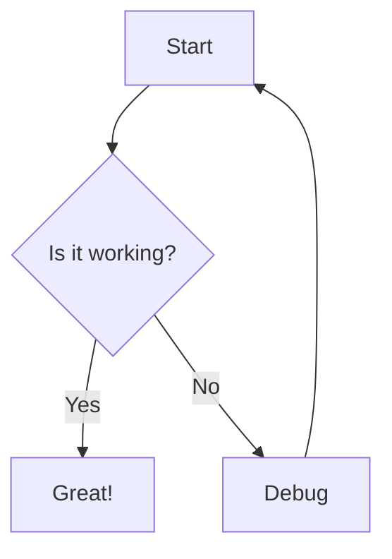

# Mermaid Collaboration Tool

This skill helps you create, edit, and collaborate on Mermaid diagrams and UI wireframes using the claude-mermaid-collab server.

## What This Tool Provides

- **Real-time Diagram Editor**: Live preview with pan, zoom, and auto-save
- **UI Wireframe Plugin**: Text-based wireframe creation for mobile, tablet, and desktop
- **Team Collaboration**: Real-time updates across all connected clients via WebSocket
- **File-Based Storage**: Simple `.mmd` files for version control
- **MCP Integration**: Create and manage diagrams directly from Claude Code

## When to Use This Skill

Use this skill when you need to:
- Create flowcharts, state diagrams, sequence diagrams, or any Mermaid diagram
- Design UI wireframes and mockups with text-based syntax
- Collaborate on diagrams with team members in real-time
- Quickly prototype and iterate on visual designs
- Document workflows, architectures, or processes

## MCP Tools Available

The server provides these MCP tools through Claude Code:

### Diagrams
- `list_diagrams()` - List all diagrams with metadata
- `get_diagram(id)` - Read diagram content
- `create_diagram(name, content)` - Create new diagram (auto-validates)
- `update_diagram(id, content)` - Update diagram (auto-validates)
- `validate_diagram(content)` - Check syntax without saving
- `preview_diagram(id)` - Get browser URL for diagram

### Documents
- `list_documents()` - List all markdown documents
- `get_document(id)` - Read document content
- `create_document(name, content)` - Create new document
- `update_document(id, content)` - Update document
- `delete_document(id)` - Delete document

## Creating Standard Mermaid Diagrams

### Flowchart Example


### Direction Toggle
Use the direction toggle button (⤡) in the editor to switch between:
- **LR** (Left to Right) - Horizontal layout
- **TD** (Top Down) - Vertical layout

Supported directions: TD, TB, BT, RL, LR

## Creating UI Wireframes

The built-in wireframe plugin lets you create UI mockups with text syntax.

### Basic Wireframe Syntax

```
wireframe mobile TD
  screen "Login Screen"
    col padding=16
      Title "Welcome Back"
      Input "Email"
      Input "Password"
      Button "Sign In" primary
```

### Viewports
- `wireframe mobile` - 375px width
- `wireframe tablet` - 768px width
- `wireframe desktop` - 1200px width

### Layout Directions
- `TD` - Top Down (vertical, default)
- `LR` - Left Right (horizontal)

### Container Types
- `screen "Title"` - Top-level screen container
- `col` - Vertical column layout
- `row` - Horizontal row layout
- `Card` - Card container with rounded corners

### UI Widgets

**Input Controls:**
- `Button "Label"` - Button (can add `primary`, `secondary`, `danger`, `success`)
- `Input "Placeholder"` - Text input field
- `Checkbox "Label"` - Checkbox with label
- `Radio "Label"` - Radio button with label
- `Switch "Label"` - Toggle switch
- `Dropdown "Label"` - Dropdown selector

**Display Elements:**
- `Text "Content"` - Normal text
- `Title "Heading"` - Bold heading text
- `Icon "name"` - Icon placeholder
- `Image` - Image placeholder
- `Avatar` - User avatar circle

**Navigation:**
- `AppBar "Title"` - Top app bar
- `NavMenu "Home|About|Contact"` - Horizontal navigation (use `|` to separate items)
- `BottomNav "Home|Search|Profile"` - Bottom navigation
- `FAB "+"` - Floating action button

**Structure:**
- `Grid` - Table/grid layout (use with `header` and `row` children)
- `List "Item 1|Item 2|Item 3"` - List of items
- `divider` - Horizontal divider line
- `spacer` - Flexible space

### Layout Modifiers

Add modifiers after widget names:
- `width=200` - Fixed width in pixels
- `height=100` - Fixed height in pixels
- `padding=16` - Padding around content
- `flex` or `flex=2` - Take remaining space (optionally with weight)
- `align=start|center|end|space-between` - Horizontal alignment
- `cross=start|center|end` - Vertical alignment

### Complex Wireframe Example

```
wireframe mobile TD
  screen "Dashboard"
    AppBar "My App"
    col padding=16
      Title "Welcome"
      Text "Here's your overview"
      spacer
      row
        Card padding=8 flex
          Text "Sales"
          Title "$1,234"
        Card padding=8 flex
          Text "Orders"
          Title "56"
      spacer
      List "Recent|Pending|Complete"
    BottomNav "Home|Stats|Profile"
```

## Best Practices

### Diagram Naming
- Use descriptive names: `user-login-flow` not `diagram1`
- Use hyphens, not spaces: `api-architecture` not `api architecture`
- Keep names lowercase for consistency

### Collaboration Workflow
1. Create diagram: `create_diagram("feature-flow", content)`
2. Share the preview URL with team members
3. Team members can view real-time updates in their browsers
4. Everyone sees changes instantly via WebSocket

### Wireframe Design Tips
1. **Start with screens**: Define your main screens first
2. **Use containers**: Group related elements in `col` and `row`
3. **Add padding**: Use `padding=16` on containers for spacing
4. **Flexible layouts**: Use `flex` for responsive elements
5. **Toggle direction**: Try both LR and TD to see what works best

### Version Control
All diagrams are stored as `.mmd` files in the `diagrams/` folder:
- Easy to commit to git
- Plain text, easy to diff
- Can edit externally with any text editor
- Auto-reloads in the web interface

## Editor Features

### Keyboard Shortcuts
- **Undo**: Ctrl+Z (managed by editor)
- **Redo**: Ctrl+Shift+Z (managed by editor)
- **Auto-save**: 500ms after typing stops

### Pan & Zoom Controls
- **Mouse wheel**: Zoom in/out
- **Drag**: Pan around diagram
- **⊡ Fit**: Fit entire diagram to viewport
- **↔ Fit Width**: Fit diagram width
- **↕ Fit Height**: Fit diagram height
- **↻ Reset**: Reset zoom to 100%
- **+ / −**: Zoom in/out buttons

### Resizable Panes
- **Drag the separator** between code and preview
- Customize your preferred layout
- Setting persists across sessions

## Common Patterns

### Mobile App Wireframe
```
wireframe mobile TD
  screen "Profile"
    AppBar "Profile"
    col padding=16
      Avatar
      Title "John Doe"
      Text "john@example.com"
      divider
      List "Settings|Privacy|Help|Logout"
```

### Desktop Dashboard
```
wireframe desktop LR
  screen "Analytics Dashboard"
    col width=200
      NavMenu "Dashboard|Reports|Users"
    col flex padding=20
      Title "Analytics Overview"
      row
        Card flex padding=16
          Text "Total Users"
          Title "1,234"
        Card flex padding=16
          Text "Revenue"
          Title "$56,789"
```

### Form Layout
```
wireframe tablet TD
  screen "Registration"
    col padding=24
      Title "Create Account"
      Input "Full Name"
      Input "Email Address"
      Input "Password"
      Checkbox "I agree to terms"
      spacer
      Button "Sign Up" primary
      Text "Already have an account?"
```

## Troubleshooting

### Diagram Not Rendering
- Check syntax with `validate_diagram(content)` first
- Look at error banner in editor for line-specific errors
- Make sure Mermaid syntax is valid

### Wireframe Not Showing
- Verify first line starts with `wireframe`
- Check indentation (use spaces, not tabs)
- Make sure viewport is specified: `wireframe mobile`

### Real-time Updates Not Working
- Check WebSocket connection status (top-right indicator)
- Click the status indicator to reconnect if disconnected
- Make sure you're subscribed to the correct diagram

## Pro Tips

1. **Use validate before save**: Call `validate_diagram()` to catch errors early
2. **Preview URL sharing**: Use `preview_diagram(id)` to get sharable links
3. **Direction matters**: Horizontal (LR) works better for wide diagrams, vertical (TD) for tall ones
4. **Prototype fast**: Wireframes are text-based, so iterate quickly
5. **Version everything**: Commit `.mmd` files to git for history
6. **Test viewports**: Try mobile, tablet, desktop to see what works best
7. **Use badges**: Dashboard shows diagram vs document badges for easy identification

## Example Workflow

```
# 1. Create a new wireframe
create_diagram("checkout-flow", """
wireframe mobile TD
  screen "Cart"
    AppBar "Shopping Cart"
    col padding=16
      List "Item 1|Item 2|Item 3"
      divider
      row
        Text "Total"
        spacer
        Title "$99.99"
      Button "Checkout" primary
""")

# 2. Get preview URL
preview_diagram("checkout-flow")

# 3. Share with team, iterate based on feedback

# 4. Update diagram
update_diagram("checkout-flow", """
wireframe mobile TD
  screen "Cart"
    AppBar "Shopping Cart"
    col padding=16
      List "Item 1 - $29.99|Item 2 - $39.99|Item 3 - $30.01"
      divider
      row
        Text "Subtotal"
        spacer
        Text "$99.99"
      row
        Text "Tax"
        spacer
        Text "$8.00"
      row
        Title "Total"
        spacer
        Title "$107.99"
      spacer
      Button "Proceed to Checkout" primary
""")
```

## Resources

- **Web Dashboard**: http://localhost:3737/
- **Editor**: http://localhost:3737/diagram.html?id=<diagram-id>
- **Mermaid Docs**: https://mermaid.js.org/
- **Project README**: See `/README.md` for full documentation
- **Wireframe Plugin**: See `/plugins/wireframe/README.md` for detailed syntax

---

**Remember**: This is a collaboration tool - diagrams update in real-time for all connected users. Perfect for pair programming, design reviews, and team brainstorming sessions!
