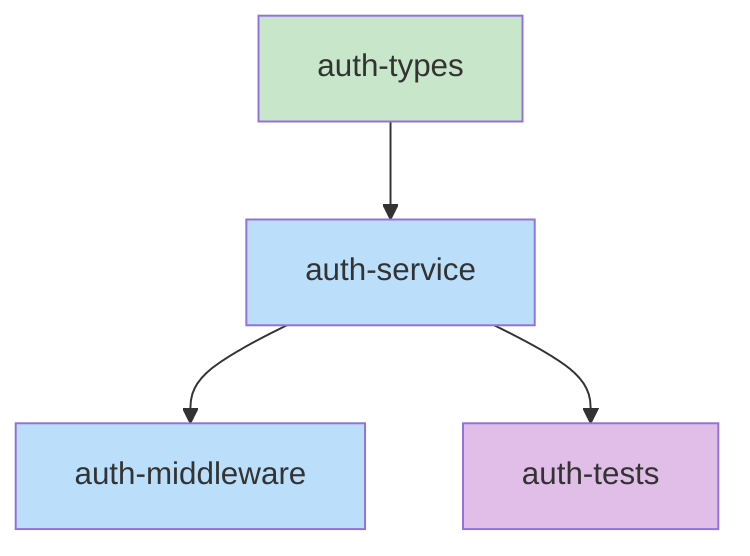

# Rough-Draft Blueprint

Create a single comprehensive blueprint document for the current work item that includes:
1. Structure summary (files and functions)
2. Function blueprints (signatures, pseudocode, stubs)
3. Task dependency graph (YAML, execution waves, Mermaid)

## Quick Assessment

Before starting the full blueprint, assess whether this item actually needs one.

**Skip the blueprint and call `complete_skill` immediately if:**
- The item is a config-only change (e.g., updating `.env`, `tsconfig.json`, `package.json`)
- The item is a simple rename or move with no logic changes
- The item is a single-file change with obvious implementation (< 20 lines)
- The design doc already contains sufficient detail to implement directly

**To skip:** Call `complete_skill` with `skill: "rough-draft-blueprint"` right away. The state machine will mark this item complete and route to the next item or to `ready-to-implement`.

**Proceed with the full blueprint if:**
- Multiple files need coordinated changes
- New functions or modules are being created
- The implementation requires a task dependency graph
- There are non-obvious edge cases or integration points

---

## Step 0: Query Kodex

Query project knowledge for relevant conventions and patterns.

### Topic Inference

From work item context, build candidates:
- `{item-keyword}-types`
- `{item-keyword}-patterns`
- `type-conventions`
- `coding-standards`
- `error-patterns`
- `file-naming`
- `project-structure`

### Example

```
Tool: mcp__plugin_mermaid-collab_mermaid__kodex_query_topic
Args: { "project": "<cwd>", "name": "type-conventions" }
```

Display found topics as context before creating the blueprint.

---

## Phase 1: Structure Enumeration

Define the structural contracts of the system.

### What to Produce

1. **File paths** - List all files that will be created or modified
2. **Class and function signatures** - Names, parameters, return types
3. **Public API contracts** - How components interact with each other
4. **Type definitions** - Custom types, interfaces, enums

### Process

```bash
# Read design doc
cat .collab/<name>/documents/design.md
```

**For each component identified in design:**
1. Define the file path where it will live
2. List all public functions/methods with signatures
3. Define input/output types
4. Document how it connects to other components

### GATE 1: Structure Confirmation

**Checklist:**
- [ ] All files from design are listed
- [ ] All public interfaces have signatures
- [ ] Parameter types are explicit (no `any`)
- [ ] Return types are explicit
- [ ] Component interactions are documented

**If structure phase doesn't apply** (e.g., pure config changes, docker setup):
Document explicitly: "N/A - [reason why structure phase doesn't apply]"
N/A sections require justification - never leave them silently empty.

**GATE: Do NOT proceed until this checklist passes.**

---

## Phase 2: Function Blueprints

Define the logic flow and implementation details for each function.

### What to Produce

For each function identified in Phase 1, create a complete blueprint:

1. **Signature** - Full function signature with types
2. **Pseudocode** - Step-by-step logic flow
3. **Error Handling** - How errors are caught, propagated, reported
4. **Edge Cases** - Boundary conditions and how they're handled
5. **Dependencies** - External services, databases, APIs called
6. **Test Strategy** - Key test cases to verify behavior
7. **Stub Code** - Actual stub implementation with TODO comments

### Language-Specific Stub Templates

**TypeScript:**
```typescript
export async function functionName(param: Type): Promise<ReturnType> {
  // TODO: Step 1 - Validate input
  // TODO: Step 2 - Process data
  // TODO: Step 3 - Return result
  throw new Error('Not implemented');
}
```

**Python:**
```python
def function_name(param: Type) -> ReturnType:
    """Brief description."""
    # TODO: Step 1 - Validate input
    # TODO: Step 2 - Process data
    # TODO: Step 3 - Return result
    raise NotImplementedError()
```

**Go:**
```go
func FunctionName(param Type) (ReturnType, error) {
    // TODO: Step 1 - Validate input
    // TODO: Step 2 - Process data
    // TODO: Step 3 - Return result
    return nil, fmt.Errorf("not implemented")
}
```

**Rust:**
```rust
pub fn function_name(param: Type) -> Result<ReturnType, Error> {
    // TODO: Step 1 - Validate input
    // TODO: Step 2 - Process data
    // TODO: Step 3 - Return result
    todo!()
}
```

**C#:**
```csharp
public async Task<ReturnType> FunctionName(Type param)
{
    // TODO: Step 1 - Validate input
    // TODO: Step 2 - Process data
    // TODO: Step 3 - Return result
    throw new NotImplementedException();
}
```

### GATE 2: Function Completeness

**Checklist:**
- [ ] Every function from Structure has a blueprint
- [ ] Pseudocode steps are clear and actionable
- [ ] Error handling is explicit for each function
- [ ] Edge cases are identified
- [ ] TODO comments in stubs match pseudocode steps
- [ ] External dependencies are noted

**If pseudocode phase doesn't apply** (e.g., no logic to describe, pure data changes):
Document explicitly: "N/A - [reason why pseudocode phase doesn't apply]"

**GATE: Do NOT proceed until this checklist passes.**

---

## Phase 3: Task Dependency Graph

Build the task dependency graph and execution plan.

### Step 1: Build Task List

For each file from the structure:
1. Create task ID from file path (e.g., `src/auth/service.ts` -> `auth-service`)
2. Set files array
3. Generate test file paths:
   - `{dir}/{name}.test{ext}`
   - `{dir}/__tests__/{name}.test{ext}`
4. Extract description from blueprint
5. Analyze dependencies:
   - If file imports from another file, add dependency
   - If pseudocode mentions "after X", add dependency

### Step 2: Identify Parallel Tasks

Mark tasks as `parallel: true` if:
- No dependencies
- Or all dependencies are from previous waves

### Step 3: Calculate Execution Waves

Group tasks by wave:
- **Wave 1:** Tasks with no dependencies
- **Wave N:** Tasks depending only on waves 1 to N-1

### Step 4: Check for Cross-Item Dependencies

If this work item depends on files from other work items:
- Document the dependency explicitly
- Note in the graph which items must complete first

### Step 5: Create Mermaid Visualization



Legend: Green = parallel-safe (no dependencies), Blue = sequential, Purple = tests

### GATE 3: Graph Validation

**Checklist:**
- [ ] All files from structure are covered in tasks
- [ ] No circular dependencies
- [ ] Dependencies match import analysis
- [ ] Test file paths are generated for each source file
- [ ] Execution waves are calculated

**GATE: Do NOT proceed until this checklist passes.**

---

## Output: Blueprint Document

Create `blueprint-item-N.md` with all three phases combined:

```
Tool: mcp__plugin_mermaid-collab_mermaid__create_document
Args: {
  "project": "<cwd>",
  "session": "<session>",
  "name": "blueprint-item-N",
  "content": "<blueprint content>"
}
```

### Document Structure

```markdown
# Blueprint: Item N - [Title]

## 1. Structure Summary

### Files
- [ ] `src/path/to/file.ts` - Description
- [ ] `src/path/to/another.ts` - Description

### Type Definitions

```typescript
// Type definitions here
```

### Component Interactions
- Component A calls Component B via method X
- Component B depends on external service Y

---

## 2. Function Blueprints

### `functionName(param: Type): ReturnType`

**Pseudocode:**
1. Validate input
2. Process data
3. Return result

**Error Handling:**
- InvalidInput: Return error with message

**Edge Cases:**
- Empty input: Return default value

**Test Strategy:**
- Test valid input
- Test invalid input
- Test edge cases

**Stub:**
```typescript
export async function functionName(param: Type): Promise<ReturnType> {
  // TODO: Step 1 - Validate input
  // TODO: Step 2 - Process data
  // TODO: Step 3 - Return result
  throw new Error('Not implemented');
}
```

[Repeat for each function]

---

## 3. Task Dependency Graph

### YAML Graph

```yaml
tasks:
  - id: task-id
    files: [path/to/file.ts]
    tests: [path/to/file.test.ts]
    description: What this task implements
    parallel: true
    depends-on: []
```

### Execution Waves

**Wave 1 (no dependencies):**
- task-1
- task-2

**Wave 2 (depends on Wave 1):**
- task-3

### Mermaid Visualization


### Summary
- Total tasks: N
- Total waves: M
- Max parallelism: P
```

---

## Recording Blueprint Insights (Optional)

If blueprint creation revealed conventions or patterns worth preserving:

```
Tool: mcp__plugin_mermaid-collab_mermaid__add_lesson
Args: {
  "project": "<cwd>",
  "session": "<session>",
  "lesson": "<insight>",
  "category": "codebase"
}
```

**Good lesson candidates:**
- Naming conventions discovered or established
- File organization patterns
- Type definition patterns specific to this codebase
- Function signature conventions
- Error handling patterns used consistently

**Category guidance:**
| Category | When to use |
|----------|-------------|
| codebase | Naming, structure, and type conventions |
| workflow | Blueprint process improvements |
| gotcha | Non-obvious constraints discovered during planning |
| universal | Broadly applicable design patterns |

---

## Completion

After creating the blueprint document, call complete_skill:

```
Tool: mcp__plugin_mermaid-collab_mermaid__complete_skill
Args: { "project": "<cwd>", "session": "<session>", "skill": "rough-draft-blueprint" }
```

**Handle response:**
- If `action == "clear"`: Invoke skill: collab-clear
- If `next_skill` is not null: Invoke that skill
- If `next_skill` is null: Workflow complete

**Note:** The state machine will automatically mark this item as 'complete' and route to the next item or to ready-to-implement if all items are done.
