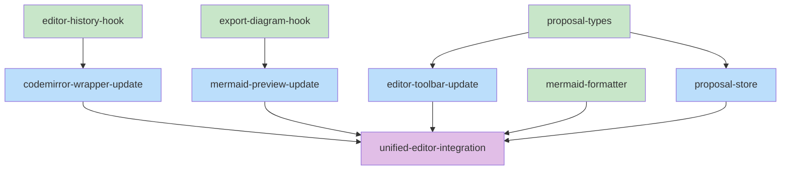

# Session: slow-pure-spring

## Session Context
**Out of Scope:** Backend/server changes, authentication, deployment
**Shared Decisions:** All features integrate with existing UI patterns (Zustand stores, Tailwind styling)

---

## Work Items

### Item 1: Implement Undo/Redo History Tracking
**Type:** code
**Status:** documented
**Problem/Goal:**
The EditorToolbar has Undo/Redo buttons that currently do nothing (`onClick={() => {}}`). CodeMirror has built-in history (Ctrl+Z works), but the toolbar buttons aren't wired to it. Users expect toolbar buttons to work like keyboard shortcuts.

**Approach:**
1. Modify CodeMirrorWrapper to expose editor view via callback prop (`onEditorReady`)
2. Create `useEditorHistory` hook that:
   - Stores EditorView reference
   - Tracks `canUndo` and `canRedo` state by listening to editor updates
   - Exposes `undo()` and `redo()` functions using `@codemirror/commands`
3. Wire UnifiedEditor to use the hook and pass props to EditorToolbar
4. EditorToolbar buttons call `onUndo`/`onRedo` and are disabled based on `canUndo`/`canRedo`

**Success Criteria:**
- [ ] Undo button triggers undo when clicked
- [ ] Redo button triggers redo when clicked
- [ ] Buttons are disabled when no undo/redo history available
- [ ] History resets when switching items (no cross-item undo)
- [ ] Keyboard shortcuts (Ctrl+Z, Ctrl+Shift+Z) still work

**Decisions:**
- Use CodeMirror's built-in history, don't build custom solution
- Track state via editor update listener, not external store
- Reset history when item changes to prevent confusing cross-item undo

---

### Item 2: Export Diagram as Image
**Type:** code
**Status:** documented
**Problem/Goal:**
Users need to export Mermaid diagrams as images (PNG/SVG) for use in documentation, presentations, or sharing. Currently there's a disabled "Export Image" button in the toolbar overflow menu that does nothing.

**Approach:**
1. Create `useExportDiagram` hook that:
   - Takes a ref to the SVG container
   - Provides `exportAsSVG()` - extracts SVG, creates Blob, triggers download
   - Provides `exportAsPNG()` - converts SVG to canvas, then to PNG blob
2. Add export dropdown menu to EditorToolbar (SVG | PNG options)
3. Wire MermaidPreview to expose its container ref via callback
4. UnifiedEditor passes export functions to toolbar

**Success Criteria:**
- [ ] Export as SVG downloads a valid .svg file
- [ ] Export as PNG downloads a valid .png file
- [ ] Exported images include proper styling (colors, fonts)
- [ ] Export button only enabled for diagrams (disabled for documents)
- [ ] Download filename includes diagram name

**Decisions:**
- Use browser-native APIs (Blob, canvas) - no external libraries needed
- SVG export is straightforward (serialize SVG)
- PNG export uses canvas drawImage with SVG data URL

---

### Item 3: Format Diagram (Auto-format Mermaid Syntax)
**Type:** code
**Status:** documented
**Problem/Goal:**
Users may write messy Mermaid syntax with inconsistent indentation or spacing. A "Format" button would auto-format the code for better readability, similar to Prettier for JavaScript.

**Approach:**
1. Research if Mermaid has a built-in formatter or AST parser
2. If not, create a simple formatter that:
   - Normalizes indentation (2 spaces)
   - Adds consistent line breaks between nodes
   - Aligns arrow syntax
3. Add format button to EditorToolbar (diagram-only)
4. On click, format content and update editor

**Success Criteria:**
- [ ] Format button appears for diagrams only
- [ ] Clicking format improves code readability
- [ ] Formatting preserves diagram semantics (same output)
- [ ] Handles common diagram types (flowchart, sequence, class)

**Decisions:**
- Start simple: basic indentation and line break normalization
- Don't try to parse full Mermaid AST initially
- Button disabled if diagram has syntax errors (can't format invalid code)

---

### Item 4: Collaboration Features (Comment, Propose, Approve, Reject, Clear)
**Type:** code
**Status:** documented
**Problem/Goal:**
Enable collaborative review workflows where Claude can propose changes and users can approve/reject them. Features needed:
- **Comment**: Add review comments to specific lines or sections
- **Propose**: Mark content as "proposed" (pending review)
- **Approve**: Accept proposed changes
- **Reject**: Discard proposed changes
- **Clear**: Clear all proposals/comments

**Approach:**
1. Define a comment/proposal data structure:
   ```typescript
   interface Proposal {
     id: string;
     type: 'comment' | 'proposed' | 'approved' | 'rejected';
     lineStart: number;
     lineEnd: number;
     content: string;
     author: 'user' | 'claude';
     timestamp: number;
   }
   ```
2. Store proposals in a Zustand store (proposalStore)
3. Render proposals as inline markers/highlights in CodeMirror
4. Add toolbar buttons: Comment, Approve All, Reject All, Clear
5. Proposals shown as cyan highlight (proposed), green (approved), red (rejected)

**Success Criteria:**
- [ ] Can add comments to specific lines
- [ ] Proposed changes highlighted in cyan
- [ ] Approve button accepts proposed change (removes highlight)
- [ ] Reject button discards proposed change (reverts content)
- [ ] Clear button removes all annotations
- [ ] Proposals persist across sessions (saved with document)

**Decisions:**
- Store proposals separately from content (not inline markers like `<!-- propose-start -->`)
- Use CodeMirror decorations for visual highlighting
- Proposals are per-document, stored in proposalStore
- Clear action requires confirmation

---

## Interface Definition

### File Structure

**New Files:**
- `src/hooks/useEditorHistory.ts` - Undo/redo history management hook
- `src/hooks/useExportDiagram.ts` - Diagram export functionality hook
- `src/lib/mermaidFormatter.ts` - Mermaid syntax formatter utility
- `src/stores/proposalStore.ts` - Proposal/comment state management
- `src/types/proposal.ts` - Proposal type definitions

**Modified Files:**
- `src/components/editors/CodeMirrorWrapper.tsx` - Add onEditorReady callback
- `src/components/editors/MermaidPreview.tsx` - Expose container ref for export
- `src/components/editors/UnifiedEditor.tsx` - Wire up hooks and pass props
- `src/components/layout/EditorToolbar.tsx` - Add export dropdown, collab buttons
- `src/types/index.ts` - Export new types

### Type Definitions

```typescript
// src/types/proposal.ts
export type ProposalType = 'comment' | 'proposed' | 'approved' | 'rejected';
export type ProposalAuthor = 'user' | 'claude';

export interface Proposal {
  id: string;
  type: ProposalType;
  lineStart: number;
  lineEnd: number;
  content: string;
  originalContent?: string; // For proposed changes, stores original
  author: ProposalAuthor;
  timestamp: number;
}

export interface ProposalState {
  proposals: Record<string, Proposal[]>; // keyed by item id
  addProposal: (itemId: string, proposal: Omit<Proposal, 'id' | 'timestamp'>) => string;
  updateProposal: (itemId: string, proposalId: string, updates: Partial<Proposal>) => void;
  removeProposal: (itemId: string, proposalId: string) => void;
  approveProposal: (itemId: string, proposalId: string) => void;
  rejectProposal: (itemId: string, proposalId: string) => void;
  clearProposals: (itemId: string) => void;
  getProposalsForItem: (itemId: string) => Proposal[];
}
```

```typescript
// src/hooks/useEditorHistory.ts
import { EditorView } from '@codemirror/view';

export interface EditorHistoryState {
  canUndo: boolean;
  canRedo: boolean;
}

export interface UseEditorHistoryReturn {
  editorRef: React.MutableRefObject<EditorView | null>;
  setEditor: (view: EditorView | null) => void;
  undo: () => void;
  redo: () => void;
  canUndo: boolean;
  canRedo: boolean;
}

export function useEditorHistory(): UseEditorHistoryReturn;
```

```typescript
// src/hooks/useExportDiagram.ts
export interface UseExportDiagramReturn {
  svgContainerRef: React.RefCallback<HTMLDivElement>;
  exportAsSVG: (filename: string) => void;
  exportAsPNG: (filename: string) => Promise<void>;
  canExport: boolean;
}

export function useExportDiagram(): UseExportDiagramReturn;
```

```typescript
// src/lib/mermaidFormatter.ts
export interface FormatOptions {
  indentSize?: number;  // default: 2
  maxLineLength?: number;  // default: 80
}

export interface FormatResult {
  formatted: string;
  success: boolean;
  error?: string;
}

export function formatMermaid(content: string, options?: FormatOptions): FormatResult;
export function canFormat(content: string): boolean;
```

### Function Signatures

```typescript
// src/hooks/useEditorHistory.ts
export function useEditorHistory(): UseEditorHistoryReturn {
  // Returns hook with EditorView management and undo/redo controls
}
```

```typescript
// src/hooks/useExportDiagram.ts
export function useExportDiagram(): UseExportDiagramReturn {
  // Returns hook with SVG container ref and export functions
}
```

```typescript
// src/lib/mermaidFormatter.ts
export function formatMermaid(content: string, options?: FormatOptions): FormatResult {
  // Formats Mermaid diagram syntax
}

export function canFormat(content: string): boolean {
  // Returns true if content is valid Mermaid that can be formatted
}
```

```typescript
// src/stores/proposalStore.ts
export const useProposalStore: UseBoundStore<StoreApi<ProposalState>>;
```

```typescript
// src/components/editors/CodeMirrorWrapper.tsx (modified)
export interface CodeMirrorWrapperProps {
  // ... existing props ...
  onEditorReady?: (view: EditorView) => void;  // NEW
}
```

```typescript
// src/components/editors/MermaidPreview.tsx (modified)
export interface MermaidPreviewProps {
  // ... existing props ...
  onContainerRef?: (ref: HTMLDivElement | null) => void;  // NEW
}
```

```typescript
// src/components/layout/EditorToolbar.tsx (modified)
export interface EditorToolbarProps {
  // ... existing props ...
  onExportSVG?: () => void;  // NEW
  onExportPNG?: () => void;  // NEW
  canExport?: boolean;  // NEW
  onFormat?: () => void;  // NEW
  canFormat?: boolean;  // NEW
  onAddComment?: () => void;  // NEW
  onApproveAll?: () => void;  // NEW
  onRejectAll?: () => void;  // NEW
  onClearProposals?: () => void;  // NEW
  hasProposals?: boolean;  // NEW
}
```

### Component Interactions

1. **Undo/Redo Flow:**
   - CodeMirrorWrapper calls `onEditorReady(view)` when editor mounts
   - UnifiedEditor uses `useEditorHistory` hook to get `setEditor`, `undo`, `redo`, `canUndo`, `canRedo`
   - UnifiedEditor passes `setEditor` to CodeMirrorWrapper's `onEditorReady`
   - EditorToolbar receives `onUndo`, `onRedo`, `canUndo`, `canRedo` props

2. **Export Flow:**
   - MermaidPreview calls `onContainerRef(ref)` when SVG container mounts
   - UnifiedEditor uses `useExportDiagram` hook to get `svgContainerRef`, `exportAsSVG`, `exportAsPNG`
   - UnifiedEditor passes `svgContainerRef` to MermaidPreview's `onContainerRef`
   - EditorToolbar receives `onExportSVG`, `onExportPNG`, `canExport` props

3. **Format Flow:**
   - EditorToolbar's Format button calls `onFormat`
   - UnifiedEditor's `handleFormat` uses `formatMermaid()` then updates content
   - `canFormat` determined by checking if item is diagram and content parses

4. **Collaboration Flow:**
   - EditorToolbar's Comment/Approve/Reject/Clear buttons call respective callbacks
   - UnifiedEditor uses `useProposalStore` to manage proposal state
   - CodeMirror decorations render proposal highlights based on store state

## Pseudocode

### useEditorHistory Hook

```
FUNCTION useEditorHistory():
  editorRef = useRef<EditorView>(null)
  canUndo = useState(false)
  canRedo = useState(false)

  FUNCTION setEditor(view):
    editorRef.current = view
    IF view is null:
      canUndo = false
      canRedo = false
      RETURN

    // Listen to editor state changes
    view.dispatch({
      effects: StateEffect.appendConfig.of(
        EditorView.updateListener.of(update => {
          IF update.docChanged OR update.transactions.length > 0:
            canUndo = undoDepth(view.state) > 0
            canRedo = redoDepth(view.state) > 0
        })
      )
    })

  FUNCTION undo():
    IF editorRef.current AND canUndo:
      undo(editorRef.current)

  FUNCTION redo():
    IF editorRef.current AND canRedo:
      redo(editorRef.current)

  RETURN { editorRef, setEditor, undo, redo, canUndo, canRedo }
```

**Error Handling:**
- If EditorView is null when undo/redo called, silently no-op
- State updates are synchronous, no async errors expected

**Edge Cases:**
- Editor unmounts: setEditor(null) cleans up
- Multiple rapid undo/redo: Each triggers state update, UI stays in sync
- Item switch: Parent must call setEditor(null) then setEditor(newView)

---

### useExportDiagram Hook

```
FUNCTION useExportDiagram():
  svgContainerRef = useRef<HTMLDivElement>(null)
  canExport = useState(false)

  FUNCTION svgContainerRefCallback(ref):
    svgContainerRef.current = ref
    canExport = ref !== null AND ref.querySelector('svg') !== null

  FUNCTION exportAsSVG(filename):
    container = svgContainerRef.current
    IF container is null: RETURN

    svg = container.querySelector('svg')
    IF svg is null: RETURN

    // Clone SVG and inline styles
    clone = svg.cloneNode(true)
    inlineStyles(clone)

    // Serialize to string
    serializer = new XMLSerializer()
    svgString = serializer.serializeToString(clone)

    // Create blob and download
    blob = new Blob([svgString], { type: 'image/svg+xml' })
    url = URL.createObjectURL(blob)
    downloadFile(url, filename + '.svg')
    URL.revokeObjectURL(url)

  FUNCTION exportAsPNG(filename):
    container = svgContainerRef.current
    IF container is null: RETURN

    svg = container.querySelector('svg')
    IF svg is null: RETURN

    // Get SVG dimensions
    bbox = svg.getBBox()
    width = bbox.width OR svg.clientWidth OR 800
    height = bbox.height OR svg.clientHeight OR 600

    // Clone and inline styles
    clone = svg.cloneNode(true)
    inlineStyles(clone)

    // Create data URL from SVG
    serializer = new XMLSerializer()
    svgString = serializer.serializeToString(clone)
    svgDataUrl = 'data:image/svg+xml;charset=utf-8,' + encodeURIComponent(svgString)

    // Draw to canvas
    canvas = document.createElement('canvas')
    canvas.width = width * 2  // 2x for retina
    canvas.height = height * 2
    ctx = canvas.getContext('2d')
    ctx.scale(2, 2)

    img = new Image()
    img.onload = () => {
      ctx.drawImage(img, 0, 0)
      canvas.toBlob(blob => {
        url = URL.createObjectURL(blob)
        downloadFile(url, filename + '.png')
        URL.revokeObjectURL(url)
      }, 'image/png')
    }
    img.src = svgDataUrl

  FUNCTION downloadFile(url, filename):
    a = document.createElement('a')
    a.href = url
    a.download = filename
    document.body.appendChild(a)
    a.click()
    document.body.removeChild(a)

  FUNCTION inlineStyles(element):
    // Copy computed styles to inline for export
    computed = window.getComputedStyle(element)
    element.setAttribute('style', computed.cssText)
    FOR child IN element.children:
      inlineStyles(child)

  RETURN { svgContainerRef: svgContainerRefCallback, exportAsSVG, exportAsPNG, canExport }
```

**Error Handling:**
- No SVG in container: export functions silently return
- Canvas operations fail: catch and log, don't crash
- Image load timeout: set 10s timeout, reject promise

**Edge Cases:**
- Very large diagrams: May hit canvas size limits, fallback to SVG
- Dark theme: Inline styles ensure colors preserved
- Animated elements: Export captures current frame

---

### formatMermaid Function

```
FUNCTION formatMermaid(content, options = {}):
  indentSize = options.indentSize OR 2
  indent = ' '.repeat(indentSize)

  TRY:
    lines = content.split('\n')
    result = []
    currentIndent = 0
    inSubgraph = false

    FOR line IN lines:
      trimmed = line.trim()
      IF trimmed is empty:
        CONTINUE  // Skip blank lines

      // Detect diagram type on first line
      IF trimmed matches /^(graph|flowchart|sequenceDiagram|classDiagram|stateDiagram|erDiagram|gantt|pie|gitGraph)/i:
        result.push(trimmed)
        CONTINUE

      // Handle subgraph start
      IF trimmed.startsWith('subgraph'):
        result.push(indent.repeat(currentIndent) + trimmed)
        currentIndent++
        inSubgraph = true
        CONTINUE

      // Handle subgraph end
      IF trimmed === 'end':
        currentIndent = max(0, currentIndent - 1)
        result.push(indent.repeat(currentIndent) + trimmed)
        inSubgraph = false
        CONTINUE

      // Handle node definitions and connections
      // Normalize arrow syntax: spaces around arrows
      formatted = trimmed
        .replace(/\s*-->\s*/g, ' --> ')
        .replace(/\s*---\s*/g, ' --- ')
        .replace(/\s*-.->|>\s*/g, ' -.-> ')
        .replace(/\s*==>\s*/g, ' ==> ')

      result.push(indent.repeat(currentIndent) + formatted)

    RETURN { formatted: result.join('\n'), success: true }

  CATCH error:
    RETURN { formatted: content, success: false, error: error.message }

FUNCTION canFormat(content):
  // Check if content starts with valid Mermaid directive
  firstLine = content.trim().split('\n')[0].toLowerCase()
  RETURN firstLine matches /^(graph|flowchart|sequenceDiagram|classDiagram|stateDiagram|erDiagram|gantt|pie|gitGraph)/i
```

**Error Handling:**
- Invalid syntax: Return original content unchanged with error message
- Empty content: Return empty string, success true

**Edge Cases:**
- Comments (%%): Preserve as-is
- Multi-line labels: Keep on same line
- Click/link callbacks: Don't alter

---

### proposalStore

```
FUNCTION createProposalStore():
  RETURN create((set, get) => ({
    proposals: {},

    addProposal: (itemId, proposal) => {
      id = generateUniqueId()
      timestamp = Date.now()
      newProposal = { ...proposal, id, timestamp }

      set(state => ({
        proposals: {
          ...state.proposals,
          [itemId]: [...(state.proposals[itemId] OR []), newProposal]
        }
      }))

      RETURN id
    },

    updateProposal: (itemId, proposalId, updates) => {
      set(state => ({
        proposals: {
          ...state.proposals,
          [itemId]: (state.proposals[itemId] OR []).map(p =>
            p.id === proposalId ? { ...p, ...updates } : p
          )
        }
      }))
    },

    removeProposal: (itemId, proposalId) => {
      set(state => ({
        proposals: {
          ...state.proposals,
          [itemId]: (state.proposals[itemId] OR []).filter(p => p.id !== proposalId)
        }
      }))
    },

    approveProposal: (itemId, proposalId) => {
      // Mark as approved - actual content change handled by caller
      get().updateProposal(itemId, proposalId, { type: 'approved' })
    },

    rejectProposal: (itemId, proposalId) => {
      // Mark as rejected - content revert handled by caller
      get().updateProposal(itemId, proposalId, { type: 'rejected' })
    },

    clearProposals: (itemId) => {
      set(state => ({
        proposals: {
          ...state.proposals,
          [itemId]: []
        }
      }))
    },

    getProposalsForItem: (itemId) => {
      RETURN get().proposals[itemId] OR []
    }
  }))
```

**Error Handling:**
- Invalid itemId: Operations silently create empty array
- Duplicate proposal IDs: Prevented by unique ID generation

**Edge Cases:**
- Clear proposals: Ask for confirmation in UI before calling
- Approve/reject: Caller must handle content changes separately
- Proposals persist in memory only (no localStorage for now)

---

### CodeMirrorWrapper (modified)

```
FUNCTION CodeMirrorWrapper(props):
  // ... existing code ...

  // NEW: Call onEditorReady when editor mounts
  useEffect(() => {
    IF isLoaded AND editorViewRef.current:
      props.onEditorReady?.(editorViewRef.current)

    RETURN () => {
      // Cleanup: notify parent that editor is unmounting
      props.onEditorReady?.(null)
    }
  }, [isLoaded])

  // ... rest of existing code ...
```

**Note:** Need to capture EditorView ref from @uiw/react-codemirror. Check if it exposes ref or callback.

---

### MermaidPreview (modified)

```
FUNCTION MermaidPreview(props):
  // ... existing code ...

  // NEW: Notify parent of container ref
  useEffect(() => {
    props.onContainerRef?.(containerRef.current)
  }, [containerRef.current])

  // OR use callback ref approach
  containerRefCallback = useCallback((node) => {
    containerRef.current = node
    props.onContainerRef?.(node)
  }, [props.onContainerRef])

  // ... use containerRefCallback in JSX ...
```

---

### EditorToolbar (modified)

```
FUNCTION EditorToolbar(props):
  // ... existing code ...

  // NEW: Export dropdown state
  isExportOpen = useState(false)

  // NEW: Render export dropdown in overflow menu
  IF props.canExport:
    ADD to overflowActions:
      {
        id: 'export-svg',
        label: 'Export as SVG',
        icon: <ExportIcon />,
        onClick: props.onExportSVG,
        disabled: !props.canExport
      },
      {
        id: 'export-png',
        label: 'Export as PNG',
        icon: <ExportIcon />,
        onClick: props.onExportPNG,
        disabled: !props.canExport
      }

  // NEW: Format button (diagram only)
  IF props.canFormat !== undefined:
    ADD to overflow actions:
      {
        id: 'format',
        label: 'Format',
        icon: <FormatIcon />,
        onClick: props.onFormat,
        disabled: !props.canFormat
      }

  // NEW: Collaboration buttons section
  IF props.hasProposals !== undefined:
    RENDER collaboration button group:
      - Comment button (calls onAddComment)
      - Approve All button (calls onApproveAll, disabled if no proposals)
      - Reject All button (calls onRejectAll, disabled if no proposals)
      - Clear button (calls onClearProposals, disabled if no proposals)
```

---

### UnifiedEditor (modified)

```
FUNCTION UnifiedEditor(props):
  // ... existing code ...

  // NEW: Undo/redo hook
  { setEditor, undo, redo, canUndo, canRedo } = useEditorHistory()

  // NEW: Export hook
  { svgContainerRef, exportAsSVG, exportAsPNG, canExport } = useExportDiagram()

  // NEW: Proposal store
  proposals = useProposalStore(state => state.getProposalsForItem(item?.id))
  { addProposal, approveProposal, rejectProposal, clearProposals } = useProposalStore()

  // NEW: Format handler
  FUNCTION handleFormat():
    IF item?.type !== 'diagram': RETURN
    result = formatMermaid(item.content)
    IF result.success:
      onContentChange(result.formatted)

  // Wire to EditorToolbar
  RENDER EditorToolbar with:
    onUndo: undo
    onRedo: redo
    canUndo: canUndo
    canRedo: canRedo
    onExportSVG: () => exportAsSVG(item.name)
    onExportPNG: () => exportAsPNG(item.name)
    canExport: canExport AND item?.type === 'diagram'
    onFormat: handleFormat
    canFormat: item?.type === 'diagram' AND canFormat(item.content)
    hasProposals: proposals.length > 0
    onApproveAll: () => proposals.forEach(p => approveProposal(item.id, p.id))
    onRejectAll: () => proposals.forEach(p => rejectProposal(item.id, p.id))
    onClearProposals: () => clearProposals(item.id)

  // Wire CodeMirrorWrapper
  RENDER CodeMirrorWrapper with:
    onEditorReady: setEditor

  // Wire MermaidPreview
  RENDER MermaidPreview with:
    onContainerRef: svgContainerRef
```

## Skeleton

### Planned Files

**Note:** These files are documented but NOT created yet. They will be created during the implementation phase by executing-plans.

- [ ] `src/types/proposal.ts` - Proposal type definitions
- [ ] `src/hooks/useEditorHistory.ts` - Undo/redo history hook
- [ ] `src/hooks/useExportDiagram.ts` - Export diagram hook
- [ ] `src/lib/mermaidFormatter.ts` - Mermaid formatter utility
- [ ] `src/stores/proposalStore.ts` - Proposal state store
- [ ] `src/components/editors/CodeMirrorWrapper.tsx` - Modified with onEditorReady
- [ ] `src/components/editors/MermaidPreview.tsx` - Modified with onContainerRef
- [ ] `src/components/editors/UnifiedEditor.tsx` - Modified with all hooks wired
- [ ] `src/components/layout/EditorToolbar.tsx` - Modified with new buttons
- [ ] `src/types/index.ts` - Modified to export proposal types

### File Contents

#### src/types/proposal.ts

```typescript
/**
 * Proposal Types - Types for collaborative review workflow
 */

export type ProposalType = 'comment' | 'proposed' | 'approved' | 'rejected';
export type ProposalAuthor = 'user' | 'claude';

export interface Proposal {
  id: string;
  type: ProposalType;
  lineStart: number;
  lineEnd: number;
  content: string;
  originalContent?: string;
  author: ProposalAuthor;
  timestamp: number;
}

export interface ProposalState {
  proposals: Record<string, Proposal[]>;
  addProposal: (itemId: string, proposal: Omit<Proposal, 'id' | 'timestamp'>) => string;
  updateProposal: (itemId: string, proposalId: string, updates: Partial<Proposal>) => void;
  removeProposal: (itemId: string, proposalId: string) => void;
  approveProposal: (itemId: string, proposalId: string) => void;
  rejectProposal: (itemId: string, proposalId: string) => void;
  clearProposals: (itemId: string) => void;
  getProposalsForItem: (itemId: string) => Proposal[];
}
```

**Status:** [ ] Will be created during implementation

---

#### src/hooks/useEditorHistory.ts

```typescript
/**
 * useEditorHistory Hook
 * 
 * Manages undo/redo history for CodeMirror editor.
 * Tracks canUndo/canRedo state and exposes undo/redo functions.
 */

import { useRef, useState, useCallback } from 'react';
import { EditorView } from '@codemirror/view';
import { undo as cmUndo, redo as cmRedo, undoDepth, redoDepth } from '@codemirror/commands';

export interface UseEditorHistoryReturn {
  editorRef: React.MutableRefObject<EditorView | null>;
  setEditor: (view: EditorView | null) => void;
  undo: () => void;
  redo: () => void;
  canUndo: boolean;
  canRedo: boolean;
}

export function useEditorHistory(): UseEditorHistoryReturn {
  const editorRef = useRef<EditorView | null>(null);
  const [canUndo, setCanUndo] = useState(false);
  const [canRedo, setCanRedo] = useState(false);

  const setEditor = useCallback((view: EditorView | null) => {
    // TODO: Implement - store view, set up update listener
    // - Store view in editorRef
    // - If null, reset canUndo/canRedo to false
    // - If view, add EditorView.updateListener to track history depth
    throw new Error('Not implemented');
  }, []);

  const undo = useCallback(() => {
    // TODO: Implement - call cmUndo if editor exists and canUndo
    throw new Error('Not implemented');
  }, []);

  const redo = useCallback(() => {
    // TODO: Implement - call cmRedo if editor exists and canRedo
    throw new Error('Not implemented');
  }, []);

  return { editorRef, setEditor, undo, redo, canUndo, canRedo };
}

export default useEditorHistory;
```

**Status:** [ ] Will be created during implementation

---

#### src/hooks/useExportDiagram.ts

```typescript
/**
 * useExportDiagram Hook
 * 
 * Provides SVG and PNG export functionality for Mermaid diagrams.
 */

import { useRef, useState, useCallback } from 'react';

export interface UseExportDiagramReturn {
  svgContainerRef: React.RefCallback<HTMLDivElement>;
  exportAsSVG: (filename: string) => void;
  exportAsPNG: (filename: string) => Promise<void>;
  canExport: boolean;
}

export function useExportDiagram(): UseExportDiagramReturn {
  const containerRef = useRef<HTMLDivElement | null>(null);
  const [canExport, setCanExport] = useState(false);

  const svgContainerRef = useCallback((node: HTMLDivElement | null) => {
    // TODO: Implement - store ref, update canExport based on SVG presence
    throw new Error('Not implemented');
  }, []);

  const exportAsSVG = useCallback((filename: string) => {
    // TODO: Implement - clone SVG, inline styles, serialize, download
    throw new Error('Not implemented');
  }, []);

  const exportAsPNG = useCallback(async (filename: string) => {
    // TODO: Implement - convert SVG to canvas, then to PNG blob, download
    throw new Error('Not implemented');
  }, []);

  return { svgContainerRef, exportAsSVG, exportAsPNG, canExport };
}

export default useExportDiagram;
```

**Status:** [ ] Will be created during implementation

---

#### src/lib/mermaidFormatter.ts

```typescript
/**
 * Mermaid Formatter Utility
 * 
 * Formats Mermaid diagram syntax for improved readability.
 */

export interface FormatOptions {
  indentSize?: number;
  maxLineLength?: number;
}

export interface FormatResult {
  formatted: string;
  success: boolean;
  error?: string;
}

export function formatMermaid(content: string, options: FormatOptions = {}): FormatResult {
  // TODO: Implement - parse lines, normalize indentation, format arrows
  // - Split content into lines
  // - Track indent level (increase after subgraph, decrease on end)
  // - Normalize arrow syntax with consistent spacing
  // - Return formatted result
  throw new Error('Not implemented');
}

export function canFormat(content: string): boolean {
  // TODO: Implement - check if first line matches Mermaid diagram type
  throw new Error('Not implemented');
}
```

**Status:** [ ] Will be created during implementation

---

#### src/stores/proposalStore.ts

```typescript
/**
 * Proposal Store
 * 
 * Zustand store for managing review proposals and comments.
 */

import { create } from 'zustand';
import { Proposal, ProposalState } from '@/types/proposal';

// Utility to generate unique IDs
const generateId = () => Math.random().toString(36).substring(2, 15);

export const useProposalStore = create<ProposalState>((set, get) => ({
  proposals: {},

  addProposal: (itemId, proposal) => {
    // TODO: Implement - generate ID, add to proposals[itemId] array
    throw new Error('Not implemented');
  },

  updateProposal: (itemId, proposalId, updates) => {
    // TODO: Implement - find proposal, apply updates
    throw new Error('Not implemented');
  },

  removeProposal: (itemId, proposalId) => {
    // TODO: Implement - filter out proposal from array
    throw new Error('Not implemented');
  },

  approveProposal: (itemId, proposalId) => {
    // TODO: Implement - call updateProposal with type: 'approved'
    throw new Error('Not implemented');
  },

  rejectProposal: (itemId, proposalId) => {
    // TODO: Implement - call updateProposal with type: 'rejected'
    throw new Error('Not implemented');
  },

  clearProposals: (itemId) => {
    // TODO: Implement - set proposals[itemId] to empty array
    throw new Error('Not implemented');
  },

  getProposalsForItem: (itemId) => {
    // TODO: Implement - return proposals[itemId] or empty array
    throw new Error('Not implemented');
  },
}));

export default useProposalStore;
```

**Status:** [ ] Will be created during implementation

---

### Task Dependency Graph

```yaml
tasks:
  - id: proposal-types
    files: [src/types/proposal.ts, src/types/index.ts]
    tests: [src/types/proposal.test.ts, src/types/__tests__/proposal.test.ts]
    description: Define proposal type definitions
    parallel: true

  - id: proposal-store
    files: [src/stores/proposalStore.ts]
    tests: [src/stores/proposalStore.test.ts, src/stores/__tests__/proposalStore.test.ts]
    description: Implement proposal state management store
    depends-on: [proposal-types]

  - id: editor-history-hook
    files: [src/hooks/useEditorHistory.ts]
    tests: [src/hooks/useEditorHistory.test.ts, src/hooks/__tests__/useEditorHistory.test.ts]
    description: Implement undo/redo history hook
    parallel: true

  - id: export-diagram-hook
    files: [src/hooks/useExportDiagram.ts]
    tests: [src/hooks/useExportDiagram.test.ts, src/hooks/__tests__/useExportDiagram.test.ts]
    description: Implement diagram export hook
    parallel: true

  - id: mermaid-formatter
    files: [src/lib/mermaidFormatter.ts]
    tests: [src/lib/mermaidFormatter.test.ts, src/lib/__tests__/mermaidFormatter.test.ts]
    description: Implement Mermaid syntax formatter
    parallel: true

  - id: codemirror-wrapper-update
    files: [src/components/editors/CodeMirrorWrapper.tsx]
    tests: [src/components/editors/CodeMirrorWrapper.test.tsx, src/components/editors/__tests__/CodeMirrorWrapper.test.tsx]
    description: Add onEditorReady callback to CodeMirrorWrapper
    depends-on: [editor-history-hook]

  - id: mermaid-preview-update
    files: [src/components/editors/MermaidPreview.tsx]
    tests: [src/components/editors/MermaidPreview.test.tsx, src/components/editors/__tests__/MermaidPreview.test.tsx]
    description: Add onContainerRef callback to MermaidPreview
    depends-on: [export-diagram-hook]

  - id: editor-toolbar-update
    files: [src/components/layout/EditorToolbar.tsx]
    tests: [src/components/layout/EditorToolbar.test.tsx, src/components/layout/__tests__/EditorToolbar.test.tsx]
    description: Add export, format, and collaboration buttons to toolbar
    depends-on: [proposal-types]

  - id: unified-editor-integration
    files: [src/components/editors/UnifiedEditor.tsx]
    tests: [src/components/editors/UnifiedEditor.test.tsx, src/components/editors/__tests__/UnifiedEditor.test.tsx]
    description: Wire all hooks to UnifiedEditor and connect to toolbar
    depends-on: [codemirror-wrapper-update, mermaid-preview-update, editor-toolbar-update, mermaid-formatter, proposal-store]
```

### Execution Order

**Parallel Batch 1 (no dependencies):**
- proposal-types
- editor-history-hook
- export-diagram-hook
- mermaid-formatter

**Batch 2 (depends on Batch 1):**
- proposal-store (depends on proposal-types)
- codemirror-wrapper-update (depends on editor-history-hook)
- mermaid-preview-update (depends on export-diagram-hook)
- editor-toolbar-update (depends on proposal-types)

**Batch 3 (depends on Batch 2):**
- unified-editor-integration (depends on all Batch 2 tasks)

### Task Dependency Diagram



Legend: Green = parallel-safe (no dependencies), Blue = sequential (has dependencies), Purple = integration

## Diagrams
(auto-synced)